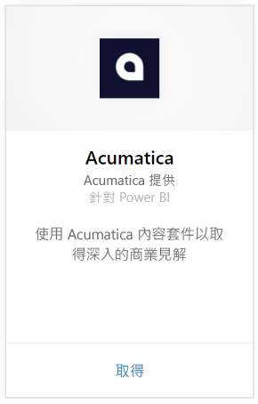
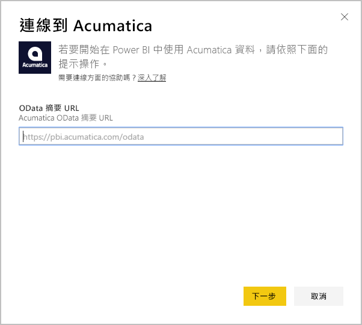
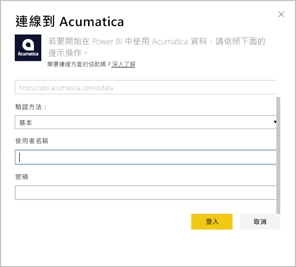
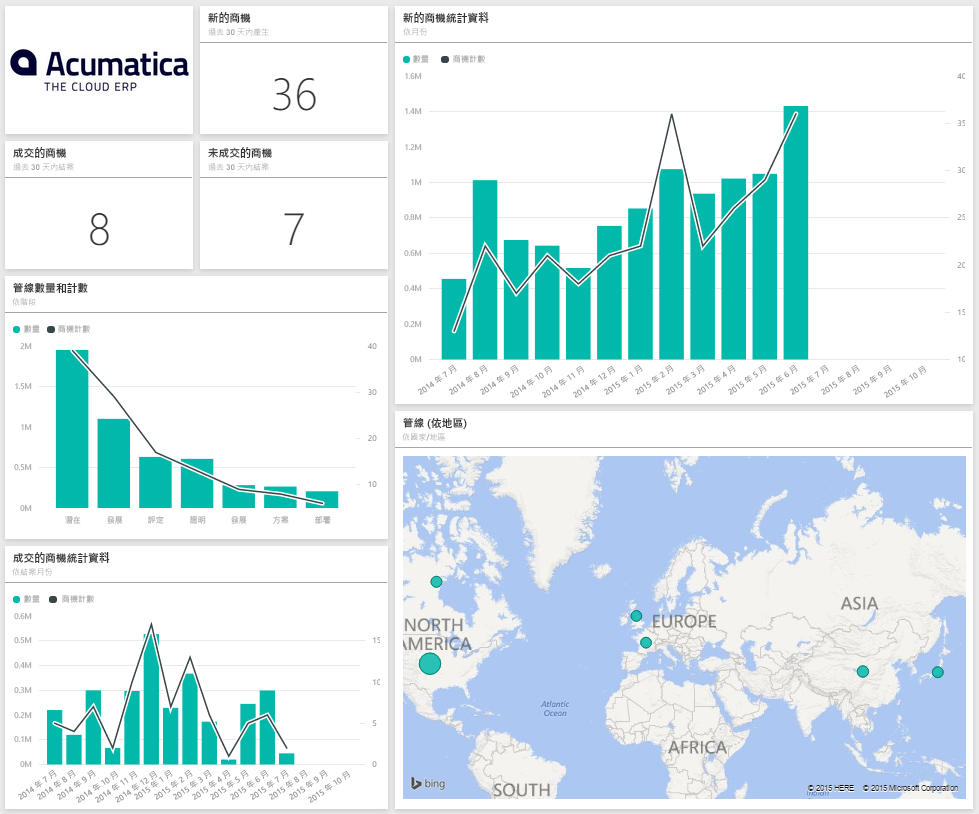
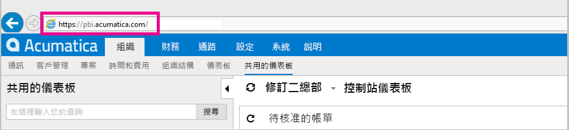
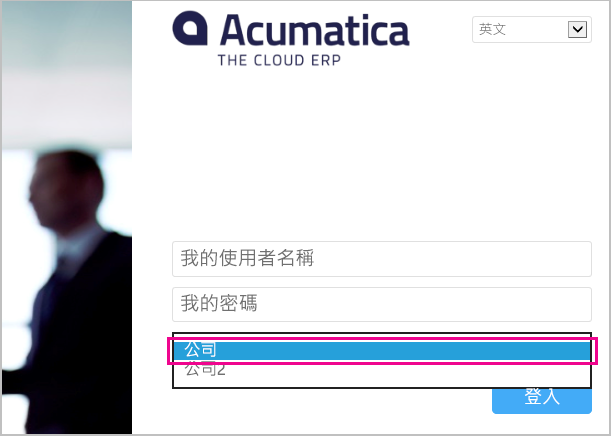

# 使用 Power BI 連接到 Acumatica
Power BI Acumatica 內容套件可讓您快速深入了解機會資料。 Power BI 會擷取您的資料 (包含機會、帳戶和客戶)，然後根據該資料建置預設的儀表板和相關報表。

[!INCLUDE [include-short-name](./includes/service-deprecate-content-packs.md)]

連接到 [Acumatica 內容套件](https://app.powerbi.com/getdata/services/acumatica) 或深入了解 Power BI 與 [Acumatica 的整合](https://powerbi.microsoft.com/integrations/acumatica)。

>[!NOTE]
>這個內容套件需要 Acumatica v5.2 或更新版本。

## 如何連接
1. 選取左側瀏覽窗格底部的 [取得資料]  。
   
   
2. 在 [服務]  方塊中，選取 [取得]  。
   
   
3. 選取 [Acumatica]  \> [取得]  。
   
   
4. 輸入 Acumatica OData 端點。 OData 端點允許外部系統從 Acumatica 要求資料。 Acumatica OData 端點的格式如下，而且應該使用 HTTPS：
   
     `https://[sitedomain]/odata/[companyname]`
   
   僅當您有多個公司部署時，才需要公司名稱。 在 Acumatica 帳戶中尋找此參數的詳細資訊如下所示。
   
   
5. 在驗證方法選取 [基本]  。 從您的 Acumatica 帳戶輸入使用者名稱和密碼，然後按一下 [登入]  。
   
    
6. Power BI 匯入資料之後，您會在左側瀏覽窗格中看到新的儀表板、報表和資料集。 新的項目會以黃色星號 \* 標示，只要經選取就會消失，而選擇儀表板會顯示類似下面的配置：
   
    

**接下來呢？**

* 請嘗試在儀表板頂端的[問與答方塊中提問](consumer/end-user-q-and-a.md)
* [變更儀表板中的圖格](service-dashboard-edit-tile.md)。
* [選取圖格](consumer/end-user-tiles.md)，開啟基礎報表。
* 雖然資料集排程為每天重新整理，但是您可以變更重新整理排程，或使用 [立即重新整理]  視需要嘗試重新整理

## 系統需求
這個內容套件需要 Acumatica v5.2 或更新版本，請與 Acumatica 系統管理員確認版本。

## 尋找參數
**Acumatica OData 端點**

Acumatica OData 端點的格式如下，而且應該使用 HTTPS：

    https://[sitedomain]/odata/[companyname]

當您登入 Acumatica 時，應用程式網站網域可以在您的瀏覽器網址列中找到。 在下列範例中，網站網域是 `https://pbi.acumatica.com`，因此要提供的 OData 端點會是 `https://pbi.acumatica.com/odata`。

 

僅當您有多個公司部署時，才需要公司名稱。 您可以從 Acumatica 登入頁面找到這項資訊。

## 疑難排解
如果您不能登入，請確認您所提供的 Acumatica OData 端點的格式正確。

    https://<application site domain>/odata/<company name>

如果您遇到連接問題，請向系統管理員確認 Acumatica 版本。 此內容套件需要 5.2 或更新版本。

## 後續步驟
[開始使用 Power BI](service-get-started.md)

[取得 Power BI 中的資料](service-get-data.md)

