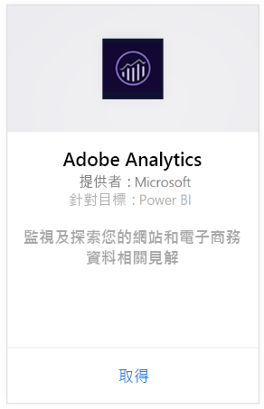
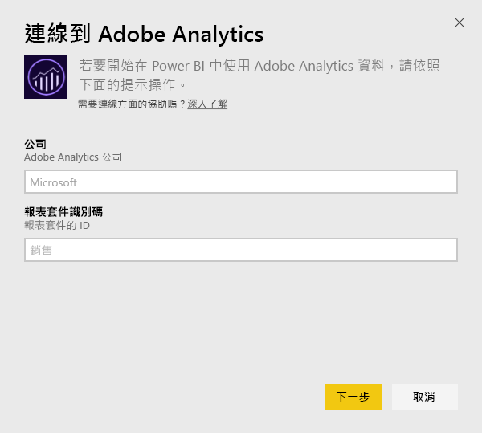
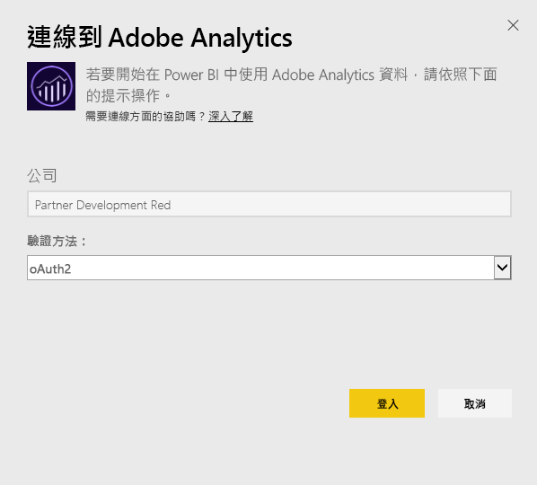
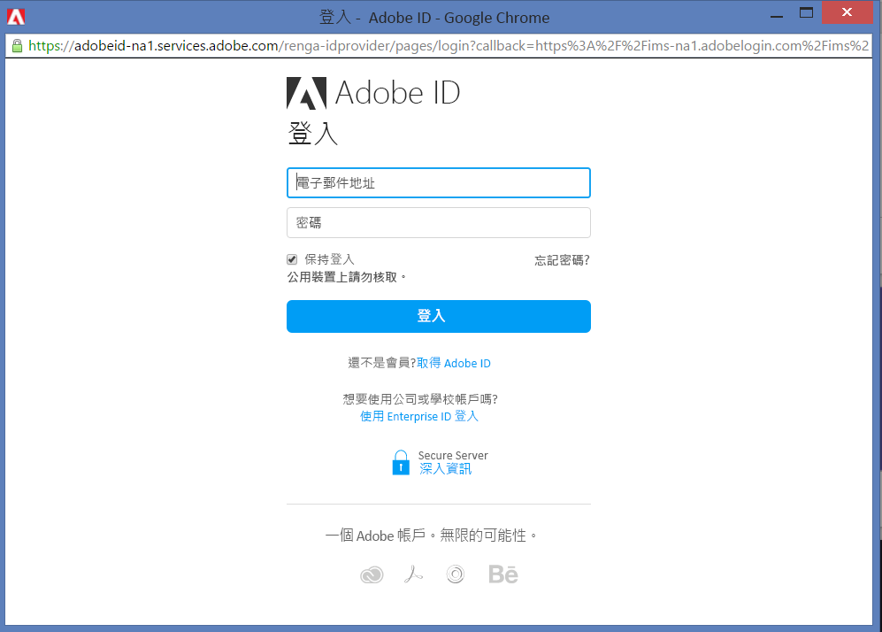
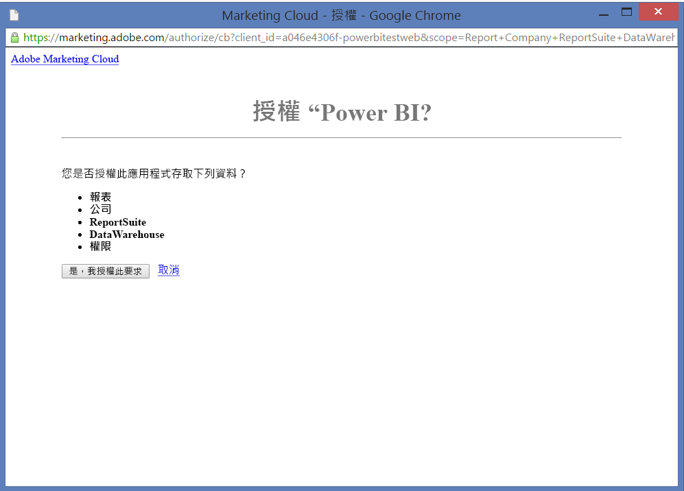
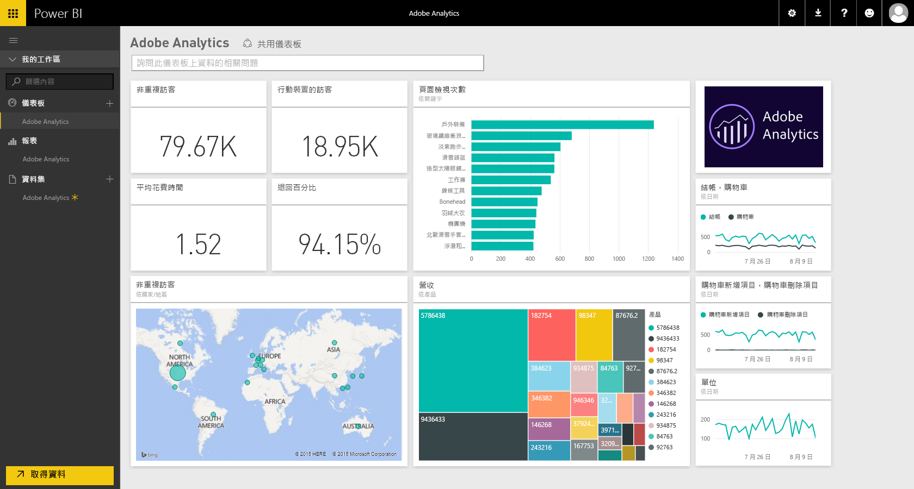
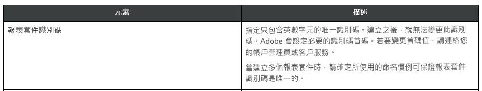

# 使用 Power BI 連接到 Adobe Analytics
透過 Power BI 連接到 Adobe Analytics 時，一開始會連接到 Adobe Analytics 行銷雲端帳戶。 您會看到應用程式與 Power BI 儀表板和一組 Power BI 報表，供您深入了解網站流量和使用者維度。 資料會自動每天重新整理一次。 您可以與儀表板和報表互動，但無法儲存變更。

連線到 [Adobe Analytics](https://app.powerbi.com/getdata/services/adobe-analytics) 或深入了解 Power BI 與 [Adobe Analytics 的整合](https://powerbi.microsoft.com/integrations/adobe-analytics)。

## 如何連接
[!INCLUDE [powerbi-service-apps-get-more-apps](./includes/powerbi-service-apps-get-more-apps.md)]

1. 選取 [Adobe Analytics] \> [取得]。
   
   
2. Power BI 會連線到特定 Adobe Analytics 公司和報表套件識別碼 (而非報表套件名稱)。 請參閱以下關於[尋找這些參數](#FindingParams)的詳細資訊。
   
   
3. 針對 [驗證方法] 選取 [oAuth2] \> [登入]。 出現提示時，請輸入您的 Adobe Analytics 認證。 
   
    
   
    
4. 按一下 [接受]  允許 Power BI 存取 Adobe Analytics 資料。
   
   
5. 核准之後，匯入程序會自動開始。 

## 檢視 Adobe Analytics 儀表板和報表
[!INCLUDE [powerbi-service-apps-open-app](./includes/powerbi-service-apps-open-app.md)]

      

[!INCLUDE [powerbi-service-apps-open-app](./includes/powerbi-service-apps-what-now.md)]

## 包含的內容
Power BI 使用 Adobe Analytics 報告 API 來定義並執行下列資料表的報表：

| **資料表名稱** | **資料行詳細資料** |
| --- | --- |
| 產品 |elements=  "product" (top 25)   metrics="cartadditions", "cartremovals", "carts", "cartviews", "checkouts", "revenue", "units" |
| 瀏覽器 |elements= "browser" (top 25)   metrics="bounces", "bouncerate", "visitors", "visits", "uniquevisitors", "totaltimespent", "pageviews" |
| 頁面 |elements= "page" (top 25)   metrics="cartadditions", "cartremovals", "carts", "cartviews", "checkouts", "revenue", "units", "visits", "uniquevisitors", "pageviews", "bounces", "bouncerate", "totaltimespent" |
| 已啟用 JavaScript |elements=  "javascriptenabled”, “browser” (top 25) |
| 行動裝置 OS |elements= "mobileos"(top 25)  metrics="bounces", "bouncerate", "visitors", "visits", "uniquevisitors", "totaltimespent", "cartadditions", "cartremovals", "checkouts", "revenue", "units", "pageviews" |
| 搜尋引擎關鍵字 |elements= "searchengine" "searchenginekeyword"   metrics="bounces", "bouncerate", "visitors", "visits", "entries", "uniquevisitors", "totaltimespent", "cartadditions", "cartremovals", "carts", "cartviews", "checkouts", "revenue", "units", "pageviews" |
| 產品搜尋引擎 |elements= "searchengine", "product"   metrics="bounces", "bouncerate", "visitors", "visits", "entries", "uniquevisitors", "totaltimespent", "cartadditions", "cartremovals", "carts", "cartviews", "checkouts", "revenue", "units", "pageviews" |
| 參考頁面 |elements= "referrer" (top 15), “page" (top 10)   metrics="bounces", "bouncerate", "visitors", "visits", "entries", "uniquevisitors", "totaltimespent", "cartadditions", "cartremovals", "carts", "cartviews", "checkouts", "revenue", "units", "pageviews" |
| Geocountry 頁面 |elements= "geocountry" (Top 20), "page"   metrics="bounces", "bouncerate", "visitors", "visits", "entries", "uniquevisitors", "totaltimespent", "cartadditions", "cartremovals", "carts", "cartviews", "checkouts", "revenue", "units", "pageviews" |
| Geocountry 產品 |elements= "geocountry" (Top 20), "product"  metrics="bounces", "bouncerate", "visitors", "visits", "entries", "uniquevisitors", "totaltimespent", "cartadditions", "cartremovals", "carts", "cartviews", "checkouts", "revenue", "units" |
| 國家及地區查閱 |elements= "geocountry" (Top 200)   metrics="bounces", "bouncerate", "visitors", "visits", "entries", "uniquevisitors", "totaltimespent", "cartadditions", "cartremovals", "carts", "cartviews", "checkouts", "revenue", "units" |
| 語言 |elements= "language", "browser" (Top 25)   metrics="bounces", "bouncerate", "visitors", "visits", "uniquevisitors", "totaltimespent", "pageviews", "cartadditions", "cartremovals", "checkouts", "carts", "cartviews" |
| 搜尋引擎查閱 |elements= "searchengine" (top 100)   metrics="bounces", "bouncerate", "visitors", "visits", "entries", "uniquevisitors", "totaltimespent", "cartadditions", "cartremovals", "carts", "cartviews", "checkouts", "revenue", "units" |
| 瀏覽器查閱 |elements= "browser" (top 25) |

## 系統需求
需要 [Adobe Analytics](http://www.adobe.com/marketing-cloud/web-analytics.html) 的存取權，包括正確參數的存取權，如下所述。

## 尋找參數
**公司**

一旦您登入帳戶，便可以在帳戶右上方找到公司值。 值會區分大小寫和間距。 請完全依照在帳戶中看到的樣子輸入它。

**報表套件識別碼**

建立報表套件時會建立套件識別碼。 您可以連絡您的系統管理員以確認識別碼值。 請注意這不是報表套件名稱。

在 Adobe [文件](https://marketing.adobe.com/resources/help/en_US/reference/new_report_suite.html)：

## 疑難排解
如果您在提供認證之後看到錯誤，指出您沒有權限，請與您的系統管理員確認是否有權存取 Adobe Analytics API。 另請確認所提供的 Adobe 識別碼已連結到行銷雲端組織 (與 Adobe Analytics 公司相關聯)。

如果您成功通過認證畫面之後遇到錯誤，有可能是因為報表佔用太多時間來完成所造成。 常見的錯誤格式為「無法從 Adobe 分析報表取得資料。內容包含 &quot;查閱者、頁面&quot;，持續時間約為 xx 秒」。 請檢閱＜包含的內容＞章節，並與您的 Adobe 執行個體大小相比較。 不幸的是目前無法解決此逾時。 不過我們正在考慮進行更新，以為較大的執行個體提供更佳的支援，請為 Power BI 小組提供您的意見反應，網址為 https://ideas.powerbi.com

## 後續步驟
* [Power BI 中的應用程式是什麼？](service-install-use-apps.md)
* [取得 Power BI 中的資料](service-get-data.md)
* 有其他問題嗎？ [嘗試在 Power BI 社群提問](http://community.powerbi.com/)

