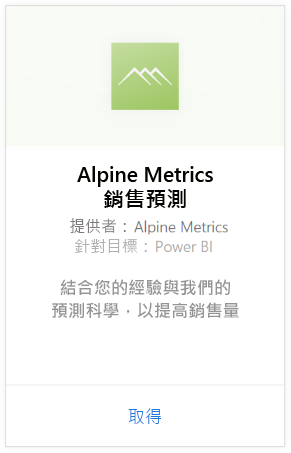
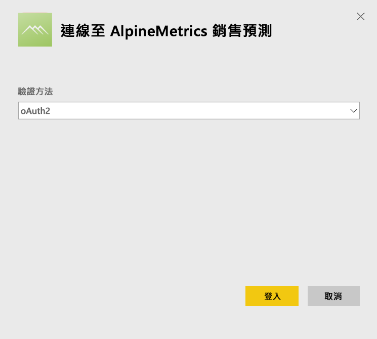
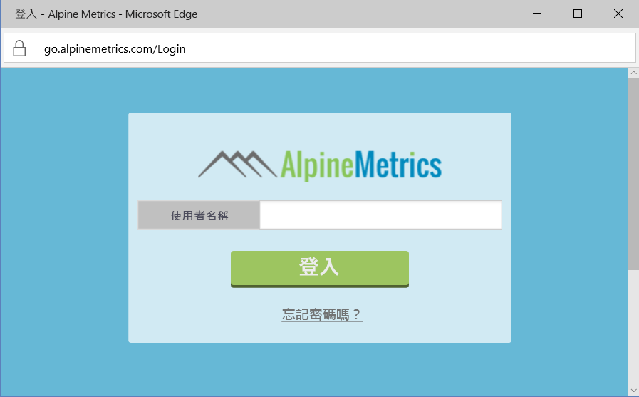
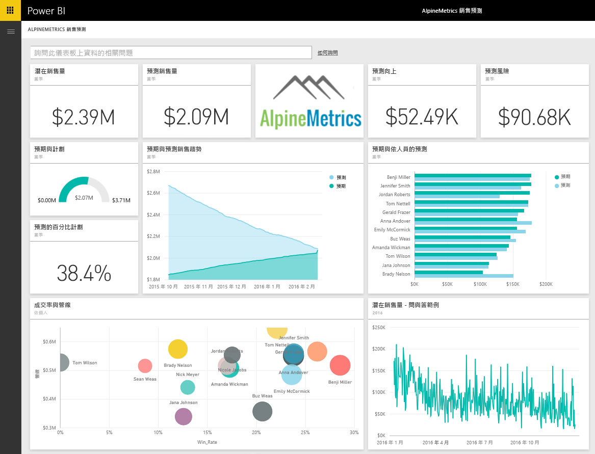

# 使用 Power BI 連接到 Alpine Metrics 銷售預測內容套件
Alpine Metrics 為各種規模的銷售組織提供最先進的雲端及隨選「預測銷售程序最佳化」。 Power BI 的 Alpine Metrics 銷售預測內容套件包含可能及預測的銷售和風險等計量資訊，讓您深入探索企業的未來。 

連接到 Power BI 的 [Alpine Metrics 銷售預測內容套件](https://app.powerbi.com/getdata/services/alpine-metrics)。

## 如何連接
1. 選取左瀏覽窗格底部的 [取得資料]。  
   
    
2. 在 [服務]  方塊中，選取 [取得] 。  
   
    
3. 選取 \[AlpineMetrics Sales Predictions] \(AlpineMetrics 銷售預測)，然後選取 [取得]。  
   
    
4. 選取 [OAuth 2]，然後 [登入]。 出現提示時，請提供您的 AlpineMetrics 認證。
   
    
   
    
5. 連接後，會自動載入儀表板、報表和資料集。 完成時，磚會更新為您帳戶中的資料。
   
    

**接下來呢？**

* 請嘗試在儀表板頂端的[問與答方塊中提問](consumer/end-user-q-and-a.md)
* [變更儀表板中的圖格](service-dashboard-edit-tile.md)。
* [選取圖格](consumer/end-user-tiles.md)，開啟基礎報表。
* 雖然資料集排程為每天重新整理，但是您可以變更重新整理排程，或使用 [立即重新整理] 視需要嘗試重新整理

## 包含的內容
此內容套件包含下列資料表中的資料：  

    - Account    
    - 商務    
    - 國家/地區    
    - Industry    
    - 商機  
    - Person  
    - Prediction    
    - Prediction History    
    - Product  
    - Region    

## 系統需求
需要有具備上述資料表權限的 Alpine Metrics 帳戶，才能具現化此內容套件。

## 後續步驟
[Power BI 是什麼？](power-bi-overview.md)

[Power BI - 基本概念](consumer/end-user-basic-concepts.md)

