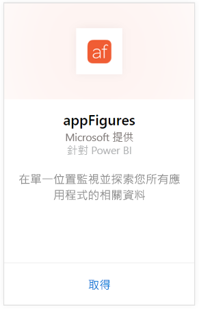
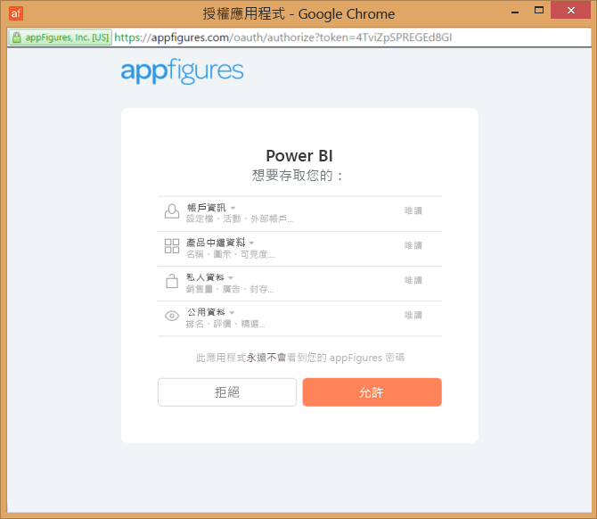
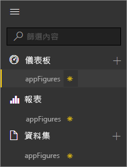
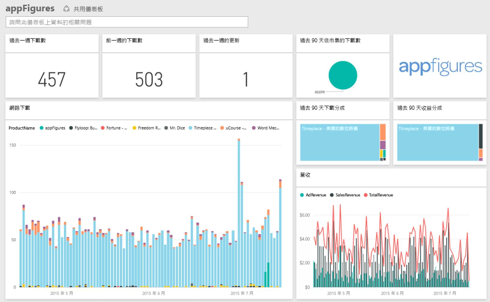
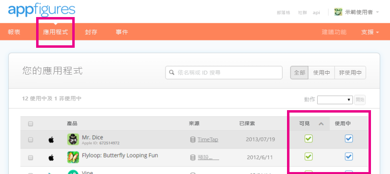

# 使用 Power BI 連接到 appFigures
使用 Power BI 與 appFigures 內容套件，可輕易追蹤與應用程式有關的重要統計資料。 Power BI 會擷取您的資料，包括 App 銷售、下載及廣告統計資料，然後會根據該資料建立預設儀表板和相關報表。

連接至 [appFigures 內容套件](https://app.powerbi.com/getdata/services/appfigures) 或深入了解 Power BI 與 [appFigures 的整合](https://powerbi.microsoft.com/integrations/appfigures)。

## 如何連接
1. 選取左側瀏覽窗格底部的 [取得資料]  。
   
   
2. 在 [服務]  方塊中，選取 [取得] 。
   
   
3. 選取 [appFigures] \> [取得]。
   
   
4. 針對 [驗證方法] 選取 [oAuth2] \> [登入]。 出現提示時，輸入 appFigures 認證，並遵循 appFigures 驗證程序。
   
   第一次連接時，Power BI 會提示您允許唯讀存取您的帳戶。 選取 [允許]  開始匯入程序。 這可能需要幾分鐘的時間，視您帳戶的資料量而定。
   
   
5. Power BI 匯入資料之後，您會在左側瀏覽窗格中看到新的儀表板、報表和資料集。 新的項目會以黃色星號 \* 標示：
   
    
6. 選取 appFigures 儀表板。 這是 Power BI 建立的預設儀表板，可顯示您的資料。 您可以修改此儀表板，以您想要的任何方式來顯示資料。
   
    

**接下來呢？**

* 請嘗試在儀表板頂端的[問與答方塊中提問](power-bi-q-and-a.md)
* [變更儀表板中的圖格](service-dashboard-edit-tile.md)。
* [選取圖格](service-dashboard-tiles.md)，開啟基礎報表。
* 雖然資料集排程為每天重新整理，但是您可以變更重新整理排程，或使用 [立即重新整理] 視需要嘗試重新整理

## 包含的內容
從 Power BI 中的 appFigures 可使用下列資料。

| **資料表名稱** | **描述** |
| --- | --- |
| 國家/地區 |下表提供國家/地區名稱資訊。 |
| 日期 |此表格包含從今天回推到最早的 App 發行日期，其在 appFigures 帳戶為作用中且可見。 |
| 事件 |此表格包含以每日為基礎且依國家/地區分類之各應用程式的下載、銷售額和廣告資訊。 請注意應用程式和應用程式內購買資訊全都放在這個單一資料表 — 您可以使用<strong>類型</strong>資料行來區分。 |
| Inapps |此表格包含不同類型應用程式內購買項目的相關資料，其與 appFigures 帳戶上作用中、可見的 App 相關聯。 |
| 產品 |此表格包含位於 appFigures 帳戶的作用中且可見之不同 App 的相關資料。 |

## 疑難排解
如果您的 App 中有某些資料未顯示於 Power BI，請檢查以確定那些 App 在 appFigures 站台的 [App]  索引標籤可見且作用中。

## 後續步驟
* [開始使用 Power BI](service-get-started.md)
* [取得 Power BI 中的資料](service-get-data.md)

