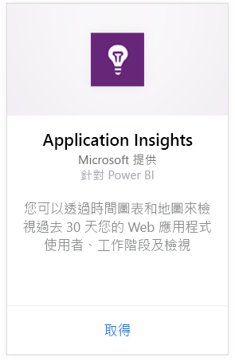
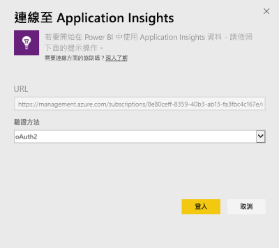
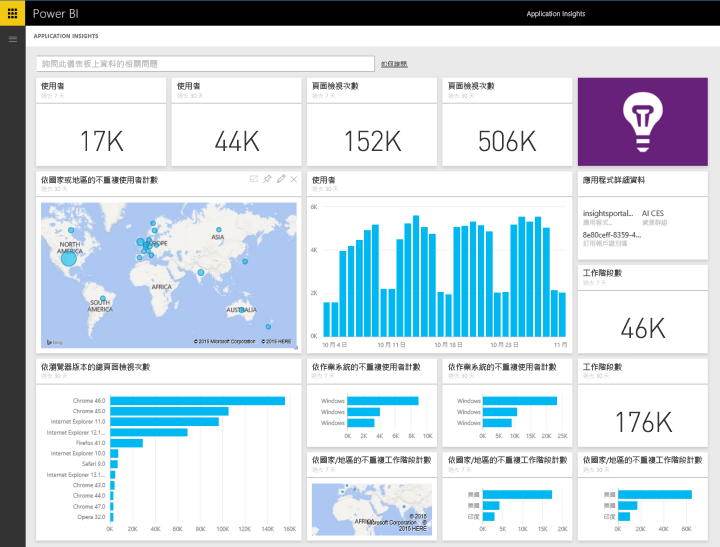
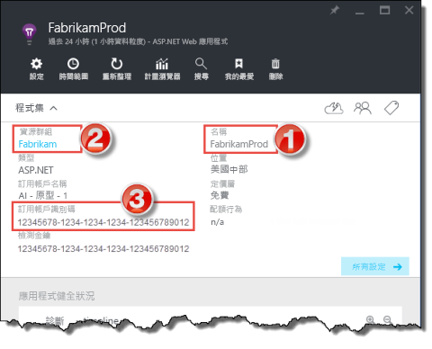
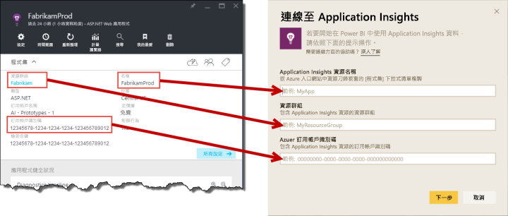

# 使用 Power BI 連接到 Application Insights
使用 Power BI 從 [Application Insights](/azure/application-insights/app-insights-overview/) 遙測建立功能強大的自訂儀表板。 想像以新方法運用應用程式遙測。 將來自多個應用程式或元件服務的度量合併到一個儀表板上。 第一版的 Power BI Application Insights 內容套件，包含常用的度量小工具，例如作用中使用者、頁面檢視、工作階段、瀏覽器和作業系統版本，以及地圖的使用者地理分佈。

連接到 [Power BI 的 Application Insights 內容套件](https://app.powerbi.com/getdata/services/application-insights)。

>[!NOTE]
>此整合方法現在已被**取代**。 若要深入了解將 Application Insights 連線到 Power BI 的慣用方法，請使用[匯出分析查詢功能](https://docs.microsoft.com/azure/application-insights/app-insights-export-power-bi#export-analytics-queries)。

## 如何連接
1. 選取左側瀏覽窗格底部的 [取得資料]  。
   
    ![[取得資料] 按鈕](media/service-connect-to-application-insights/pbi_getdata.png)
2. 在 [服務]  方塊中，選取 [取得]  。
   
    ![[取得服務] 按鈕](media/service-connect-to-application-insights/pbi_getservices.png)
3. 選取 [Application Insights]   > [取得]  。
   
    
4. 提供想要連接的應用程式詳細資料，包括 **Application Insights 資源名稱**、 **資源群組**和 **訂閱識別碼**。 如需詳細資訊，請參閱[尋找 Application Insights 參數](#FindingAppInsightsParams)。
   
    ![[Application Insights 連接] 對話方塊](media/service-connect-to-application-insights/pbi_contpkappinsitconnectndialog.png)    
5. 選取 [登入]  並依照畫面連接。
   
    
6. 匯入程序會自動開始。 完成時會顯示通知，新的儀表板、報表和模型也會出現在瀏覽窗格中，並以星號標示。  選取儀表板以檢視匯入的資料。
   
    

**接下來呢？**

* 請嘗試在儀表板頂端的[問與答方塊中提問](consumer/end-user-q-and-a.md)
* [變更儀表板中的圖格](service-dashboard-edit-tile.md)。
* [選取圖格](consumer/end-user-tiles.md)，開啟基礎報表。
* 雖然資料集排程為每天重新整理，但是您可以變更重新整理排程，或使用 [立即重新整理]  視需要嘗試重新整理

## 包含的內容
Application Insights 內容套件包含下列資料表和計量︰  

    ´´´
    - ApplicationDetails  
    - UniqueUsersLast7Days   
    - UniqueUsersLast30Days   
    - UniqueUsersDailyLast30Days  
    - UniqueUsersByCountryLast7Days  
    - UniqueUsersByCountryLast30Days   
    - PageViewsDailyLast30Days   
    - SessionsLast7Days   
    - SessionsLast30Days  
    - PageViewsByBrowserVersionDailyLast30Days   
    - UniqueUsersByOperatingSystemLast7Days   
    - UniqueUsersByOperatingSystemLast30Days    
    - SessionsDailyLast30Days   
    - SessionsByCountryLast7Days   
    - SessionsByCountryLast30Days   
    - PageViewsByCountryDailyLast30Days  
    ´´´ 

## 尋找參數
您的資源名稱、資源群組和訂閱識別碼，在 Azure 入口網站都找得到。 選取名稱會開啟詳細的檢視，您可以使用 [程式集] 下拉式清單尋找所有需要的值。

複製並貼到 Power BI 的這些欄位：

## 後續步驟
[開始使用 Power BI](service-get-started.md)

[取得 Power BI 中的資料](service-get-data.md)

