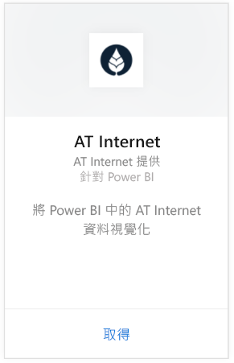
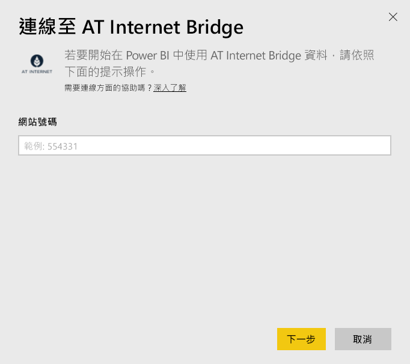
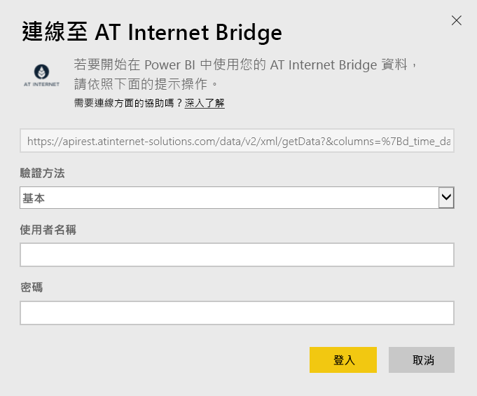

# 使用 Power BI 連接到 AT Internet Bridge
AT Internet 可協助您從資料擷取即時運算值，方法是使用 Analytics Suite 這套統一的數位分析平台。 Power BI 的 AT Internet Bridge 內容套件包含適用您網站的資料瀏覽、來源、當地語系化以及裝置。

連接至 Power BI 的 [AT Internet Bridge 內容套件](https://app.powerbi.com/getdata/services/at-internet-bridge)。

## 如何連接
1. 選取左側瀏覽窗格底部的 [取得資料]  。
   
    
2. 在 [服務]  方塊中，選取 [取得]  。
   
    
3. 選取 [AT Internet Bridge]  \> [取得]  。
   
   
4. 指定要連接至的 AT Internet 網站號碼。
   
   
5. 選取 [基本]  作為驗證機制、提供您的 AT Internet 使用者名稱與密碼，然後按一下 [登入]  。
   
   
6. 按一下 [連接]  開始匯入程序。 完成時，新的儀表板、報表和模型會出現在瀏覽窗格中。 選取儀表板以檢視匯入的資料。
   
    

**接下來呢？**

* 請嘗試在儀表板頂端的[問與答方塊中提問](consumer/end-user-q-and-a.md)
* [變更儀表板中的圖格](service-dashboard-edit-tile.md)。
* [選取圖格](consumer/end-user-tiles.md)，開啟基礎報表。
* 雖然資料集排程為每天重新整理，但是您可以變更重新整理排程，或使用 [立即重新整理]  視需要嘗試重新整理

## 包含的內容
這個內容套件包含下列資料表過去 45 天的資料︰  

    - Conversion  
    - Devices  
    - Localization  
    - Sources  
    - Global Visits  

## 後續步驟
[Power BI 是什麼？](power-bi-overview.md)

[Power BI 服務中的設計工具基本概念](service-basic-concepts.md)

