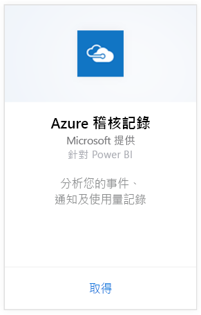
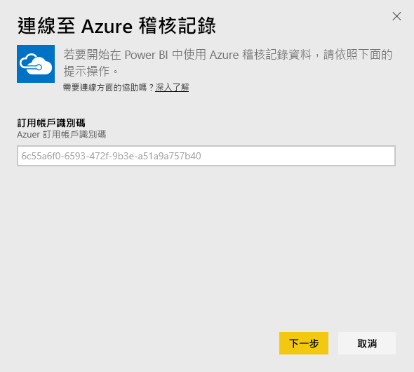
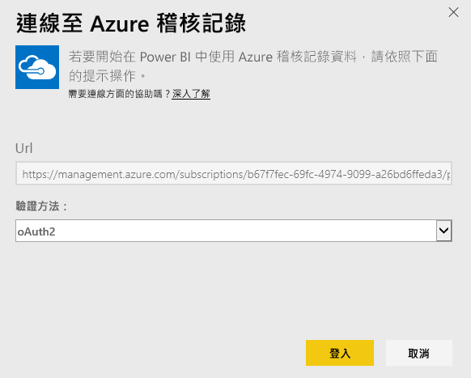
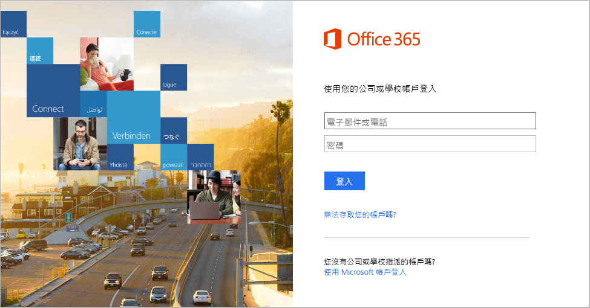
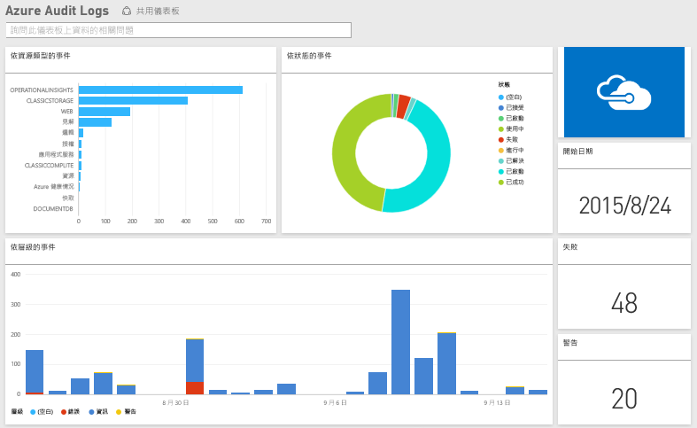

# 使用 Power BI 連接到 Azure 稽核記錄
您可以使用 Azure 稽核記錄內容套件，來分析及視覺化儲存在稽核記錄中的資訊。 Power BI 會擷取您的資料、建置現成的儀表板，然根據該資料建立報表。

[連接至 Azure 稽核記錄檔內容套件](https://app.powerbi.com/getdata/services/azure-audit-logs)或深入了解 Power BI 與 [Azure 稽核記錄檔的整合](https://powerbi.microsoft.com/integrations/azure-audit-logs)。

## 如何連接
1. 選取左側瀏覽窗格底部的 [取得資料]  。  
   
    
2. 在 [服務]  方塊中，選取 [取得] 。  
   
     
3. 選取 [Azure 稽核記錄檔] > [取得]。  
   
   
4. 出現提示時，輸入您的 **Azure 訂用帳戶 ID**。 請參閱下面有關尋找[訂閱識別碼](#FindingParams)的詳細資訊。   
   
    
5. 針對 [驗證方法] 選取 [oAuth2] \> [登入]。
   
    
6. 輸入您的帳戶認證以完成登入程序。
   
    
7. Power BI 會擷取您的 Azure 稽核記錄資料，並建立現成可用的儀表板和報表。 
   
    

**接下來呢？**

* 請嘗試在儀表板頂端的[問與答方塊中提問](power-bi-q-and-a.md)
* [變更儀表板中的圖格](service-dashboard-edit-tile.md)。
* [選取圖格](service-dashboard-tiles.md)，開啟基礎報表。
* 雖然資料集排程為每天重新整理，但是您可以變更重新整理排程，或使用 [立即重新整理] 視需要嘗試重新整理

## 系統需求
Azure 稽核記錄檔內容套件需要存取 Azure 入口網站中的稽核記錄檔。 更多詳細資料在[這裡](https://azure.microsoft.com/documentation/articles/insights-debugging-with-events/)。

## 尋找參數
有兩個簡單的方法可尋找您的訂用帳戶 ID。

1. 從 https://portal.azure.com -&gt; [瀏覽] -&gt; [訂閱] -&gt; [訂閱識別碼]。
2. 從 https://manage.windowsazure.com -&gt; [設定] -&gt; [訂閱識別碼]。

您的訂閱識別碼會是一組很長的數字和字元，類似上述步驟 \#4 中的範例。 

## 疑難排解
如果您看見認證錯誤，或因為認證無效而嘗試重新整理時發生錯誤，請嘗試刪除所有 Azure 稽核記錄檔內容套件的執行個體，並重新連接。

## 後續步驟
[開始使用 Power BI](service-get-started.md)  
[Power BI - 基本概念](service-basic-concepts.md)  

