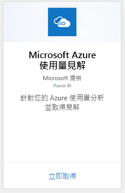
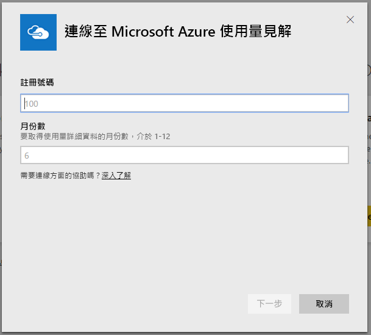
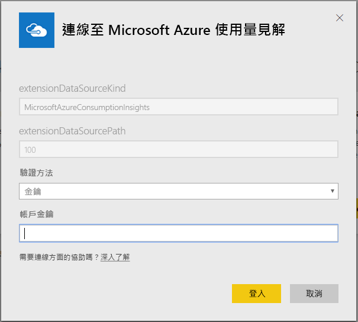
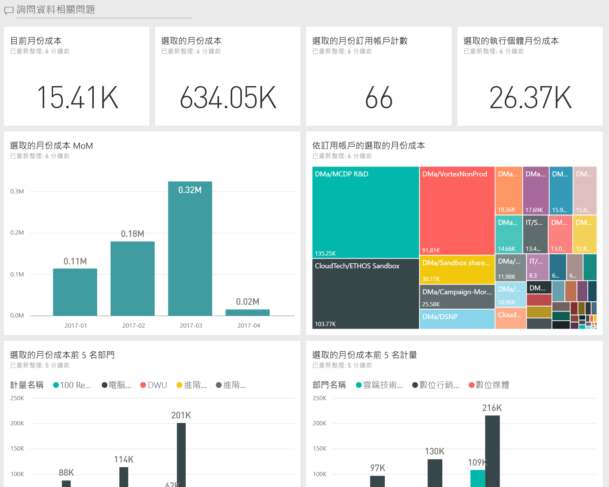
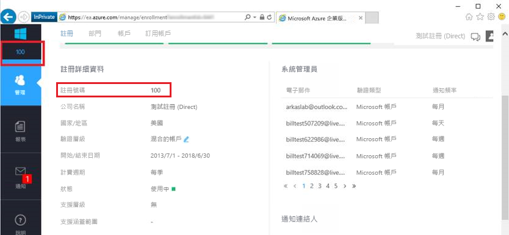
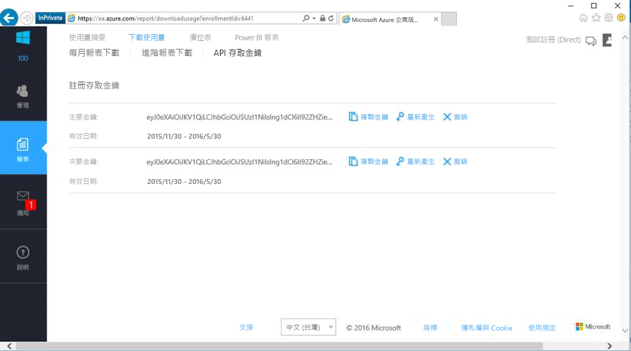

# 使用 Power BI 連接到 Microsoft Azure Consumption Insights
使用 Power BI 內容套件探索並監視 Power BI 中的 Microsoft Azure 耗用量資料。 資料會自動每天重新整理一次。

連接到 Power BI 的 [Microsoft Azure Consumption Insights 內容套件](https://app.powerbi.com/getdata/services/azureconsumption)。

## 如何連接
1. 選取左側瀏覽窗格底部的 [取得資料]  。
   
    
2. 在 [服務]  方塊中，選取 [取得] 。
   
   
3. 選取 [Microsoft Azure Consumption Insights] \> [取得]。 
   
   
4. 提供要匯入的月份數資料和 Azure 企業版的註冊號碼。 請參閱以下關於[尋找這些參數](#FindingParams)的詳細資料。
   
    
5. 提供連接用的存取金鑰。 註冊金鑰位於 Azure EA 入口網站。 
   
    
6. 匯入程序會自動開始。 完成時，新的儀表板、報表和模型會出現在瀏覽窗格中。 選取儀表板以檢視匯入的資料。
   
   

**接下來呢？**

* 請嘗試在儀表板頂端的[問與答方塊中提問](service-q-and-a.md)
* [變更儀表板中的圖格](service-dashboard-edit-tile.md)。
* [選取圖格](service-dashboard-tiles.md)，開啟基礎報表。
* 雖然資料集排程為每天重新整理，但是您可以變更重新整理排程，或使用 [立即重新整理] 視需要嘗試重新整理

## 包含的內容
Microsoft Azure Consumption Insights 內容套件包含每月報告資料，其範圍是連接流程期間所提供的月數。 範圍是移動的視窗，以便重新整理資料集時，將會更新包含的日期。

## 系統需求
內容套件需要存取 Azure 入口網站中的 企業版功能。 

## 尋找參數
能夠檢視帳單資訊的 EA Direct、合作夥伴和間接客戶都可以取得 Power BI 報表。 請閱讀下文以取得尋找連接流程所有預期值的詳細資料。

**月份數**

* 這應該是介於 1 到 36 的數字，代表您要匯入的資料月數 (從今天起算)。

**註冊號碼**

* 這是您的 Azure 企業版註冊號碼，位於 [Azure 企業版入口網站](https://ea.azure.com/)主畫面的 [註冊詳細資料] 底下。
  
    

**存取金鑰**

* 金鑰位在 Azure 企業版入口網站的 [下載使用量] > [API 存取金鑰]。
  
    

**其他說明**

* 如需設定 Azure 企業版 Power BI 套件的其他說明，請登入 Azure Enterprise 入口網站，以檢視 ＜說明＞下的 API 說明檔案，以及在 [報表] -> [下載使用量] -> [API 存取金鑰] 下取得其他指示。 

## 後續步驟
[開始使用 Power BI](service-get-started.md)

[取得 Power BI 中的資料](service-get-data.md)

