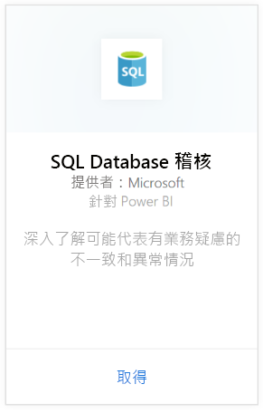
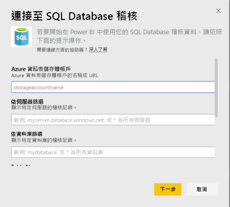
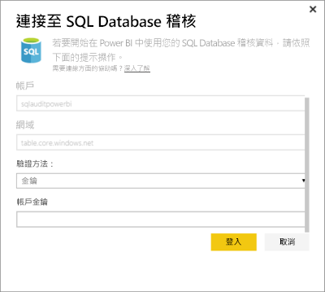
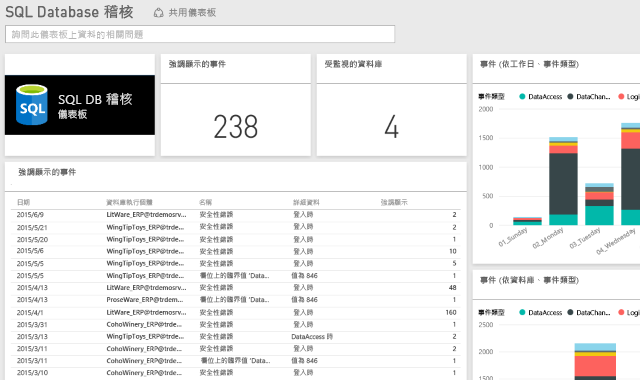

# 適用於 Power BI 的 SQL Database 稽核內容套件

> [!IMPORTANT]
> SQL Database 稽核內容套件已被取代，無法再使用。
 
Power BI 的 Azure [SQL Database 稽核](/azure/sql-database/sql-database-auditing/)內容套件可協助您了解資料庫活動，以及獲取可能指出業務疑慮或可疑安全性違規之差異及異常的深入資訊。 

連接到 Power BI 的 [SQL Database 稽核內容套件](https://app.powerbi.com/getdata/services/sql-db-auditing)。

>[!NOTE]
>此內容套件可從名稱中含有 "AuditLogs" 的所有資料表匯入資料，並將其附加到名為 "AuditLogs" 的單一資料模型資料表。 最後 250k 個事件將會包含在內，並將每日重新整理資料。

## 如何連接
1. 選取左側瀏覽窗格底部的 [取得資料]  。
   
    
2. 在 [服務] 方塊中選取 [取得]。
   
    
3. 選取 [SQL Database 稽核] \> [取得]。
   
   
4. 在 [連接到 SQL Database 稽核] 視窗中：
   
   - 輸入儲存您記錄檔的 Azure 資料表儲存體帳戶名稱或 URL。
   
   - 輸入您感興趣的 SQL Server 名稱。 輸入 “\*” 以載入所有伺服器的稽核記錄。
   
   - 輸入您感興趣的 SQL 資料庫名稱。 輸入 “\*” 以載入所有資料庫的稽核記錄。
   
   - 輸入包含您感興趣之記錄的 Azure 資料表名稱。 輸入 “\*” 以從其名稱中包含 “AuditLogs” 的所有資料表載入稽核記錄。
   
   >[!IMPORTANT]
   >基於效能理由，建議您務必指定明確的資料表名稱，即使所有稽核記錄檔都儲存在單一資料表亦如此。
   
   - 輸入您感興趣之稽核記錄的開始日期。 輸入 “\*” 以載入沒有時間限制下限的稽核記錄，或輸入 “1d” 載入從最後一天開始的稽核記錄。
   
   - 輸入您感興趣之稽核記錄的結束日期。 輸入 “\*” 以載入沒有時間限制上限的稽核記錄。
   
   
5. 在 [驗證方法] 選取 [金鑰]，輸入您的**帳戶金鑰** \> [登入]。
   
   
6. Power BI 匯入資料之後，您會在左側瀏覽窗格中看到新的儀表板、報表和資料集。 新的項目會以黃色星號標示\*。
   
   

**接下來呢？**

* 請嘗試在儀表板頂端的[問與答方塊中提問](consumer/end-user-q-and-a.md)
* [變更儀表板中的圖格](service-dashboard-edit-tile.md)。
* [選取圖格](consumer/end-user-tiles.md)，開啟基礎報表。
* 雖然資料集排程為每天重新整理，但是您可以變更重新整理排程，或使用 [立即重新整理] 視需要嘗試重新整理

## 後續步驟
[取得 Power BI 的資料](service-get-data.md)
[Power BI 是什麼？](power-bi-overview.md)
