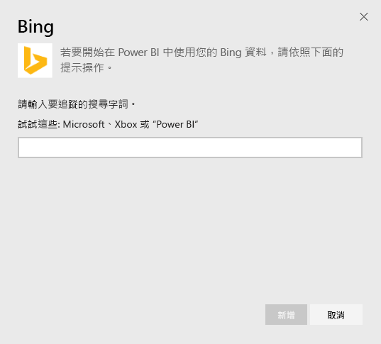
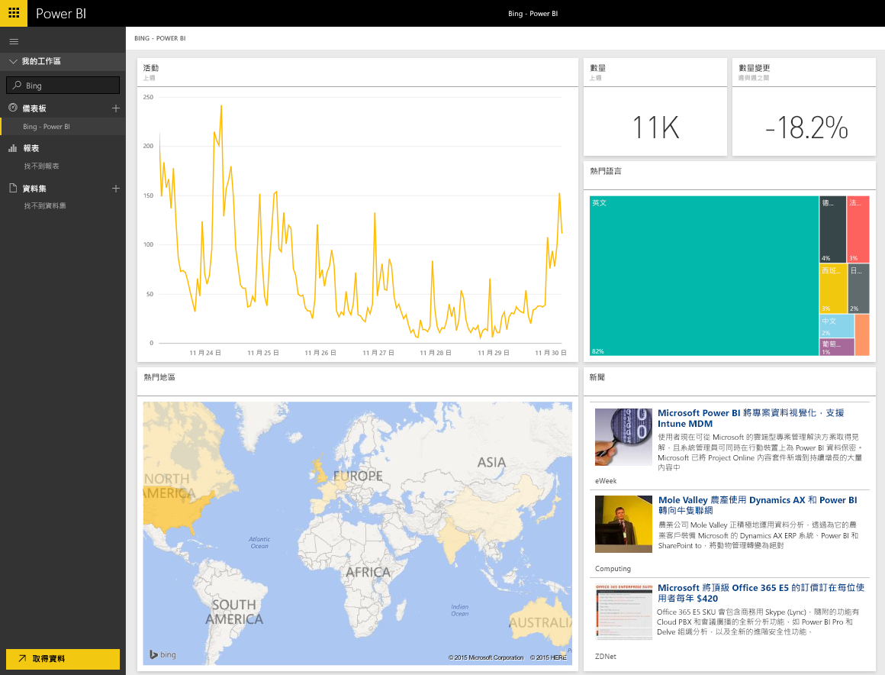

# 使用 Power BI 連接到 Bing
Bing 內容套件可讓您檢視與所選字詞的網際網路搜尋活動相關的分析。

連接到 Power BI 的 [Bing 內容套件](https://app.powerbi.com/groups/me/getdata/services/bing)。

>[!NOTE]
>Bing 磚會大約每隔 5 分鐘自動更新一次，唯一可選取的磚為 [新聞] 磚，該磚將帶您前往對應的新聞文章。 

>[!NOTE]
>行動應用程式中無法轉譯來自 Bing 內容套件的磚。 我們正在解決這個問題。

1. 選取左側瀏覽窗格底部的 [取得資料]  。
   
    
2. 在 [服務]  方塊中，選取 [取得] 。
   
    
3. 選取 [Bing] > [取得]。
   
    
4. 在 [參數] 對話方塊中，輸入您要追蹤的搜尋字詞，然後按 [加入]。
   
        
5. 您會在左側儀表板清單中看到一個名為 Bing 的新項目，以及您提供的搜尋字詞。 請注意，沒有與這個儀表板相關聯的資料集或報表。 載入磚可能需要一些時間，一旦完成，您將會看到類似如下的配置。
   
    

完成載入之後，您可以開始瀏覽資料，包括將這個儀表板中的磚釘選到您帳戶的其他儀表板。

