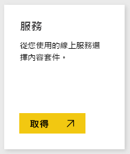
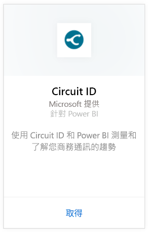
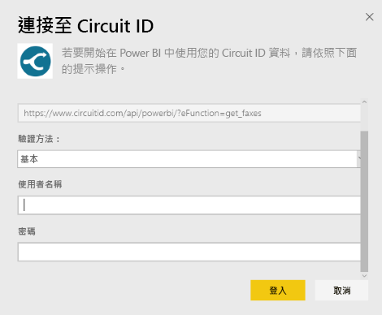
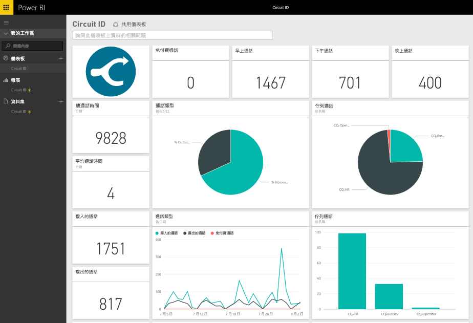

# 使用 Power BI 連接到電路識別碼
使用 Power BI 可以輕鬆地分析來自 Circuit ID 的通訊資料。 Power BI 會擷取您的資料，然後根據該資料建置預設的儀表板和相關報表。 在建立連接之後，您可以瀏覽資料並自訂儀表板以符合您的需求。 資料會自動每天重新整理。

連接到 Power BI 的 [Circuit ID 內容套件](https://app.powerbi.com/getdata/services/circuitid)。

## 如何連接
1. 選取左側瀏覽窗格底部的 [取得資料]  。
   
    
2. 在 [服務]  方塊中，選取 [取得] 。
   
    
3. 選取 [Circuit ID] \> [取得]。
   
    
4. 在驗證方法選取 [基本]，然後輸入使用者名稱及密碼。 然後按下 [登入]。
   
    
5. Power BI 匯入資料之後，您會在左側瀏覽窗格中看到新的儀表板、報表和資料集。 新的項目會以黃色星號標示。
   
    

**接下來呢？**

* 請嘗試在儀表板頂端的[問與答方塊中提問](power-bi-q-and-a.md)
* [變更儀表板中的圖格](service-dashboard-edit-tile.md)。
* [選取圖格](service-dashboard-tiles.md)，開啟基礎報表。
* 雖然資料集排程為每天重新整理，但是您可以變更重新整理排程，或使用 [立即重新整理] 視需要嘗試重新整理

## 後續步驟
[開始使用 Power BI](service-get-started.md)

[取得 Power BI 的資料](service-get-data.md)

