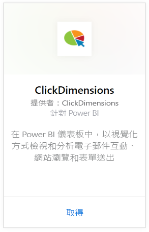
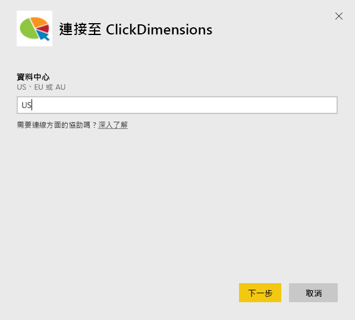
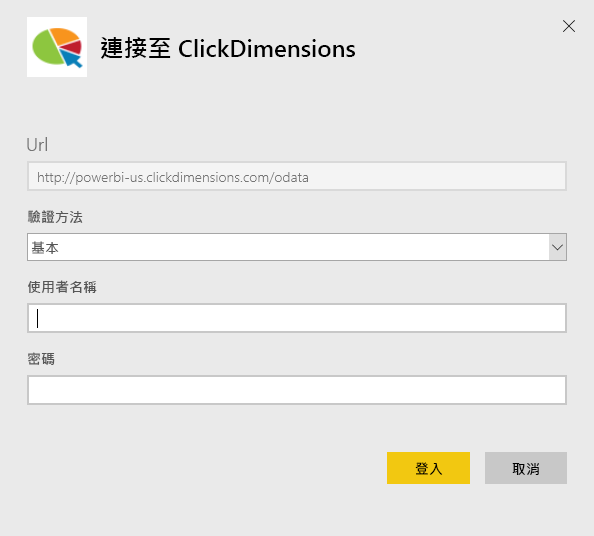
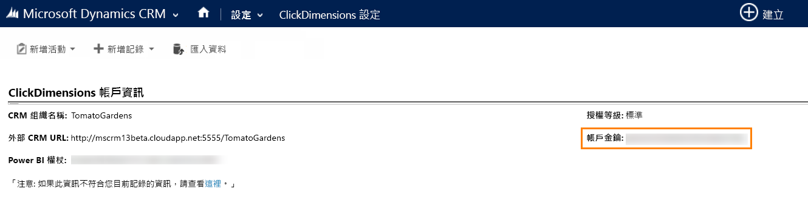
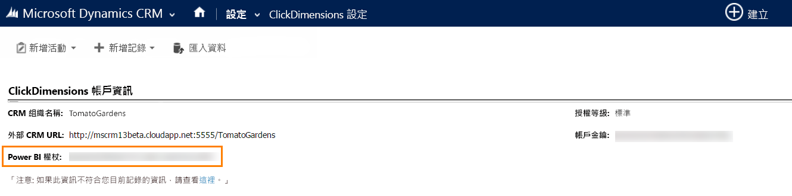

# 使用 Power BI 連接到 ClickDimensions
Power BI 的 ClickDimensions 內容套件可讓使用者在 Power BI 中利用 ClickDimensions 行銷資料，讓管理團隊進一步深入探索其銷售和行銷活動的成功原因。 在 Power BI 儀表板和報表中，以視覺化方式檢視和分析電子郵件互動、網站瀏覽和表單送出。

連接到 Power BI 的 [ClickDimensions 內容套件](https://app.powerbi.com/getdata/services/click-dimensions)。

## 如何連接
1. 選取左側瀏覽窗格底部的 [取得資料]  。
   
   
2. 在 [服務]  方塊中，選取 [取得] 。
   
   
3. 選取 [ClickDimensions] \> [取得]。
   
   
4. 提供您的資料中心位置 (US、EU 或 AU) 的，然後選取 [下一步]。
   
   
5. 針對 [驗證方法] 選取 [基本] \> [登入]。 出現提示時，請輸入您的 ClickDimensions 認證。 請參閱以下關於[尋找這些參數](#FindingParams)的詳細資訊。
   
    
6. 一經核准，匯入程序會自動開始。 完成時，新的儀表板、報表和模型會出現在瀏覽窗格中。 選取儀表板以檢視匯入的資料。
   
     

**接下來呢？**

* 請嘗試在儀表板頂端的[問與答方塊中提問](power-bi-q-and-a.md)
* [變更儀表板中的圖格](service-dashboard-edit-tile.md)。
* [選取圖格](service-dashboard-tiles.md)，開啟基礎報表。
* 雖然資料集排程為每天重新整理，但是您可以變更重新整理排程，或使用 [立即重新整理] 視需要嘗試重新整理

## 系統需求
若要連接到 Power BI 內容套件，您必須提供對應至您帳戶的資料中心，並使用 ClickDimensions 帳戶進行登入。 如果您不確定該提供哪個資料中心，請洽詢您的系統管理員。

## 尋找參數
帳戶金鑰位於 [CRM 設定] \> [ClickDimensions 設定] 中。 從 [ClickDimensions 設定] 複製帳戶金鑰並貼到 [使用者名稱] 欄位。  

  

從 [ClickDimensions 設定] 複製 Power BI 權杖並貼到 [密碼] 欄位。 Power BI 權杖位於 [CRM 設定] \> [ClickDimensions 設定] 中。  

  

## 後續步驟
[開始使用 Power BI](service-get-started.md)

[取得 Power BI 中的資料](service-get-data.md)

