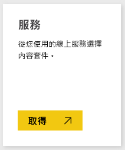
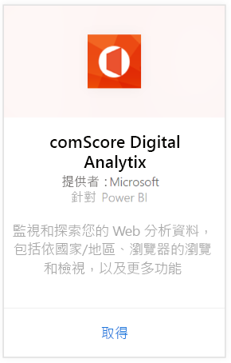
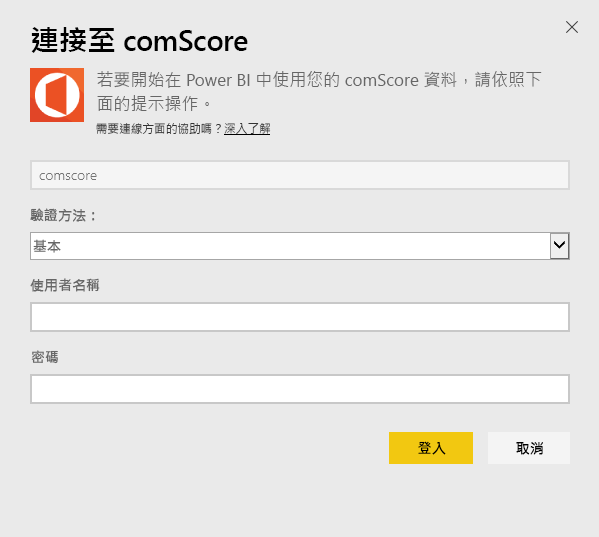
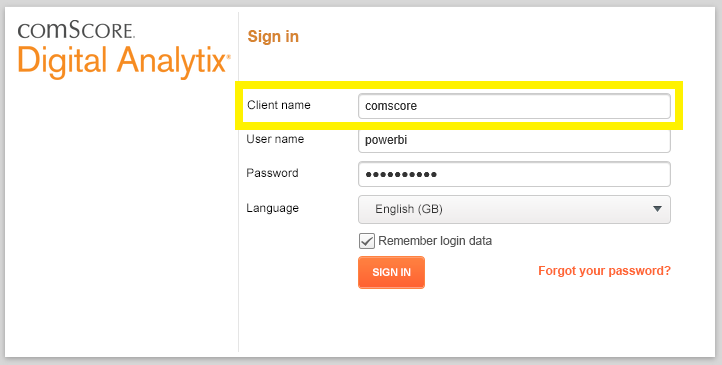
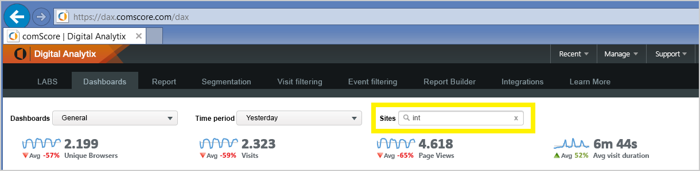

# 使用 Power BI 連接到 comScore Digital Analytix
使用 Power BI 內容套件以視覺化方式檢視和瀏覽 Power BI 中的 comScore Digital Analytix 資料。 資料會自動每天重新整理一次。

連接到[適用於 Power BI 的 comScore 內容套件](https://app.powerbi.com/getdata/services/comscore)。

>[!NOTE]
>若要連接內容套件，您需要 comScore DAx 使用者帳戶及 comScore API 的存取權。 請參閱下列[詳細資訊](#Requirements)。

## 如何連接
1. 選取左瀏覽窗格底部的 [取得資料]。
   
   
2. 在 [服務]  方塊中，選取 [取得] 。
   
   
3. 選取 [comScore Digital Analytix] \> [取得]。
   
   
4. 輸入資料中心、comScore 用戶端識別碼和您想要連接的站台。 如需如何尋找這些值的詳細資訊，請參閱以下的[尋找 comScore 參數](#FindingParams)。
   
   
5. 提供您 comScore 使用者名稱和密碼來連接。 請參閱以下關於尋找此值的詳細資訊。
   
   
6. 匯入程序會自動開始。 完成時，新的儀表板、報表和模型會出現在瀏覽窗格中。 選取儀表板以檢視匯入的資料。

**接下來呢？**

* 請嘗試在儀表板頂端的[問與答方塊中提問](power-bi-q-and-a.md)
* [變更儀表板中的圖格](service-dashboard-edit-tile.md)。
* [選取圖格](service-dashboard-tiles.md)，開啟基礎報表。
* 雖然資料集排程為每天重新整理，但是您可以變更重新整理排程，或使用 [立即重新整理] 視需要嘗試重新整理

## 系統需求
需要有 comScore DAx 使用者帳戶及 comScore DAx API 的存取權才能連接。 請連絡 comScore DAx 系統管理員，以確認您的帳戶。

## 尋找參數
以下是如何尋找每個 comScore 參數的詳細資訊。

**資料中心**

您連接的資料中心取決於您瀏覽至 comScore 中的 URL。

如果使用 https://dax.comscore.com，請輸入 "US"；如果使用 https://dax.comscore.eu，請輸入"EU"。

 

**用戶端**

此用戶端與您登入 comScore DAx 時所提供的相同。

 

**網站**

comScore 站台會決定您想要看到的資料是從哪個站台而來。 您可以從 comScore 帳戶中找到站台的清單。

## 後續步驟
[開始使用 Power BI](service-get-started.md)

[取得 Power BI 中的資料](service-get-data.md)

