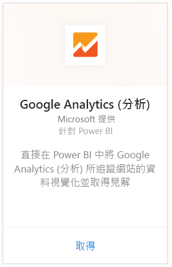
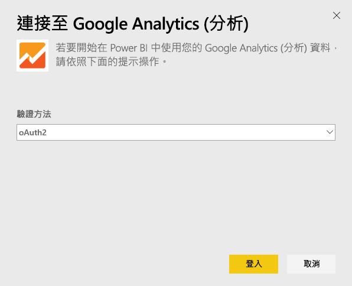
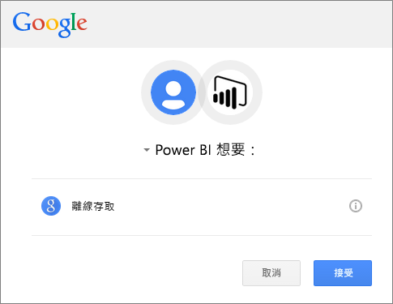
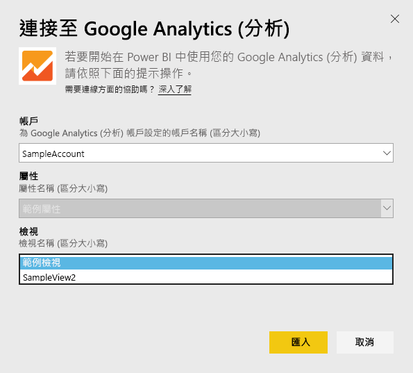
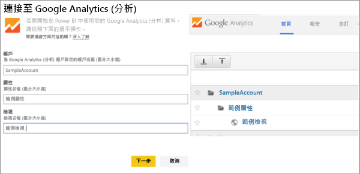

# 使用 Power BI 連接到 Google Analytics (分析)
透過 Power BI 連接到 Google Analytics 時，一開始會連接到您的 Google Analytics 帳戶。 您會看到 Power BI 儀表板和一組 Power BI 報表，供您深入了解網站流量和使用者維度。 您可以與儀表板和報表互動，但無法儲存變更。 資料會自動每天重新整理一次。

連線到 Power BI 的 [Google Analytics](https://app.powerbi.com/getdata/services/google-analytics)。 深入了解 [Google Analytics 與 Power BI 的整合](https://powerbi.microsoft.com/integrations/google-analytics)。

您可以在 Power BI Desktop 中從 [Google Analytics 連接器](service-google-analytics-connector.md)開始，建立自訂儀表板和報表。 只需連線到 Google Analytics 帳戶，並建立可發行到 Power BI 服務的自訂報表。

## 如何連接
[!INCLUDE [powerbi-service-apps-get-more-apps](./includes/powerbi-service-apps-get-more-apps.md)]

1. 選取 [Google Analytics (分析)] \> [取得]。
   
   
2. 出現提示時，請輸入您的 Google Analytics 認證。 選取 [oAuth 2]  做為驗證機制，然後按一下 [登入] 。 請遵循 Google 驗證流程，如果您已經設定，其中可能包含雙因素驗證。
   
   
3. 按一下 [接受]  允許 Power BI 存取 Google Analytics 資料。
   
   
4. Power BI 會連線到特定的 Google Analytics 檢視。 請選取帳戶名稱、屬性名稱和您想要連接的檢視名稱。 這項資訊可在您的 Google Analytics 帳戶中找到，位於左上方或在 [首頁]  索引標籤上。請參閱下列詳細資料。 
   
   
5. 按一下 [連接]  開始匯入程序。 

## 檢視 Google Analytics 儀表板和報表
[!INCLUDE [powerbi-service-apps-open-app](./includes/powerbi-service-apps-open-app.md)]

      

[!INCLUDE [powerbi-service-apps-open-app](./includes/powerbi-service-apps-what-now.md)]

## 系統需求
若要從 Power BI 連線，您必須先有 [Google Analytics](https://www.google.com/analytics/) 帳戶。 其他未與 Google Analytics (分析) 帳戶連接的 Google 帳戶會看到驗證錯誤。

## 疑難排解
**認證**：如果您有多個 Google 帳戶，請在連接期間使用 incognito 或私用瀏覽器視窗，以確保使用正確的帳戶。

如果您收到錯誤指出認證無效，但您仍可登入 Google，請確認您是否具有 [Google Analytics (分析)](https://www.google.com/analytics/) 帳戶。

**參數**：目前參數需要唯一的名稱。 如果您看到錯誤，指出您選取的值重複，請選取另一個值，或變更 Google Analytics (分析) 中的名稱使其成為唯一。 我們正積極改善此問題。

>[!NOTE]
>參數會區分大小寫。 請準確輸入出現在您 Google Analytics 帳戶中的參數。

仍然有問題嗎？ 請開啟支援票證，連絡 Power BI 小組：

* 請在 Power BI 應用程式中選取問號 \> [連絡支援人員]。
* 從 Power BI 支援網站 (也就是您正在閱讀本文的位置) 中，選取頁面右側的 [連絡支援人員]  。

## 後續步驟
* [Power BI 中的應用程式是什麼？](service-install-use-apps.md)
* [取得 Power BI 中的資料](service-get-data.md)
* 有其他問題嗎？ [嘗試在 Power BI 社群提問](http://community.powerbi.com/)

