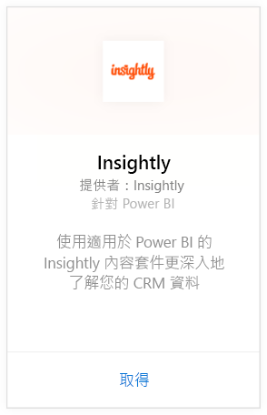
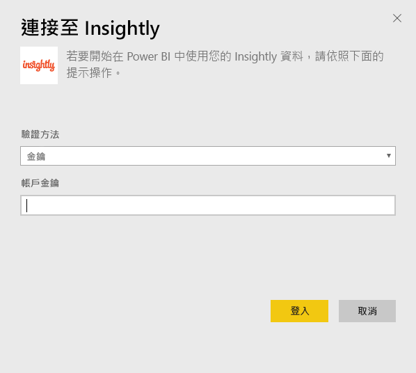
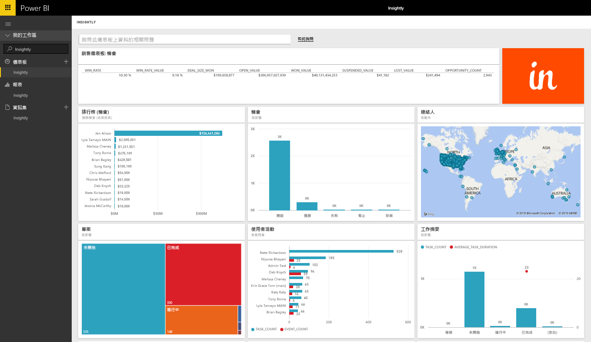
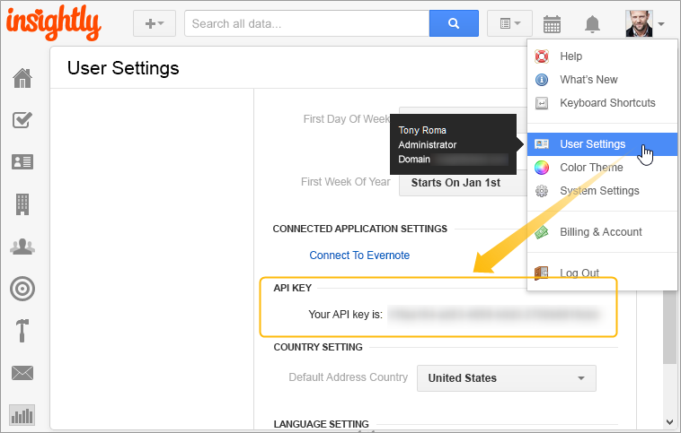

# 使用 Power BI 連接到 Insightly
使用 Insightly 內容套件在 Power BI 中視覺化和共用 Insightly CRM 資料。 使用 Insightly API 金鑰連接到 Power BI，檢視及建立使用 CRM 資料的報表和儀表板。 透過 Power BI，您可以新方式分析資料、建立功能強大的圖形和圖表，並在地圖上顯示連絡人、潛在客戶和組織。

連接到適用於 Power BI 的 [Insightly 內容套件](https://app.powerbi.com/getdata/services/insightly)。

## 如何連接
1. 選取左側瀏覽窗格底部的 [取得資料]  。
   
   
2. 在 [服務]  方塊中，選取 [取得] 。
   
   
3. 選取 [Insightly] \> [取得]。
   
   
4. 驗證類型選取 [金鑰]  並提供 Insight API 金鑰，然後選取 [登入] 。 如需詳細資訊，請參閱下文的[尋找這個](#FindingParams)。
   
   
5. 一經核准，匯入程序會自動開始。 完成時，新的儀表板、報表和模型會出現在瀏覽窗格中。 選取儀表板以檢視匯入的資料。
   
     

**接下來呢？**

* 請嘗試在儀表板頂端的[問與答方塊中提問](power-bi-q-and-a.md)
* [變更儀表板中的圖格](service-dashboard-edit-tile.md)。
* [選取圖格](service-dashboard-tiles.md)，開啟基礎報表。
* 雖然資料集排程為每天重新整理，但是您可以變更重新整理排程，或使用 [立即重新整理] 視需要嘗試重新整理

## 包含的內容
內容套件包含下列資料表，其中的欄位來自於對應的記錄：

| 資料表 |  |  |  |
| --- | --- | --- | --- |
| 連絡人 |商機 |銷售管線階段 |工作完成日期 |
| 自訂欄位 |商機成交日期 |專案完成日期 |工作 |
| 事件 |商機預測日期 |專案 |小組/成員 |
| Leads |組織 |標記 |使用者 |

許多資料表與報表還包含唯一的導出欄位，例如︰  

* 「已分組」商機預測成交日期、商機實際成交日期、專案完成日期及工作完成日期的資料表，可依月、季或年進行分析。  
* 商機的加權值欄位 (商機價值 * 成交機率)。  
* 工作的平均及總持續時間，以開始與完成日期來計算。  
* 具有商機成交率 (成交計數/總商機數) 與成交率價值 (成交價值/總商機價值) 之導出欄位的報表。  

## 系統需求
需有 Insightly API 存取權限的 Insightly 帳戶。 可見度權限以建立 Power BI 連線所用的 API 金鑰為基礎。 您能看到的所有 Insightly 記錄，也會顯示在您與其他人共用的 Power BI 報表和儀表板中。

## 尋找參數
**API 金鑰**

若要從 Insightly 複製 API 金鑰，請選取 Insightly [設定檔] 功能表的 [使用者設定] 並向下捲動。 您的資料會使用這個字元字串連接至 Power BI。

## 疑難排解
您的資料會透過 Insightly API 匯入，其中包含以 Insightly 訂閱方案層級為基礎的每日限制。 這些限制列於 API 文件的＜速率限制/節流要求＞一節： https://api.insight.ly/v2.2/Help#!/Overview/Introduction#ratelimit

提供的報表會使用 Insightly 的預設欄位，可能不含自訂項目。 編輯報表以檢視所有可用欄位。

## 後續步驟
[開始使用 Power BI](service-get-started.md)

[取得 Power BI 中的資料](service-get-data.md)

