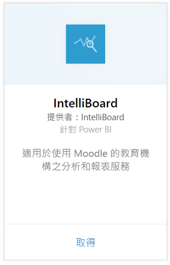
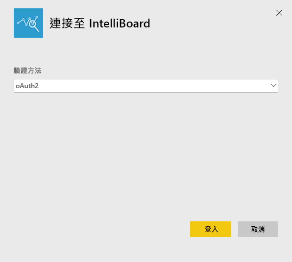
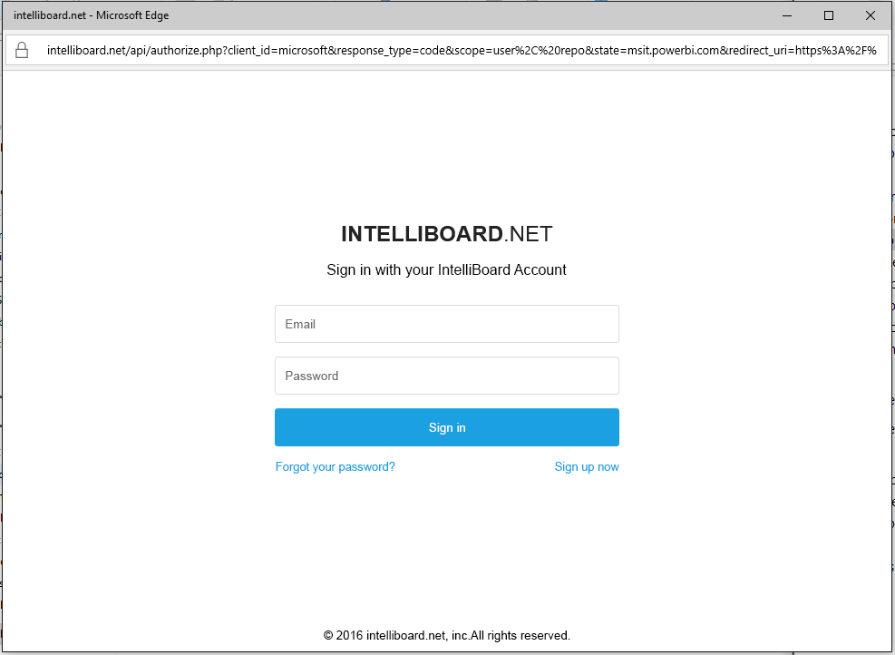
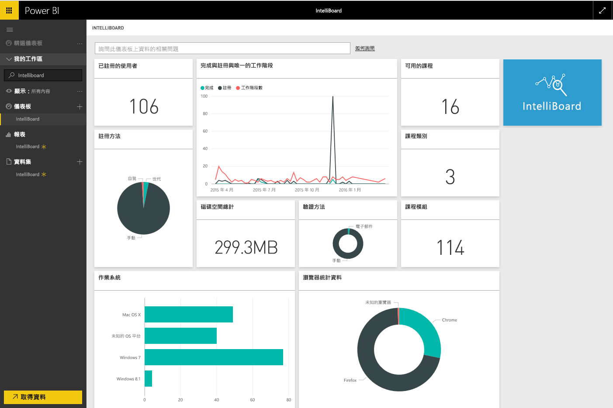

# 使用 Power BI 連接到 IntelliBoard
IntelliBoard 透過 Reporting Services 簡化對 Moodle 學習管理系統的存取。 Power BI 的 IntelliBoard 內容套件提供額外的分析，包括您的課程、註冊的使用者、整體績效和 LMS 活動的度量。

連接到 Power BI 的 [IntelliBoard 內容套件](https://app.powerbi.com/getdata/services/intelliboard)。

## 如何連接
1. 選取左側瀏覽窗格底部的 [取得資料]  。  
   
    
2. 在 [服務]  方塊中，選取 [取得] 。  
   
    
3. 選取 [IntelliBoard]，然後選取 [取得]。  
   
    
4. 選取 [OAuth 2]，然後 [登入]。 出現提示時，提供您的 IntelliBoard 認證。
   
    
   
    
5. 連接後，會自動載入儀表板、報表和資料集。 完成時，圖格會更新為您 IntelliBoard 帳戶中的資料。
   
    

**接下來呢？**

* 請嘗試在儀表板頂端的[問與答方塊中提問](power-bi-q-and-a.md)
* [變更儀表板中的圖格](service-dashboard-edit-tile.md)。
* [選取圖格](service-dashboard-tiles.md)，開啟基礎報表。
* 雖然資料集排程為每天重新整理，但是您可以變更重新整理排程，或使用 [立即重新整理] 視需要嘗試重新整理

## 包含的內容
此內容套件包含下列資料表中的資料：  

    - 活動  
    - Agents  
    - Auth  
    - 國家/地區  
    - CoursesProgress  
    - Enrollments
    - Lang  
    - Platform  
    - Totals  
    - UsersProgress    

## 系統需求
需要有具備上述資料表權限的 IntelliBoard 帳戶，才能具現化此內容套件。

## 後續步驟
[開始使用 Power BI](service-get-started.md)

[Power BI - 基本概念](service-basic-concepts.md)

