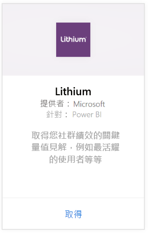
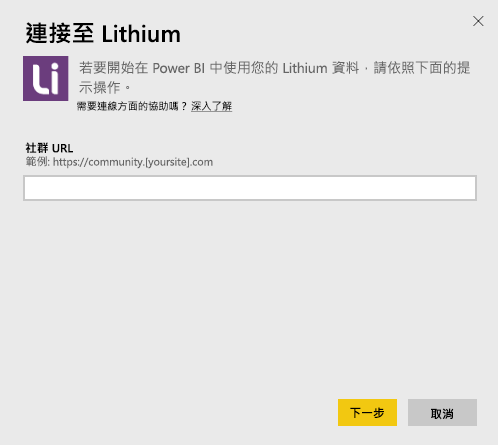
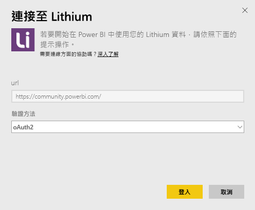
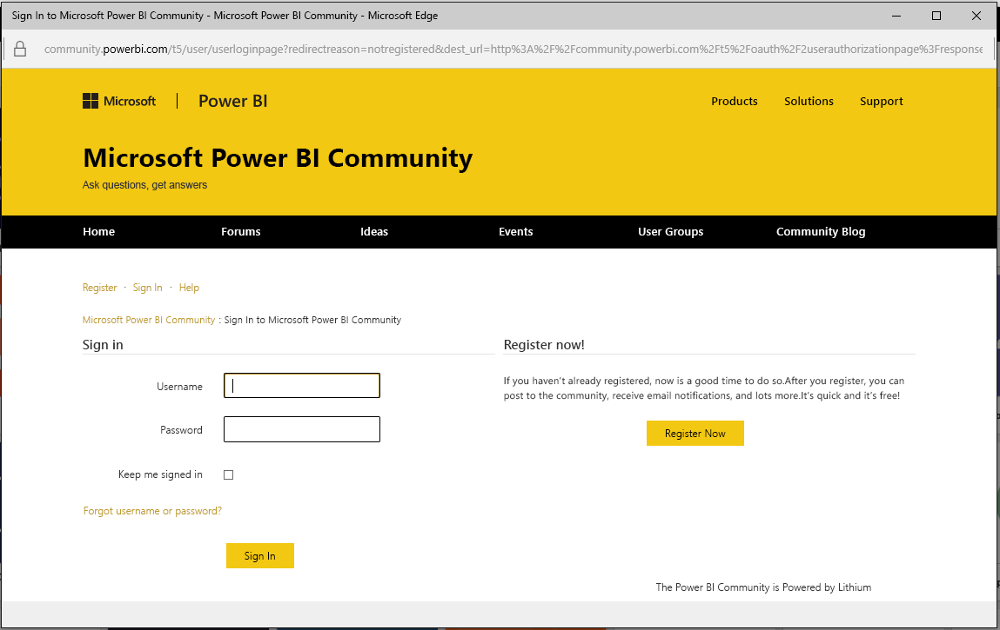
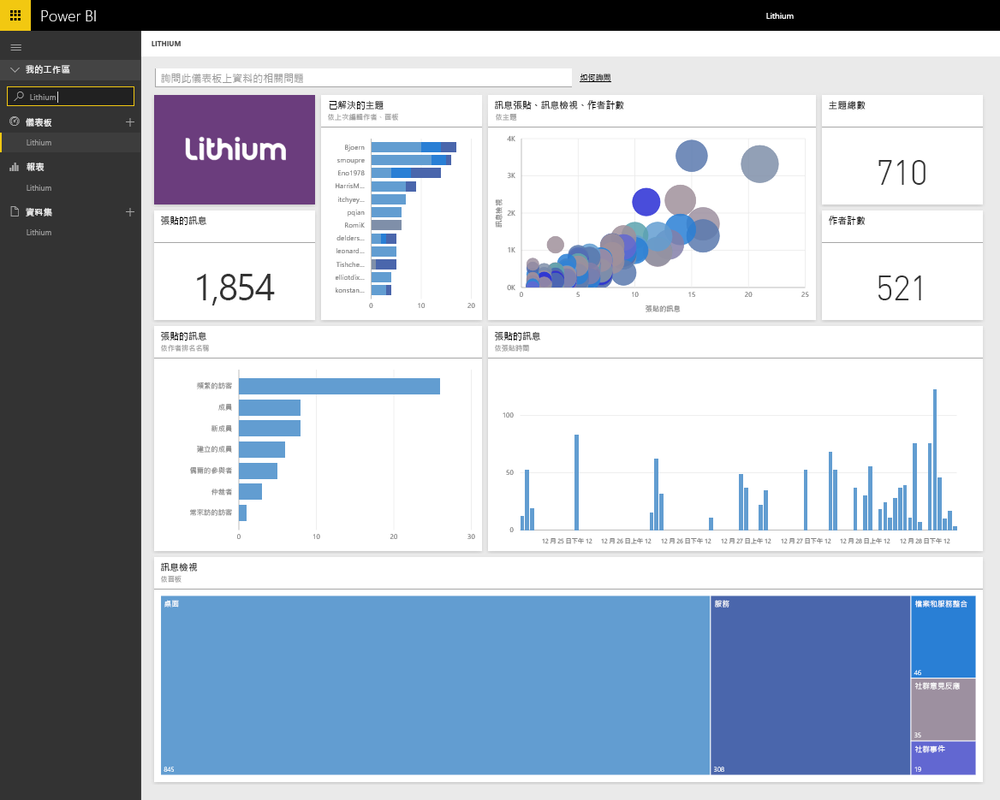

# 使用 Power BI 連接到 Lithium
Lithium 搭起世界最佳品牌與客戶之間的信任關係，協助大眾取得解答並分享使用經驗。 透過連接 Lithium 內容套件與 Power BI，您便可以測量線上社群的關鍵計量，進而協助提升銷售量、降低服務成本並提高忠誠度。 

連接到適用於 Power BI 的 [Lithium 內容套件](https://app.powerbi.com/getdata/services/lithium)。

>[!NOTE]
>Power BI 內容套件會使用 Lithium API。 過多的 API 呼叫可能會造成 Lithium 的額外費用，請與 Lithium 系統管理員確認。

## 如何連接
1. 選取左側瀏覽窗格底部的 [取得資料]  。
   
    
2. 在 [服務]  方塊中，選取 [取得] 。
   
    
3. 選取 [Lithium] \> [取得]。
   
   
4. 提供 Lithium 社群的 URL。 其格式為 *https://community.yoursite.com*。
   
   
5. 出現提示時，輸入您的 Lithium 認證。 選取 **oAuth 2** 作為驗證機制，然後按一下 [登入]  ，並遵循 Lithium 驗證流程。
   
   
   
   
6. 一旦完成登入流程就會開始匯入程序。 完成時，新的儀表板、報表和模型會出現在瀏覽窗格中。 選取儀表板以檢視匯入的資料。
   
    

**接下來呢？**

* 請嘗試在儀表板頂端的[問與答方塊中提問](consumer/end-user-q-and-a.md)
* [變更儀表板中的圖格](service-dashboard-edit-tile.md)。
* [選取圖格](consumer/end-user-tiles.md)，開啟基礎報表。
* 雖然資料集排程為每天重新整理，但是您可以變更重新整理排程，或使用 [立即重新整理] 視需要嘗試重新整理

## 系統需求
Lithium 內容套件需要 Lithium community v15.9 或更新版本。 請與 Lithium 系統管理員確認。

## 後續步驟
[Power BI 是什麼？](power-bi-overview.md)

[Power BI - 基本概念](consumer/end-user-basic-concepts.md)

