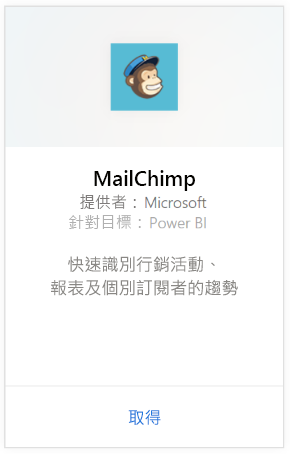
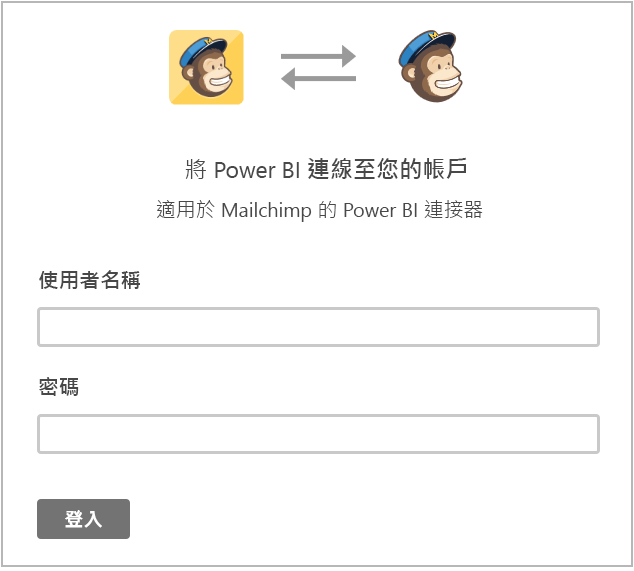
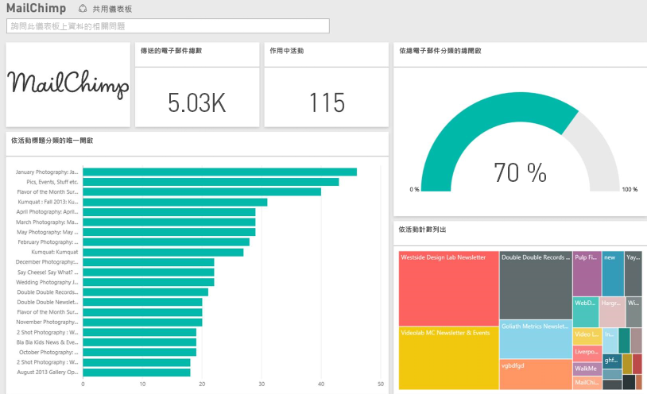

# 使用 Power BI 連接到 MailChimp
Power BI 內容套件會從 MailChimp 帳戶提取資料，並產生儀表板、一組報表與資料集，可讓您瀏覽資料。 提取分析以建立 [MailChimp 儀表板](https://powerbi.microsoft.com/integrations/mailchimp)，並快速識別行銷活動、報表及個別訂閱者的趨勢。 資料會設定為每天重新整理，確保您所監視的資料為最新狀態。

連接到適用於 Power BI 的 [MailChimp 內容套件](https://app.powerbi.com/getdata/services/mailchimp)。

## 如何連接
1. 選取左側瀏覽窗格底部的 [取得資料]  。
   
    
2. 在 [服務]  方塊中，選取 [取得] 。
   
   
3. 選取 [MailChimp] \> [取得]。
   
   
4. 針對 [驗證方法] 選取 [oAuth2] \> [登入]。
   
    出現提示時，輸入 MailChimp 認證，並遵循驗證程序。
   
    第一次連接時，會提示您允許 Power BI 唯讀存取您的帳戶。 選取 [允許]  ，開始匯入程序，可能需要幾分鐘的時間，視您帳戶的資料量而定。
   
    
5. Power BI 匯入資料之後，您會在左側瀏覽窗格中看到新的儀表板、報表和資料集。 這是 Power BI 建立的預設儀表板，可顯示您的資料。 您可以修改此儀表板，以您想要的任何方式來顯示資料。
   
   

**接下來呢？**

* 請嘗試在儀表板頂端的[問與答方塊中提問](consumer/end-user-q-and-a.md)
* [變更儀表板中的圖格](service-dashboard-edit-tile.md)。
* [選取圖格](consumer/end-user-tiles.md)，開啟基礎報表。
* 雖然資料集排程為每天重新整理，但是您可以變更重新整理排程，或使用 [立即重新整理] 視需要嘗試重新整理

## 後續步驟
[Power BI 是什麼？](power-bi-overview.md)

[Power BI - 基本概念](consumer/end-user-basic-concepts.md)

