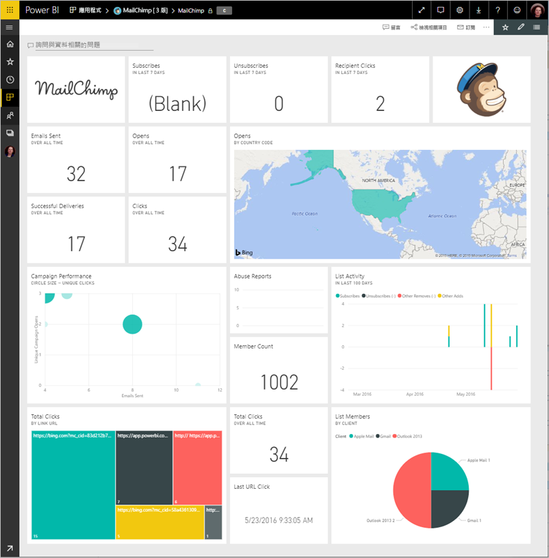
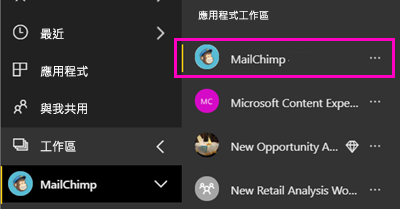
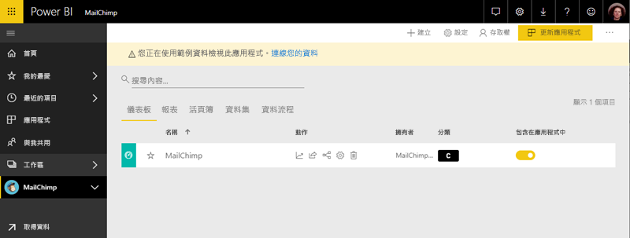

# 使用 Power BI 連接到 MailChimp
這篇文章會引導您提取您的資料，從您的 MailChimp 帳戶與 Power BI 範本應用程式。 範本應用程式會產生儀表板、 一組報表，與資料集，以便讓您瀏覽您的 MailChimp 資料的工作區。 提取分析以建立 [MailChimp 儀表板](https://powerbi.microsoft.com/integrations/mailchimp)，並快速識別行銷活動、報表及個別訂閱者的趨勢。 資料重新整理的每日，確保您要監視的資料最新狀態。

您已安裝的範本應用程式之後，您可以變更儀表板和報表。 然後您可以將它散發為應用程式給同事您組織中。

連接到[MailChimp 範本應用程式](https://app.powerbi.com/getdata/services/mailchimp)適用於 Power BI。

## 如何連接

[!INCLUDE [powerbi-service-apps-get-more-apps](./includes/powerbi-service-apps-get-more-apps.md)]

3. 選取  **MailChimp** \> **立即取得**。
4. 在 **安裝此 Power BI 應用程式嗎？** 選取**安裝**。
4. 在 **應用程式**窗格中，選取**MailChimp**圖格。

    

6. 在 **開始使用新的應用程式**，選取**將資料連接**。

    

1. 針對 [驗證方法] 選取 [oAuth2]  \> [登入]  。
   
    出現提示時，輸入 MailChimp 認證，並遵循驗證程序。
   
    第一次連接時，Power BI 會提示您允許唯讀存取您的帳戶。 選取 [允許]  開始匯入程序。 可能需要幾分鐘的時間，您的帳戶中的資料量而定。
   
    

5. Power BI 匯入資料之後，會開啟 MailChimp 儀表板。
   
    

## 修改並散發應用程式

您已安裝 MailChimp 範本應用程式。 也就是說，您也建立了 MailChimp 應用程式工作區。 在工作區中，您可以變更報表和儀表板，並再將它做為散發*應用程式*給組織中的同事。 

1. 若要檢視新的 MailChimp 工作區中的所有內容，在左側的導覽列中，選取**工作區** > **MailChimp**。 

    

    此檢視位於工作區的內容清單。 在右上角中，您會看到**更新應用程式**。 當您準備好應用程式散發給您的同事時，這是您將開始的地方。

    

2. 選取 **報表**並**資料集**若要查看工作區中的其他項目。 

    了解[將應用程式散發](service-create-distribute-apps.md)向您的同事。

## 後續步驟

* [在 Power BI 中建立新的工作區](service-create-the-new-workspaces.md)
* [在 Power BI 中安裝和使用應用程式](consumer/end-user-apps.md)
* [外部服務的 Power BI 應用程式](service-connect-to-services.md)
* 有問題嗎？ [嘗試在 Power BI 社群提問](http://community.powerbi.com/)

