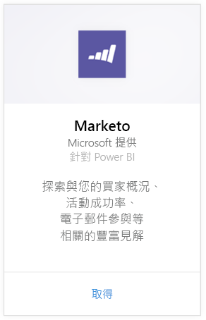
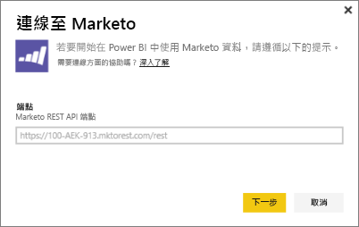
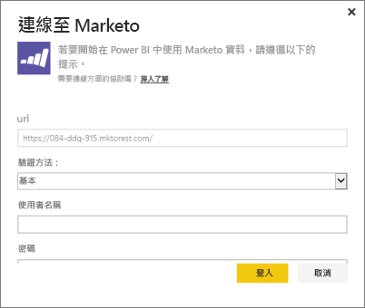
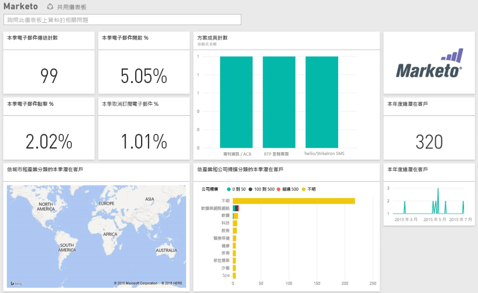

# 使用 Power BI 連接到 Marketo
適用於 Marketo 的 Power BI 內容套件，可讓您深入了解您的 Marketo 帳戶有關潛在客戶和其活動的資料。建立此連接時可擷取您的資料，並自動依據該資料提供儀表板和相關報表。

連接到 Power BI 的 [Marketo 內容套件](https://app.powerbi.com/getdata/services/marketo)。

## 如何連接
1. 選取左側瀏覽窗格底部的 [取得資料]  。
   
   
2. 在 [服務]  方塊中，選取 [取得] 。
   
    
3. 選取 [Marketo] \>[取得]。
   
   
4. 輸入 Marketo 或您 Marketo 系統管理員提供給您的 Marketo REST 端點，然後選取 [下一步]。
   
   
   
   深入閱讀 Marketo REST 端點：[ http://developers.marketo.com/documentation/rest/endpoint-url/ ](http://developers.marketo.com/documentation/rest/endpoint-url/)。
5. 使用 [基本]  驗證方法時，請輸入用戶端 ID 做為 **使用者名稱** 和用戶端密碼做為 **密碼**。 Marketo 中提供用戶端識別碼與用戶端密碼，或是可從您的 marketo 系統管理員 ([http://developers.marketo.com/documentation/rest/custom-service/](http://developers.marketo.com/documentation/rest/custom-service/)) 取得。 
   
   
   
   這可讓「Power BI 的 Marketo」內容套件存取 [Marketo 分析](https://powerbi.microsoft.com/integrations/marketo)資料，並可讓您分析 Power BI 中的資料。 資料會每天重新整理一次。
6. 一旦連接到 Marketo 帳戶，會載入儀表板與您的所有資料：
   
   

**接下來呢？**

* 請嘗試在儀表板頂端的[問與答方塊中提問](power-bi-q-and-a.md)
* [變更儀表板中的圖格](service-dashboard-edit-tile.md)。
* [選取圖格](service-dashboard-tiles.md)，開啟基礎報表。
* 雖然資料集排程為每天重新整理，但是您可以變更重新整理排程，或使用 [立即重新整理] 視需要嘗試重新整理

## 包含的內容
下列資料可在 Power BI 從 Marketo 活動取得，其中的活動發生時間介於今天與一年前之間：

| 資料表名稱 | 描述 |
| --- | --- |
| EmailActivities |傳送給潛在客戶/連絡人的電子郵件相關資料，其中包含裝置、類別、退回計數和百分比、點擊計數和百分比、已開啟的計數和百分比，以及程式名稱的資料。 Power BI 中所示之電子郵件活動是絕對的電子郵件傳遞能力報表，不會套用任何其他邏輯到此資料。 因此，您可能會看到 Marketo 用戶端和 Power BI 之間有一些不同的結果。 |
| ProgramActivites |狀態有所變更的程式資料。 這包含詳細資料，例如：原因、成功、程式擷取計數和百分比，以及程式成功計數和百分比。 |
| WebPageActivities |使用者造訪網頁的資料，包括搜尋代理程式、使用者代理程式、網頁和小時。 |
| Datetable |介於今天和過去一年間的日期。  可讓您依日期分析 Marketo 資料。 |
| Leads |潛在客戶資訊，例如公司、營收大小、員工數目、國家/地區、產業、潛在客戶分數和潛在客戶狀態。 會根據電子郵件、程式及網頁活動資料中的目前狀態擷取潛在客戶。 |

所有日期都為 UTC 格式。 根據您的帳戶所在時區，日期可能不同 (和 Marketo 用戶端中看到的類似)

## 系統需求
* 您用來連接的 Marketo 帳戶具有存取潛在客戶和活動的權限。
* 有足夠的 API 呼叫可以連接到資料。  Marketo 有每個帳戶的 API。  當達到限制時，您無法將資料載入至 Power BI。 

**API 限制詳細資料**

從 Marketo 匯入資料時會使用 Marketo API。 Marketo 的每一位客戶每天 API 呼叫總數上限為 10,000，可在所有使用 Marketo API 的應用程式之間共用。 您可以使用 API 進行其他整合以及 Power BI 整合。 如需 API 的詳細資訊，請參閱：<http://developers.marketo.com/documentation/rest/>。

Power BI 對 Marketo 進行之 API 呼叫的數量取決於 Marketo 帳戶中的資料數量。 Power BI 匯入近一年來所有潛在客戶和活動。 以下是 Marketo 資料的範例和 Power BI 在匯入時所使用的 API 呼叫的數量：  

| 資料類型 | 資料列數目 | API 呼叫 |
| --- | --- | --- |
| 潛在客戶資訊 |15,000 |50 |
| 郵件活動 |150,000 |1,000 |
| 程式活動 |15,000 |100 |
| 網頁活動 |150,000 |1,000 |
| 程式變更 |7,500 |50 |
| **總 API 呼叫** | |**2,200** |

## 後續步驟
[開始使用 Power BI](service-get-started.md)

[取得 Power BI 的資料](service-get-data.md)

[Power BI 部落格：使用 Power BI 監視及分析 Marketo 資料](http://blogs.msdn.com/b/powerbi/archive/2015/03/19/monitor-and-analyze-your-marketo-data-with-power-bi.aspx)

