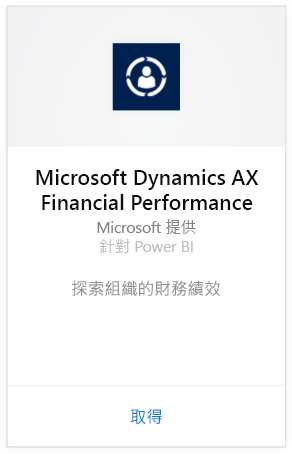
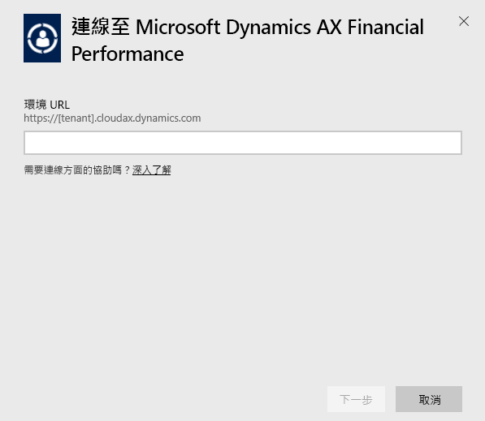
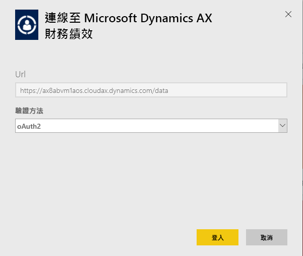
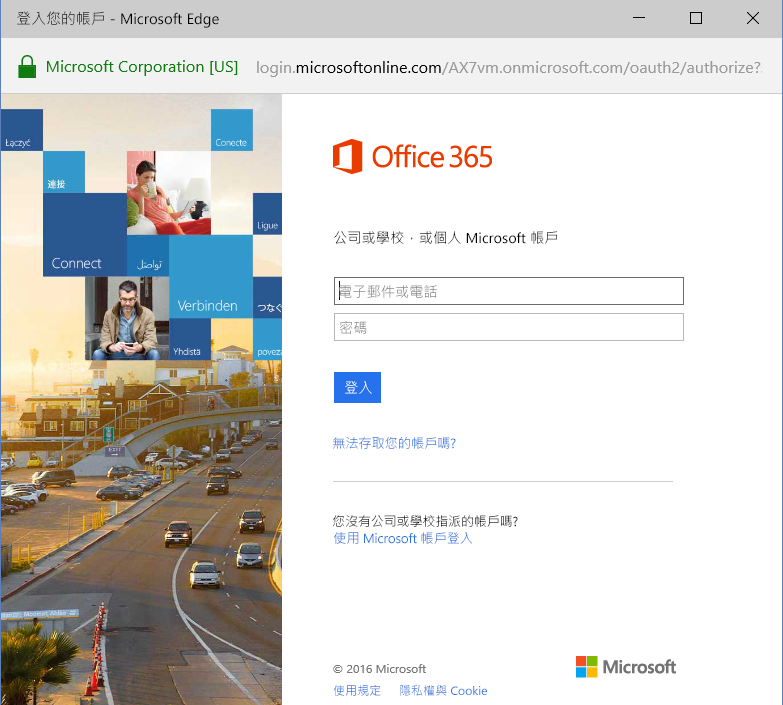
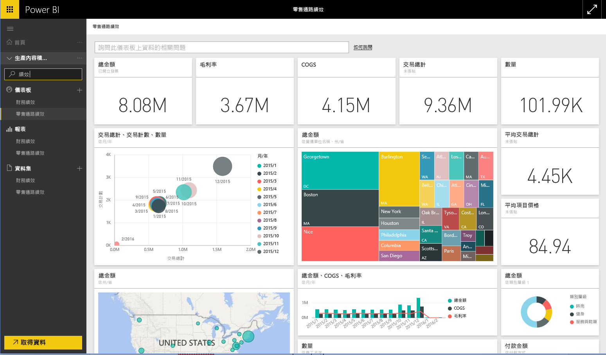

# 使用 Power BI 連接到 Microsoft Dynamics AX 內容套件
Microsoft Dynamics AX 有三種針對不同商務使用者的 Power BI 內容套件。 專為 CFO 所設計的財務績效內容套件，可存取組織財務績效的深入資訊。 零售通路績效內容套件針對注重銷售績效的通路管理員，直接繪製零售與商務資料，以預測趨勢和探索深入資訊。 成本管理是專為 COO 和 CFO 所設計，並提供作業效能的詳細資料。

連接到 Power BI 的 Microsoft Dynamics AX [零售通路績效](https://app.powerbi.com/getdata/services/dynamics-ax-retail-channel-performance)、[財務績效](https://app.powerbi.com/getdata/services/dynamics-ax-financial-performance)或[成本管理](https://app.powerbi.com/getdata/services/dynamics-ax-cost-management)內容套件。

## 如何連接
1. 選取左側瀏覽窗格底部的 [取得資料]  。
   
   
2. 在 [服務]  方塊中，選取 [取得] 。
   
   
3. 選取其中一個 Dynamics AX 內容套件，然後選擇 [取得]。
   
   
4. 指定 Dynamics AX 7 環境的 URL。 請參閱以下關於[尋找這些參數](#FindingParams)的詳細資訊。
   
   
5. 針對 [驗證方法] 選取 [oAuth2] \> [登入]。 出現提示時，請輸入 Dynamics AX 認證。
   
    
   
    
6. 一經核准，匯入程序會自動開始。 完成時，新的儀表板、報表和模型會出現在瀏覽窗格中。 選取儀表板以檢視匯入的資料。
   
     

**接下來呢？**

* 請嘗試在儀表板頂端的[問與答方塊中提問](power-bi-q-and-a.md)
* [變更儀表板中的圖格](service-dashboard-edit-tile.md)。
* [選取圖格](service-dashboard-tiles.md)，開啟基礎報表。
* 雖然資料集排程為每天重新整理，但是您可以變更重新整理排程，或使用 [立即重新整理] 視需要嘗試重新整理

## 包含的內容
此內容套件使用 Dynamics AX 7 OData 摘要，分別匯入零售通路、財務績效和成本管理的相關資料。

## 系統需求
此內容套件需要 Dynamics AX 7 環境 URL，而且使用者應該要能夠存取 OData 摘要。

## 尋找參數

當使用者登入時，Dynamics AX 7 環境 URL 位於瀏覽器內。 只要將根 Dynamics AX 環境的 URL 複製到 Power BI 對話方塊即可。

## 疑難排解
視執行個體的大小而定，資料可能需要一些時間來載入。 如果您看見 Power BI 中有空白報表，請確認您可存取報表所需的 OData 資料表。

## 後續步驟
[開始使用 Power BI](service-get-started.md)

[取得 Power BI 中的資料](service-get-data.md)

