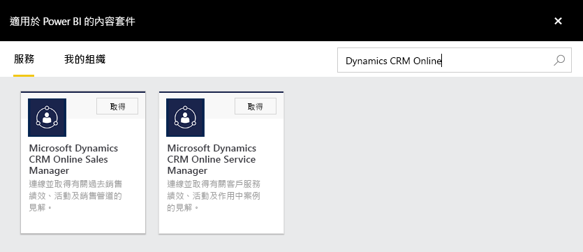
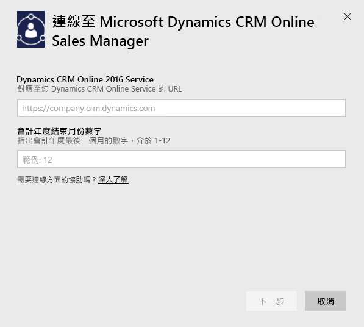
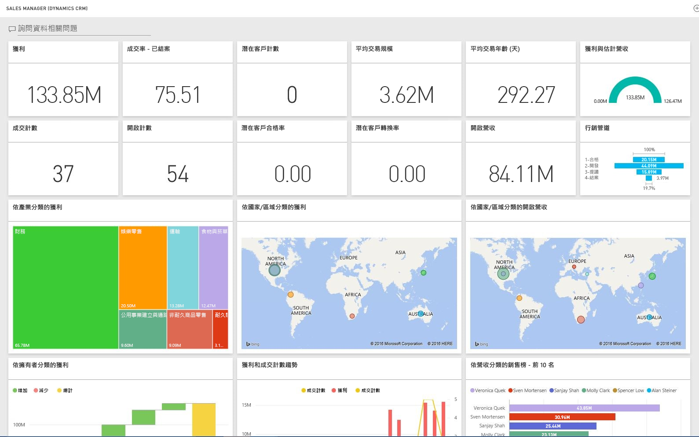

# 使用 Power BI 連接到 Microsoft Dynamics CRM
Microsoft Dynamics CRM Online for Power BI可讓您輕鬆存取並分析資料。 Power BI 使用 OData 摘要建立描述性模型，包括所有必要的實體及量值，例如帳戶、活動、機會、產品、潛在客戶、使用者和其他資料。 安裝應用程式之後，即可在 Power BI 服務 ([https://powerbi.com](https://powerbi.com)) 及 Power BI 行動應用程式中，檢視儀表板與報表。 

連線至 Dynamics CRM Online [銷售經理](https://msit.powerbi.com/groups/me/getdata/services/dynamics-crm-sales-manager)或[服務管理員](https://msit.powerbi.com/groups/me/getdata/services/dynamics-crm-customer-service)。 深入了解 [Dynamics CRM Online 與 Power BI 的整合](https://powerbi.microsoft.com/integrations/microsoft-dynamicscrm)。

此連線需要 **Microsoft Dynamics CRM Online 2016 或更新版本**。 下方有[需求](#Requirements)的詳細資訊。

## 如何連接
[!INCLUDE [powerbi-service-apps-get-more-apps](./includes/powerbi-service-apps-get-more-apps.md)]

1. 選取 [Microsoft Dynamics CRM 銷售經理] 或 [Microsoft Dynamics CRM 服務經理]，並按一下 [連接]。
   
   
2. 提供與您帳戶相關聯的服務 URL。  這會位於表單 `https://company.crm.dynamics.com` 中，請參閱[下方](#FindingParams)的詳細資料。
   
   
3. 出現提示時，請提供您的認證 (如果您已經登入瀏覽器，此步驟可能會略過)。 針對 [驗證方法]，請輸入 **oAuth2** 並按一下 [登入] ：
   
   
4. 連接之後，您會看到針對銷售經理或服務經理所自訂的儀表板且已填入您的資料：
   
   

## 檢視 Microsoft Dynamics CRM 儀表板和報表
[!INCLUDE [powerbi-service-apps-open-app](./includes/powerbi-service-apps-open-app.md)]

[!INCLUDE [powerbi-service-apps-open-app](./includes/powerbi-service-apps-what-now.md)]

## 包含的內容
以下各節會詳細說明[銷售經理](#Sales)和[服務管理員](#Service)人物所包含的內容。

請注意，根據指派給 Dynamics CRM Online 使用者的安全性角色，資料也受到限制。

儀表板和報表旨在提供聚焦於小組或群組近期資料的作業報告。 每項查詢都限制為最多從 Dynamics CRM Online 擷取 100K 筆記錄。 如因貴組織的資料量龐大而超過此限制，佈建會失敗，因為資料重新整理 Dynamics CRM online 會終止。 如果您的帳戶太大，請考慮透過 Power BI Desktop 連接，以建置自訂解決方案。

### 銷售經理
儀表板和報表包含重要度量，例如：  

* 獲利   
* 成交率   
* 公開收入   
* 虧損   
* 預期收入  
* 平均交易規模等。  

它們也包含重要圖表，例如︰  

* 獲利和虧損趨勢、獲利和估計營收趨勢  
* 產業、地區、範圍等各層面的獲利   
* 收入、活動銷售榜   
* 科目金榜、成交/不成交金榜    
* 新的潛在客戶趨勢、準銷售案源等等。   

這些度量和圖表有助於了解銷售組織效能，以及分析整個業務團隊的準銷售案源。

下表列出此服務中可用的 CRM 實體，並提供每筆實體記錄所套用的篩選詳細資料。

| CRM 實體 | 套用的篩選 |
| --- | --- |
| Account |與過去 365 天內修改過相關商機的所有科目。 |
| 活動 |過去 90 天內修改過的所有活動   [modifiedon] > today - 90 days |
| 業務單位 |未停用的所有業務單位   [isdisabled] = false |
| 潛在客戶 |過去 180 天內修改過的所有潛在客戶   [modifiedon] > today - 180 days |
| 商機 |過去 365 天內修改過的所有商機   [modifiedon] > today - 365 days |
| 商機產品 |過去 365 天內修改過的所有商機產品   [modifiedon] > today - 365 days |
| Product |所有使用中的產品   [statecode] <> 1 |
| 領域 |所有領域 |
| 使用者 |所有作用中使用者和非委派系統管理員    [isdisabled] = false and [accessmode] <> 4 |

### 服務管理員
這些儀表板和報表包含重要度量，例如：  

* CSAT 百分比   
* 符合 SLA 百分比   
* 上報案件百分比   
* 平均處理時間   
* 已解決案件總數  
* 處理中案件總數  
* 案例的知識文章使用次數等。    

它們也包含重要圖表，例如︰   

* 待處理案件、已解決案件、上報案件的案件量趨勢   
* 各層面的案件量 (如來源、位置、優先順序、類型)  
* CSAT 百分比、符合 SLA 百分比、活動、已解決案件的排行榜  
* 最常使用和最常檢視的知識文章等。  
   這些度量和圖表有助於了解您的支援組織效能，並分析整個服務團隊和服務佇列的處理中案件工作負載。

下表列出此服務可用的 CRM 實體，以及每筆實體記錄所套用的篩選詳細資料。

| CRM 實體 | 套用的篩選 |
| --- | --- |
| Account |與過去 90 天內修改過的案件有關聯的所有科目。 |
| 活動 |過去 90 天內修改過的所有活動   [modifiedon] > today - 90 days |
| 案件 |過去 90 天內修改過的所有案件   [modifiedon] > today - 90 days |
| 結案活動 |過去 90 天內修改過的所有結案活動   [modifiedon] > today - 90 days |
| 連絡 |與過去 90 天內修改過的案件有關聯的所有連絡人。 |
| 知識文章 |所有最新版本的知識文章    [islatestversion] = true |
| 知識文章事件 |過去 90 天內修改過的所有知識文章事件   [modifiedon] > today - 90 days |
| 佇列 |所有使用中佇列    [statecode] = 0 |
| 佇列項目 |過去 365 天建立的所有案件相關佇列項目    [createdon] > today - 365 days and   [objecttypecode] = 112 |
| 使用者 |所有使用中使用者    [isdisabled] = false |

## 系統需求
* 有效的 Dynamics CRM Online 2016 或更新版的執行個體 (Power BI 不適用於內部部署 CRM 版本)。 如果沒有 2016 或更新版本：
* 系統管理員必須啟用站台設定中的 OData 端點。
* 在任何資料表中具有少於 100k 記錄的帳戶。 請注意，如果帳戶存取超過 100k 記錄，匯入將會失敗。

## 尋找參數
執行個體的位址位於瀏覽器的 URL 列。 其格式通常為：`https://[instance_name].crm.dynamics.com`。

Power BI 只支援 Dynamics CRM 2016 端點。 連線不適用於舊版的 CRM Online。 請使用 Power BI Desktop 直接連線到您的帳戶。

## 疑難排解
如果在連線時遇到問題，請確認︰  

* 提供了正確的執行個體 URL (請與系統管理員確認)  
* 執行個體為 CRM Online 2016  
* OData 端點已啟用  

此外，請再次在 Power BI Desktop 中嘗試直接連線，使用 OData URL `https://[instance_name].crm.dynamics.com/api/data/v8.0/`。

如果您確認您有 Dynamics CRM Online 2016，不過仍然發生連線問題，請連絡您的 CRM 系統管理員，確認您擁有所有可用的更新。

如果沒有 CRM Online 2016 或更新版本，請使用 Power BI Desktop 直接連線到您的帳戶。

如果您看到錯誤「資料重新整理失敗，因為查詢超過 100000 筆記錄上限。」，請考慮直接從 Power BI Desktop 連線，或利用 CRM 方案範本。

## 後續步驟
* [Power BI 中的應用程式是什麼？](service-install-use-apps.md)
* [取得 Power BI 中的資料](service-get-data.md)
* 有其他問題嗎？ [嘗試在 Power BI 社群提問](http://community.powerbi.com/)

