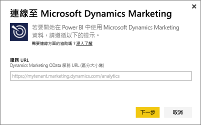
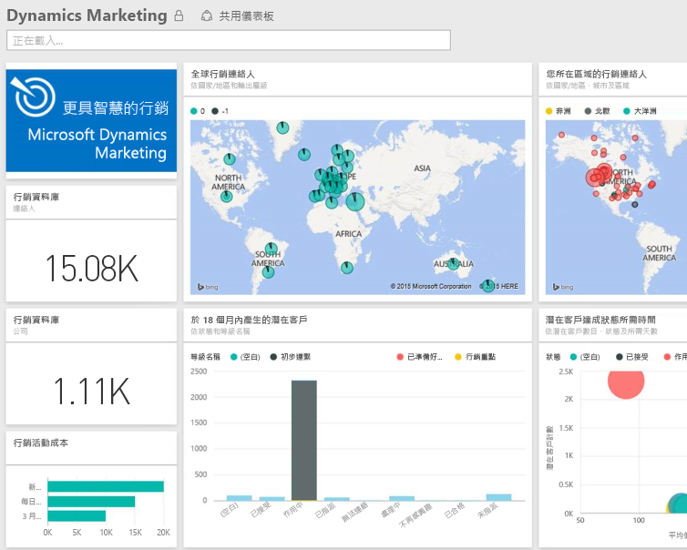

# 使用 Power BI 連接到 Microsoft Dynamics Marketing
Power BI 的 Microsoft Dynamics Marketing 內容套件可讓您輕鬆存取並分析 Dynamics Marketing 的資料。 此內容套件使用 OData 摘要頂端的描述性模型，包括所有必要的實體和量值，例如方案、行銷活動、行銷連絡人和公司、潛在客戶、用戶互動與用戶評分、電子郵件行銷訊息和網站、行為觀察、預算、金融交易、效能 KPI 及其他許多資料。 

連接到 Power BI 的 [Dynamics Marketing 內容套件](https://app.powerbi.com/getdata/services/microsoft-dynamics-marketing)。

>[!NOTE]
>您必須針對 Dynamics Marketing 執行個體 (內容套件不適用於內部部署 CRM 版本) 指定有效的 OData URL。 請參閱下列其他需求。

## 如何連接
1. 選取左瀏覽窗格底部的 [取得資料]。
   
    
2. 在 [服務]  方塊中，選取 [取得] 。
   
    
3. 選取 [Microsoft Dynamics Marketing] \> [取得]。
   
   
4. 提供與您帳戶相關聯的 OData URL。  其格式為 "https://[執行個體\_名稱].marketing.dynamics.com/analytics"。
   
   
5. 出現提示時，請提供您的認證 (如果您已經登入瀏覽器，此步驟可能會略過)。 針對 [驗證方法]，請輸入 **oAuth2** 並按一下 [登入] ：
   
   
6. 連接之後，您會看到 Dynamics Marketing 儀表板且已填入您的資料。 左側瀏覽窗格中的新項目會以黃色星號標示。
   
   

**接下來呢？**

* 請嘗試在儀表板頂端的[問與答方塊中提問](power-bi-q-and-a.md)
* [變更儀表板中的圖格](service-dashboard-edit-tile.md)。
* [選取圖格](service-dashboard-tiles.md)，開啟基礎報表。
* 雖然資料集排程為每天重新整理，但是您可以變更重新整理排程，或使用 [立即重新整理] 視需要嘗試重新整理

## 系統需求
* 您必須針對 Dynamics Marketing 執行個體 (內容套件不適用於內部部署 CRM 版本) 指定有效的 OData URL。  
* 系統管理員必須啟用站台設定中的 OData 端點。 瀏覽至 [組織資料服務] 區段的 [首頁] \> [設定] \> [站台設定]，即可找到 OData 端點的位址。  OData URL 的格式為：https://[執行個體\_名稱].marketing.dynamics.com/analytics  
* 您用來存取 Microsoft Dynamics Marketing 的使用者帳戶/身分識別，必須與您註冊使用 Power BI 的使用者帳戶/身分識別相同。 登入 Microsoft Dynamics Marketing 時，系統會以您用於 Power BI 的相同身分識別，自動將您登入。 如果您想使用不同帳戶登入 Microsoft Dynamics Marketing，請註冊為使用其他帳戶的 Power BI 使用者。 我們希望於即將推出的版本中解決這個問題。   

## 疑難排解
如果您在嘗試連接至 Dynamics CRM 帳戶時看到「登入失敗」訊息，請確認您登入 Power BI 時所使用的是您用來存取 CRM Online OData 摘要的同一個帳戶。 也請您試著登入您瀏覽器中的摘要，測試其是否存在。

詢問您的系統管理員，確認 OData URL 正確無誤且已啟用 OData 端點。

檢查您正在使用的 Dynamics 行銷版本 - 18.0 和 18.1 經過了其他修正，如果您仍會遇到問題且現正使用較舊的版本，或許可考慮升級。

如果您仍然碰到問題，請開啟支援票證，連絡 Power BI 小組：

* 請在 Power BI 應用程式中選取問號 \> [連絡支援人員]。
* 從 Power BI 支援網站 (也就是您正在閱讀本文的位置) 中，選取頁面右側的 [連絡支援人員]  。

## 後續步驟
[取得 Power BI 的資料](service-get-data.md)

[開始使用 Power BI](service-get-started.md)

