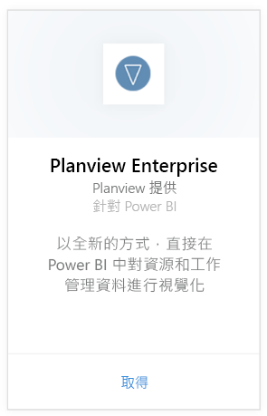
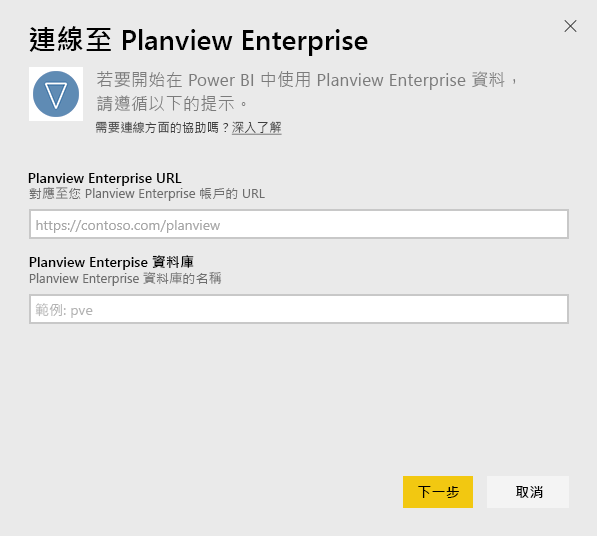
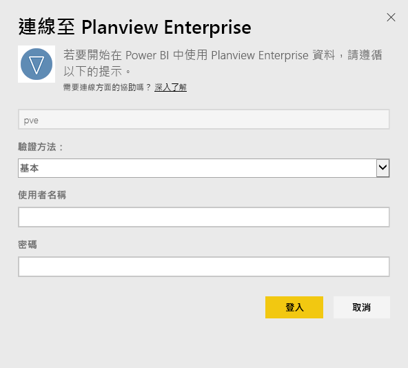
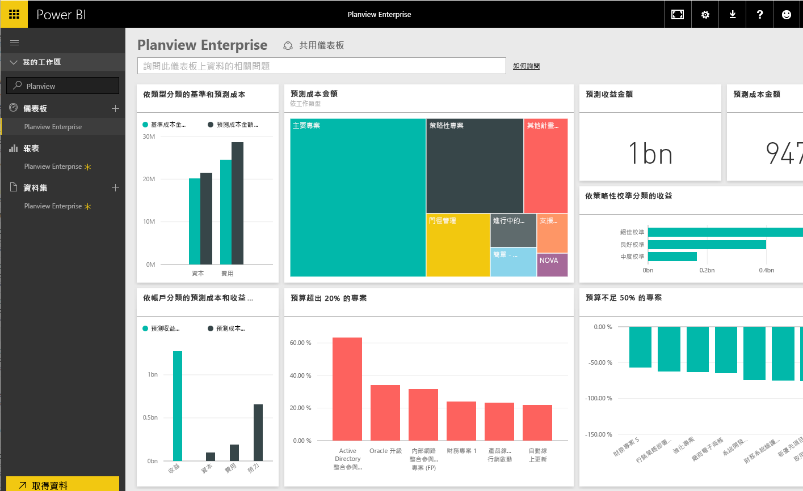

# 使用 Power BI 連接到 Planview Enterprise
使用 Planview Enterprise 內容套件，您可以全新的方式，直接在 Power BI 中視覺化資源和工作管理資料。 請使用 Planview Enterprise 登入認證以互動方式查看投資組合的費用、了解超出預算及預算不足的部分，以及清楚專案如何配合公司的策略優先順序。 您也可以擴充立即可用的儀表板和報表，取得對您而言最重要的深入資訊。

[!INCLUDE [include-short-name](./includes/service-deprecate-content-packs.md)]

連接到 [Power BI 的 Planview Enterprise 內容套件](https://app.powerbi.com/getdata/services/planview-enterprise)

>[!NOTE]
>若要將 Planview Enterprise 資料匯入 Power BI，您必須是啟用 Reporting 入口網站檢視器功能之角色的 Planview Enterprise 使用者。 請參閱下列其他需求。

## 如何連接
1. 選取左側瀏覽窗格底部的 [取得資料]  。
   
    
2. 在 [服務]  方塊中，選取 [取得]  。
   
    
3. 在 Power BI 頁面上，選取 [Planview Enterprise]  ，然後選取 [取得]  ：  
    
4. 在 [Planview Enterprise URL] 文字方塊中，輸入您要使用的 Planview Enterprise 伺服器的 URL。 在 [Planview Enterprise 資料庫] 文字方塊中，輸入 Planview Enterprise 資料庫名稱，然後按一下 [下一步]。  
    
5. 在 [驗證方法] 清單中，如未選取請選取 [Basic]  。 輸入帳戶的 [使用者名稱]  和 [密碼]  ，再選取 [登入]  。  
   
6. 在左窗格中，從儀表板清單中選取 [Planview Enterprise]。  
     Power BI 將 Planview Enterprise 資料匯入儀表板。 請注意，載入資料可能需要一些時間。  
    

**接下來呢？**

* 請嘗試在儀表板頂端的[問與答方塊中提問](consumer/end-user-q-and-a.md)
* [變更儀表板中的圖格](service-dashboard-edit-tile.md)。
* [選取圖格](consumer/end-user-tiles.md)，開啟基礎報表。
* 雖然資料集排程為每天重新整理，但是您可以變更重新整理排程，或使用 [立即重新整理]  視需要嘗試重新整理

## 系統需求
若要將 Planview Enterprise 資料匯入 Power BI，您必須是啟用 Reporting 入口網站檢視器功能之角色的 Planview Enterprise 使用者。 請參閱下列其他需求。

這個程序假設您已使用 Power BI 帳戶登入 Microsoft Power BI 的首頁。 若您沒有 Power BI 帳戶，請前往 [powerbi.com](https://powerbi.microsoft.com/get-started/)，然後在 [Power BI - 雲端共同作業與共用]  下選取 [免費試用]  。 然後按一下 [取得資料]  。

## 後續步驟：

[Power BI 是什麼？](power-bi-overview.md)

[取得 Power BI 的資料](service-get-data.md)