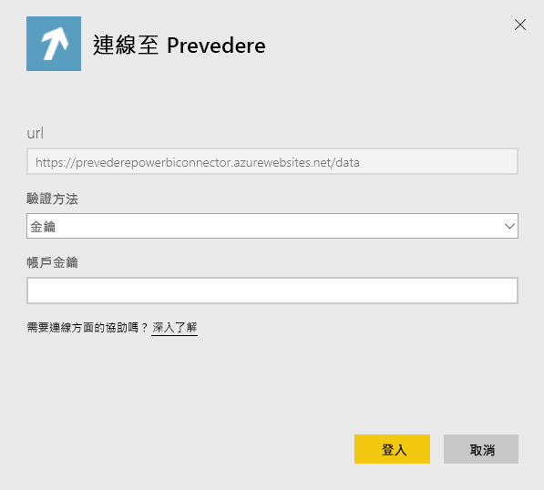
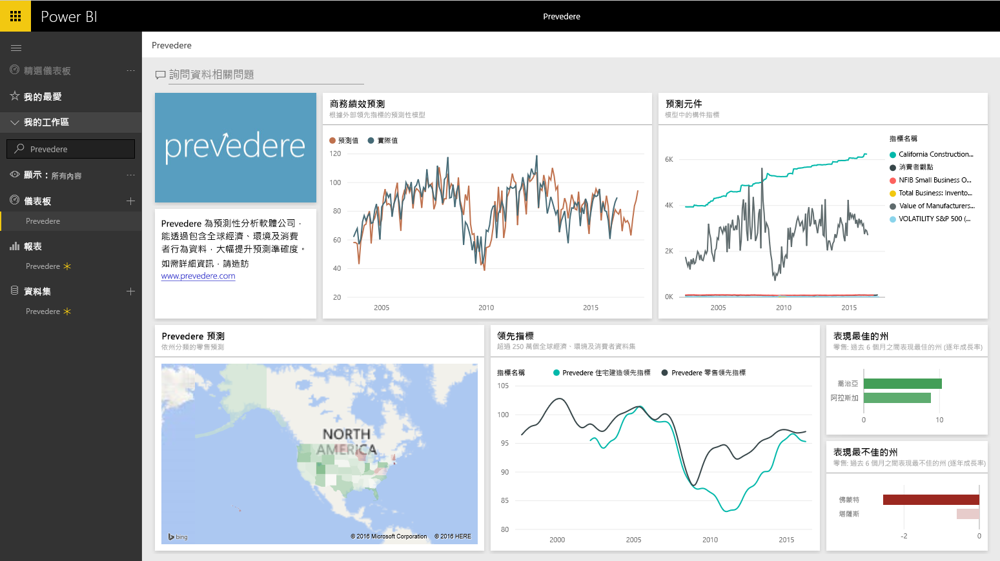

# 使用 Power BI 連接到 Prevedere
獲取專有和重要的財務資訊，自信積極地開展業務。

連接至 Power BI 的 [Prevedere 內容套件](https://app.powerbi.com/getdata/services/prevedere)。

>[!NOTE]
>如果您還不是 Prevedere 使用者，請使用[範例金鑰](https://prevederepowerbiconnector.azurewebsites.net/static/learnmore.html)試用。

## 如何連接
1. 選取左側瀏覽窗格底部的 [取得資料]  。
   
   
2. 在 [服務]  方塊中，選取 [取得] 。
   
   
3. 選取 [Prevedere] 和 [取得]。
   
   
4. 在 [驗證方法] 選取 [金鑰]，並輸入 Prevedere API 金鑰。
   
    
5. 選取 [登入] 開始匯入程序。 完成時，新的儀表板、報表和模型會出現在瀏覽窗格中。 選取儀表板以檢視匯入的資料。
   
     

**接下來呢？**

* 請嘗試在儀表板頂端的[問與答方塊中提問](power-bi-q-and-a.md)
* [變更儀表板中的圖格](service-dashboard-edit-tile.md)。
* [選取圖格](service-dashboard-tiles.md)，開啟基礎報表。
* 雖然資料集排程為每天重新整理，但是您可以變更重新整理排程，或使用 [立即重新整理] 視需要嘗試重新整理

## 包含的內容
此內容套件會從零售預測、預測模型、領先指標及其他，取得詳細資料。

## 系統需求
此內容套件需要存取 Prevedere API 金鑰或範例金鑰 (請參閱下文)。

## 尋找參數

現有客戶可以使用他們的 API 金錀存取他們的資料。 如果您還不是客戶，您可以查看範例資料並使用[範例金鑰](https://prevederepowerbiconnector.azurewebsites.net/static/learnmore.html)分析。

## 疑難排解
視執行個體的大小而定，資料可能需要一些時間來載入。

## 後續步驟
[開始使用 Power BI](service-get-started.md)

[取得 Power BI 中的資料](service-get-data.md)

