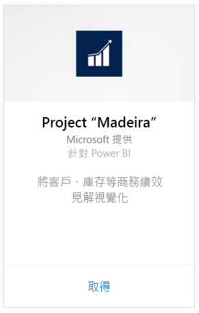
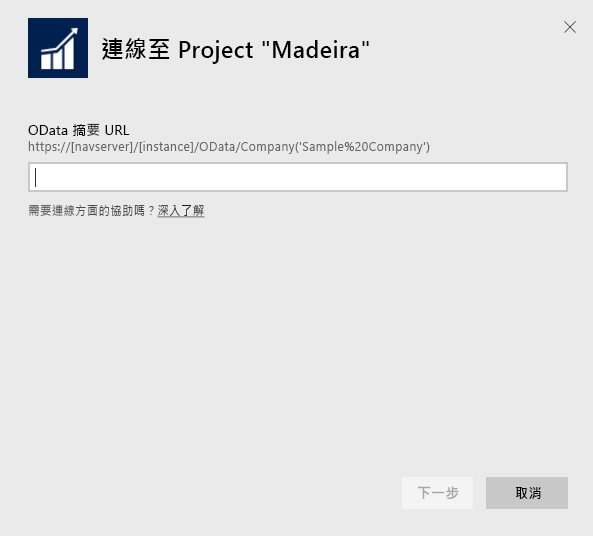
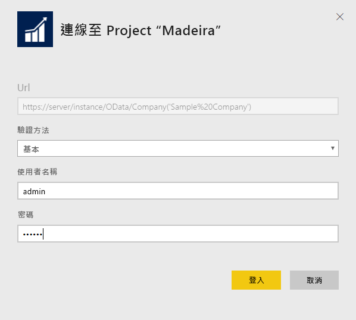
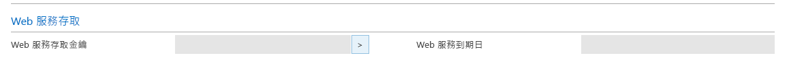
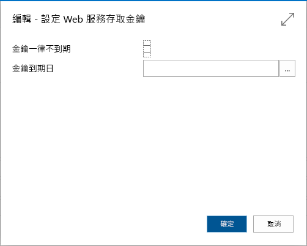
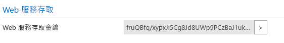

# 使用 Power BI 連接到 Project "Madeira"
Power BI 和專案「Madeira」內容套件讓您輕鬆深入探索專案「Madeira」的資料。 Power BI 會擷取您的資料 (銷售和財務資料)，然後根據該資料建置現成的儀表板和報表。
連接到 Power BI 的專案「Madeira」內容套件，或深入了解 Power BI 與專案「Madeira」的整合。

>[!NOTE]
>這個內容套件需要有資料擷取來源資料表的權限，本例中為銷售和財務資料。 [下方](#Requirements)有需求的詳細資料。

連接至 Power BI 的[專案 "Madeira" Analytics 內容套件](https://app.powerbi.com/getdata/services/project-madeira)。

## 如何連接
1. 選取左側瀏覽窗格底部的 [取得資料]  。  
    
2. 在 [服務]  方塊中，選取 [取得] 。  
    
3. 選取 [專案「Madeira」]，然後選取 [取得]。  
    
4. 出現提示時，輸入您的專案「Madeira」 URL。 URL 必須完全遵循下列模式：<https://mycronusus.projectmadeira.com:7048/NAV/OData/Company('CRONUS%20US>')，且附上專案 “Madeira” 公司名稱。 請注意結尾沒有尾端斜線，且連線必須為 https。 請參閱[以下](#FindingParams)關於尋找此 URL 的詳細資訊。  
   
    
5. 出現提示時，請將驗證方法選取為 [基本]，輸入您的專案「Madeira」電子郵件地址作為使用者名稱，然後輸入專案「Madeira」帳戶的 Web 服務存取金鑰作為密碼。 如果您已經在瀏覽器中登入專案「Madeira」，可能就不會出現輸入認證的提示。 請參閱[以下](#FindingParams)關於產生此存取金鑰的詳細資料。  
   
    >[!NOTE]
    >您必須是專案「Madeira」中的超級使用者。
   
   
6. 連接後，會自動載入儀表板、報表和資料集。 完成時，磚會更新為您帳戶中的資料。  
   
    

**接下來呢？**

* 請嘗試在儀表板頂端的[問與答方塊中提問](power-bi-q-and-a.md)
* [變更儀表板中的圖格](service-dashboard-edit-tile.md)。
* [選取圖格](service-dashboard-tiles.md)，開啟基礎報表。
* 雖然資料集排程為每天重新整理，但是您可以變更重新整理排程，或使用 [立即重新整理] 視需要嘗試重新整理

## 系統需求
若要將專案「Madeira」資料匯入 Power BI，您需要有銷售和財務資料的資料表權限，而該類資料表為資料擷取所在。 內容套件所需的所有資料表 (區分大小寫) 包括：  
 
    ´´´ 
    - ItemSalesAndProfit  
    - ItemSalesByCustomer  
    - powerbifinance  
    - SalesDashboard  
    - SalesOpportunities  
    - SalesOrdersBySalesPerson  
    - TopCustomerOverview  
    ´´´ 

## 尋找參數
**取得正確的 URL** 取得這個 URL 的簡單方法是在專案「Madeira」中，移至 Web 服務，尋找 powerbifinance Web 服務並複製 Odata URL (以滑鼠右鍵按一下，並複製捷徑)，但省略 URL 字串中的 “/powerbifinance…” 部分。

**Web 服務存取金鑰** 若要使用專案「Madeira」中的資料，您需要為使用者帳戶建立 Web 服務存取金鑰。 在專案「Madeira」中，搜尋 [使用者] 頁面，然後開啟使用者帳戶的卡片。 這裡可以產生新的 Web 服務存取金鑰，並將金鑰複製到 Power BI 連接頁面中的 [密碼] 欄位。

當您開始使用 Web 服務存取金鑰，您就必須繼續使用，所以請針對快顯訊息選擇 [確定] 。
建立金鑰時，您可以選擇金鑰是否會在特定日期過期。

選擇 [確定] 後即會建立金鑰，您就可以將該金鑰複製到 Power BI 連接頁面中的 [密碼] 欄位。

## 疑難排解
Power BI 儀表板仰賴上列已發佈的 Web 服務，當您從目前的財務解決方案匯入資料時，該儀表板會顯示示範公司或您公司的資料。 不過，如果發生錯誤，本節提供常見問題的因應措施。

**「參數驗證失敗。請確定所有參數都有效。」**

如果您在輸入專案「Madeira」URL 之後看到此錯誤，請確定 URL 滿足以下需求：  

- URL 會完全遵循此模式 https://*mycronusus*.projectmadeira.com:7048/NAV/OData/Company ('<em>CRONUS%20US</em>')  
- 刪除括弧中公司名稱後的所有文字  
- 請確定在 URL 結尾沒有尾端斜線。  
- 請確定 URL 使用的是安全連線，安全的 URL 會以 https 開頭。  

**「登入失敗」** 如果使用專案「Madeira」認證登入儀表板時收到「登入失敗」錯誤，可能是下列其中一個問題所導致：  

   - 您使用的帳戶沒有從帳戶讀取專案「Madeira」資料的權限。 請確認您專案「Madeira」的使用者帳戶，並確定密碼已經使用正確的 Web 服務存取金鑰，然後再試一次。  
   - 您嘗試連線的專案「Madeira」執行個體不具備有效的 SSL 憑證。 在此情況下，您會看到更詳細的錯誤訊息 (「無法建立信任的 SSL 關係 」)。 請注意，自我簽署的憑證不受支援。  

**「糟糕」** 如果通過 [驗證] 對話方塊之後看到「糟糕」錯誤對話方塊，通常是由於連接到內容套件資料時遇到了問題。 請確認 URL 遵循以上指定的模式︰  
    https://*mycronusus*.projectmadeira.com:7048/NAV/OData/Company('<em>CRONUS%20US</em>')

常見的錯誤是指定特定 Web 服務的完整 URL：  
    https://*mycronusus*.projectmadeira.com:7048/NAV/OData/Company('<em>CRONUS%20US</em>')/powerbifinance

或者，您可能忘記指定公司名稱︰   
    https://<em>mycronusus</em>.projectmadeira.com:7048/NAV/OData/

## 後續步驟
[Power BI 是什麼？](power-bi-overview.md)

[Power BI - 基本概念](service-basic-concepts.md)

