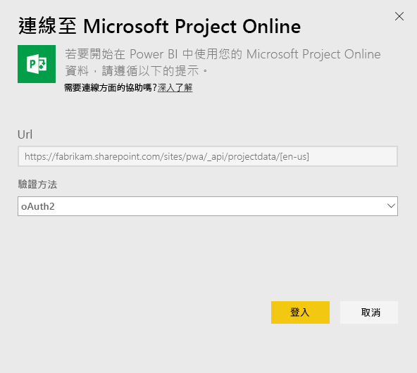
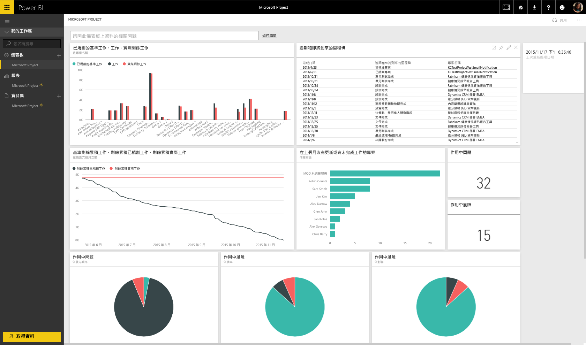

# 使用 Power BI 連接到 Project Online
Microsoft Project Online 是針對專案組合管理 (PPM) 與日常工作的靈活線上解決方案。 Project Online 可讓組織開始、優先排定專案投資組合並提供預期的商業價值。 Power BI 的 Project Online 內容套件可讓您解除鎖定來自 Project Online 的見解，協助管理專案、組合和資源。

連接到 Power BI 的 [Project Online 內容套件](https://app.powerbi.com/getdata/services/project-online)。

## 如何連接
1. 選取左側瀏覽窗格底部的 [取得資料]  。
   
    
2. 在 [服務]  方塊中，選取 [取得] 。
   
   
3. 選取 [Microsoft Project Online] \> [取得]。
   
   
4. 在 [Project Web App URL]  文字方塊中，輸入您想要連接的 Project Web App (PWA) 的 URL，並點擊 [下一步] 。 請注意，自訂網域可能和範例不一樣。 在 [PWA Site Language] \(PWA 網站語言\) 文字方塊中，鍵入對應至 PWA 網站語言的數字。 鍵入單一數字 '1' 表示英文、'2' 表示法文、'3' 表示德文、'4' 表示葡萄牙文 (巴西)、'5' 表示葡萄牙文 (葡萄牙) 和 '6' 表示西班牙文。 
   
    
5. 針對 [驗證方法] 選取 [oAuth2] \> [登入]。 出現提示時，輸入 Project Online 認證，並遵循驗證程序。
   
    
    
請注意，您必須擁有公事包檢視器、公事包管理員或系統管理員權限，以供您要連線的 Project Web App 使用。

6. 您會看到通知，指出正在載入資料。 時間長短視帳戶大小而定。 Power BI 匯入資料之後，您會在左側瀏覽窗格中看到新的儀表板、13 份報表和資料集。 這是 Power BI 建立的預設儀表板，可顯示您的資料。 您可以修改此儀表板，以您想要的任何方式來顯示資料。

   

7. 儀表板和報表準備就緒之後，請繼續並開始探索 Project Online 資料！ 內容套件隨附 13 個豐富且詳細的報表：組合概觀 (6 個報表頁面)、資源概觀 (5 個報表頁面) 和專案狀態 (2 個報表頁面)。 

   
   
   
   
   

**接下來呢？**

* 請嘗試在儀表板頂端的[問與答方塊中提問](consumer/end-user-q-and-a.md)
* [變更儀表板中的圖格](service-dashboard-edit-tile.md)。
* [選取圖格](consumer/end-user-tiles.md)，開啟基礎報表。
* 雖然資料集排程為每天重新整理，但是您可以變更重新整理排程，或使用 [立即重新整理] 視需要嘗試重新整理

**展開內容套件**

下載 [GitHub PBIT 檔案](https://github.com/OfficeDev/Project-Power-BI-Content-Packs)，進一步自訂和更新內容套件

## 後續步驟
[開始使用 Power BI](service-get-started.md)

[取得 Power BI 中的資料](service-get-data.md)

