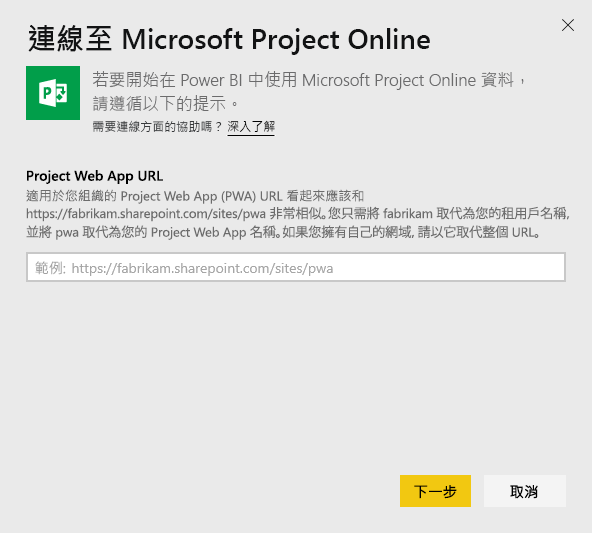

# 使用 Power BI 連線到 Project Web App
Microsoft Project Web App 是針對專案組合管理 (PPM) 與日常工作的靈活線上解決方案。 Project Web App 可讓組織開始著手專案組合的投資、排定優先順序，並提供預期的商業價值。 Power BI 的 Project Web App 範本應用程式可讓您解鎖 Project Web App 的見解，協助管理專案、組合和資源。

連線到 Power BI 的 [Project Web App 範本應用程式](https://appsource.microsoft.com/product/power-bi/pbi_msprojectonline.pbi-microsoftprojectwebapp)。

## 如何連接

1. 在導覽窗格中選取 [應用程式]  > 選取右上角的 [取得應用程式]  。

    

2. 在 [服務]  方塊中，選取 [取得]  。
   
   
3. 在 AppSource 中，選取 [應用程式]  索引標籤，然後搜尋/選取 [Microsoft Project Web App]  。
   
4. 您會收到一則訊息，指出「要安裝此 Power BI 應用程式嗎?」  ，請選取 [安裝]  。 

   
5. 在 [應用程式]  窗格中，選取 [Microsoft Project Web App]  磚。 
   
   
6. 在 [開始使用您的新應用程式]  中，選取 [連線資料]  。
   
   
7. 在 [Project Web App URL]  文字方塊中，輸入您想要連線之 Project Web App (PWA) 的 URL。  請注意，自訂網域可能和範例不一樣。 在 [PWA Site Language] \(PWA 網站語言\)  文字方塊中，鍵入對應至 PWA 網站語言的數字。 鍵入單一數字 '1' 表示英文、'2' 表示法文、'3' 表示德文、'4' 表示葡萄牙文 (巴西)、'5' 表示葡萄牙文 (葡萄牙) 和 '6' 表示西班牙文。 
   
   
8. 針對 [驗證方法] 選取 [oAuth2]  \> [登入]  。 出現提示時，輸入 Project Web App 認證，並遵循驗證程序。

    > [!NOTE]
    > 您必須擁有公事包檢視者、公事包管理員或系統管理員權限，以供您要連線的 Project Web App 使用。

9. 您會看到通知，指出正在載入資料。 時間長短視帳戶大小而定。 Power BI 匯入資料之後，您即可看到新工作區的內容。 您可能需要重新整理資料集，才能取得最新的更新。 

    Power BI 匯入資料之後，您會在導覽窗格中看到 13 頁的報表和資料集。 

10. 報表準備就緒之後，請繼續並開始探索 Project Web App 資料！ 範本應用程式隨附 13 頁豐富且詳細的報表：組合概觀 (6 個報表頁面)、資源概觀 (5 個報表頁面) 和專案狀態 (2 個報表頁面)。 

    
   
    
   
    

**接下來呢？**

* 雖然資料集排程為每天重新整理，但是您可以變更重新整理排程，或使用 [立即重新整理]  視需要嘗試重新整理。

**展開範本應用程式**

下載 [GitHub PBIT 檔案](https://github.com/OfficeDev/Project-Power-BI-Content-Packs)，進一步自訂和更新內容套件。

## 後續步驟
[開始使用 Power BI](service-get-started.md)

[取得 Power BI 中的資料](service-get-data.md)

