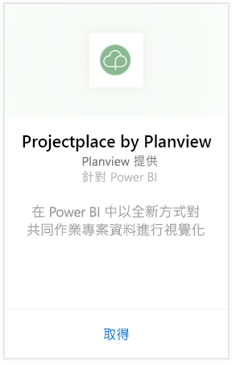
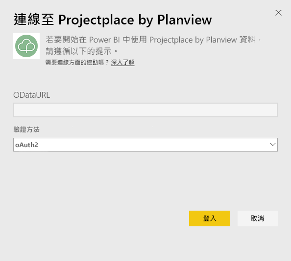
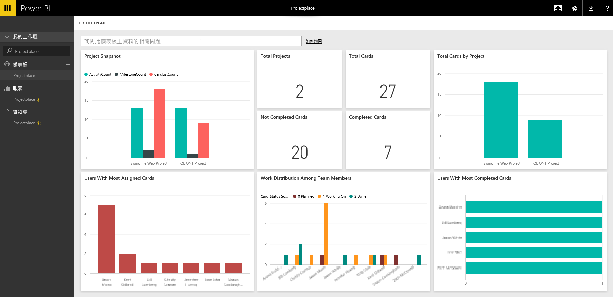

# 使用 Power BI 連接到 Projectplace by Planview
使用 Projectplace by Planview 內容套件，您可以全新的方式，直接在 Power BI 中視覺化共同作業的專案資料。 使用 Projectplace 登入認證，以互動方式檢視關鍵專案統計資料，找出最活躍和產能最高的小組成員，及識別 Projectplace 帳戶中跨專案的高風險卡片和活動。 您也可以擴充立即可用的儀表板和報表，取得對您而言最重要的深入資訊。

[連接到 Power BI 的 Projectplace 內容套件](https://app.powerbi.com/getdata/services/projectplace)

>[!NOTE]
>若要將 Projectplace 資料匯入 Power BI，您必須是 Projectplace 的使用者。 請參閱下列其他需求。

## 如何連接
1. 選取左側瀏覽窗格底部的 [取得資料]  。
   
    
2. 在 [服務]  方塊中，選取 [取得] 。
   
    
3. 在 Power BI 頁面上，選取 [Projectplace by Planview]，然後選取 [取得]：  
   
    
4. 在 [OData 摘要 URL] 文字方塊中，輸入您想要使用的 Projectplace OData 摘要 URL，如下圖所示的：
   
    
5. 在 [驗證方法] 清單中，如未選取請選取 [OAuth]  。 點擊 [登入]  並遵循登入流程。  
   
   
6. 在左窗格中，從儀表板清單中選取 [Projectplace]  。 Power BI 將 Projectplace 資料匯入儀表板。 請注意，載入資料可能需要一些時間。  
   
    儀表板包含顯示 Projectplace 資料庫資料的圖格。 下圖顯示 Power BI 的預設 Projectplace 儀表板範例。
   
    

**接下來呢？**

* 請嘗試在儀表板頂端的[問與答方塊中提問](power-bi-q-and-a.md)
* [變更儀表板中的圖格](service-dashboard-edit-tile.md)。
* [選取圖格](service-dashboard-tiles.md)，開啟基礎報表。
* 雖然資料集排程為每天重新整理，但是您可以變更重新整理排程，或使用 [立即重新整理] 視需要嘗試重新整理

## 系統需求
若要將 Projectplace 資料匯入 Power BI，您必須是 Projectplace 的使用者。 這個程序假設您已使用 Power BI 帳戶登入 Microsoft Power BI 的首頁。 如果您還沒有 Power BI 帳戶，請在 Power BI 的首頁建立新的免費 Power BI 帳戶，然後按一下 [取得資料]。

## 後續步驟
[開始使用 Power BI](service-get-started.md)

[Power BI - 基本概念](service-basic-concepts.md)

