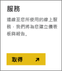
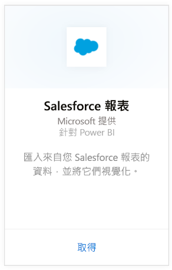

# 使用 Power BI 連接到 Salesforce
您可以使用 Power BI 輕鬆地連接到您的 Salesforce.com 帳戶。 建立此連接時可擷取您的資料，並自動依據您的資料提供儀表板和相關報表。

連接到 Power BI 的 [Salesforce 內容套件](https://app.powerbi.com/getdata/services/salesforce)或深入了解 Power BI 與 [Salesforce 的整合](https://powerbi.microsoft.com/integrations/salesforce)。

## 如何連接
1. 選取左側瀏覽窗格底部的 [取得資料]  。
   
    
2. 在 [服務]  方塊中，選取 [取得] 。
   
    
3. 按一下 [Salesforce]，然後選取 [取得]。  
   
   
4. 選取 [登入] 起始登入流程。
   
    
5. 出現提示時，請輸入您的 Salesforce 認證。 按一下 [允許]  讓 Power BI 存取您基本的 Salesforce 資訊和資料。
   
   
6. 使用下拉式選項，設定您要匯入 Power BI 的內容：
   
   * **儀表板**
     
     以角色來選取預先定義的儀表板 (例如 **銷售經理**)。 這些儀表板會從 Salesforce 帶進特定的標準資料集，且不會包含自訂欄位。
     
     
   * **報表**
     
     從您的 Salesforce 帳戶選取一個或多個自訂報表。 這些報表會比對您在 Salesforce 中的檢視，且可包含自訂欄位或物件中的資料。
     
     
     
     如果您沒有看到任何報表，請在您的 Salesforce 帳戶中加入或建立報表，然後再試著連接一次。
7. 按一下 [連接]  開始匯入程序。 您會在匯入期間看到顯示匯入正在進行中的通知。 匯入完成後，您會看到其中有您 Salesforce 資料的儀表板、報表和資料集，全都列在左側的瀏覽窗格中。
   
   

您可以變更此儀表板，以您想要的任何方式來顯示資料。 您可以透過問與答提問 - 或按一下圖格[開啟基礎報表](service-dashboard-tiles.md)，並在儀表板中[變更圖格](service-dashboard-edit-tile.md)。

**接下來呢？**

* 請嘗試在儀表板頂端的[問與答方塊中提問](power-bi-q-and-a.md)
* [變更儀表板中的圖格](service-dashboard-edit-tile.md)
* [選取圖格](service-dashboard-tiles.md)，開啟基礎報表
* 雖然資料集排程為每天重新整理，但是您可以變更重新整理排程，或使用 [立即重新整理] 視需要嘗試重新整理

## 系統需求和考量
- 與已啟用 API 存取的 Salesforce 生產帳戶連接
- 登入期間獲授 Power BI 應用程式的權限
- 帳戶有足夠可用的 API 呼叫，以便提取和重新整理資料
- 進行重新整理所需的有效驗證權杖。 請確認您匯入的 Salesforce 資料集為 5 個以下，原因是 Salesforce 有每個應用程式最多 5 個驗證權杖的上限
- Salesforce Reports API 有支援最多 2000 個資料列的限制。

## 疑難排解
如發生任何錯誤，請檢閱上述需求。 另請注意，目前不支援登入自訂或沙箱網域。

## 後續步驟
[開始使用 Power BI](service-get-started.md)

[取得資料](service-get-data.md)

