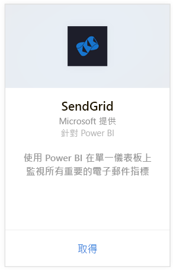
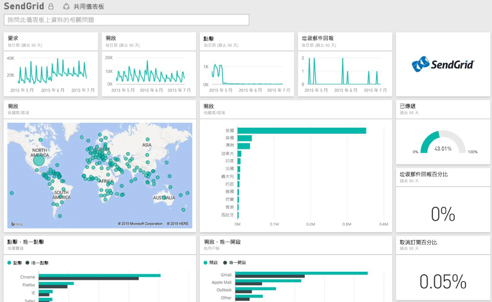

# 使用 Power BI 連接到 SendGrid
SendGrid 的 Power BI 內容套件可讓您從 SendGrid 帳戶中擷取深入資訊與統計資料。 您可以使用 SendGrid 內容套件，在儀表板中以視覺化方式呈現您的 SendGrid 統計資料。

連接到 Power BI 的 [SendGrid 內容套件](https://app.powerbi.com/getdata/services/sendgrid)。

## 如何連接
1. 選取左側瀏覽窗格底部的 [取得資料]  。
   
    
2. 在 [服務]  方塊中，選取 [取得] 。
   
    
3. 選取 **SendGrid** 內容套件並按一下 [取得]。
   
    
4. 出現提示時，請提供您的 SendGrid 使用者名稱和密碼。 選取 [登入] 。
   
   
5. Power BI 匯入資料之後，您會在左側瀏覽窗格中看到新的儀表板、報表和資料集，其中已填入您過去 90 天內的電子郵件統計資料。 新的項目會以黃色星號標示\*。
   
   

**接下來呢？**

* 請嘗試在儀表板頂端的[問與答方塊中提問](power-bi-q-and-a.md)
* [變更儀表板中的圖格](service-dashboard-edit-tile.md)。
* [選取圖格](service-dashboard-tiles.md)，開啟基礎報表。
* 雖然資料集排程為每天重新整理，但是您可以變更重新整理排程，或使用 [立即重新整理] 視需要嘗試重新整理

## 包含的內容
SendGrid 儀表板提供下列度量資訊︰

* 電子郵件的整體統計資料 - 要求、已傳遞、已退回、已封鎖的垃圾郵件、垃圾郵件報告等等。
* 依類別目錄排列的電子郵件統計資料
* 依地理位置排列的電子郵件統計資料
* 依 ISP 排列的電子郵件統計資料
* 依裝置、用戶端、瀏覽器排列的電子郵件統計資料

## 後續步驟
[開始使用 Power BI](service-get-started.md)

[取得資料](service-get-data.md)

