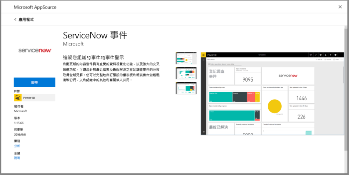
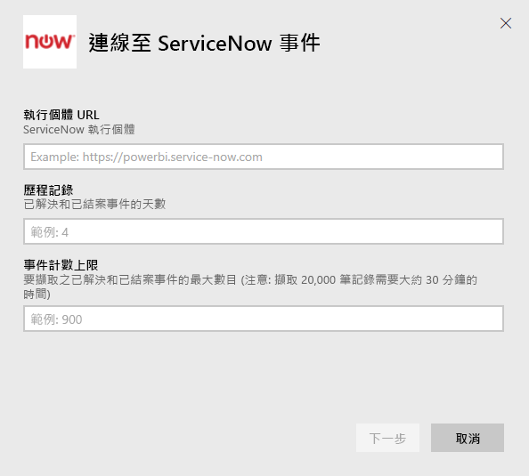
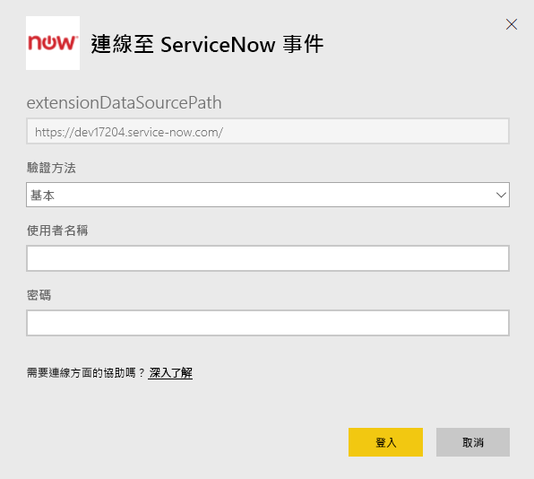
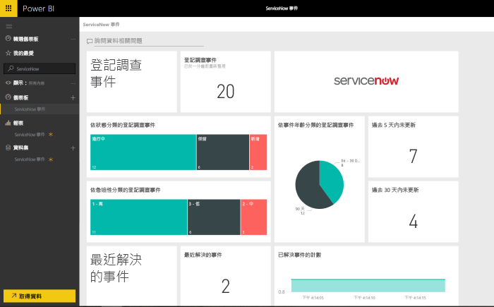

# 使用 Power BI 連接到 ServiceNow 以取得事件報告
ServiceNow 提供多樣產品與解決方案，包括商務、營運與 IT 管理，進而提升您的業務發展。 這個內容套件包括多個報表與深入解析，為您開放、最近解決與最近關閉的事件提供資訊。  

連接至適用於 [ServiceNow 事件](https://app.powerbi.com/getdata/services/servicenow)的 Power BI 內容套件。

## 如何連接
1. 選取左側瀏覽窗格底部的 [取得資料]  。
   
    
2. 在 [服務]  方塊中，選取 [取得]  。
   
    
3. 選取 [ServiceNow 事件]  \> [取得]  。
   
   
4. 提供 ServiceNow 執行個體的 URL 以及要帶入的天數/記錄範圍。 請注意，只要達到一項限制，即停止匯入。
   
   
5. 出現提示時，請輸入您的 ServiceNow **基本**認證。 請注意，目前不支援單一登入，系統需求的詳細資料如下。
   
   
6. 一旦完成登入流程就會開始匯入程序。 完成時，新的儀表板、報表和模型會出現在瀏覽窗格中。 選取儀表板以檢視匯入的資料。
   
    

**接下來呢？**

* 請嘗試在儀表板頂端的[問與答方塊中提問](consumer/end-user-q-and-a.md)
* [變更儀表板中的圖格](service-dashboard-edit-tile.md)。
* [選取圖格](consumer/end-user-tiles.md)，開啟基礎報表。
* 雖然資料集排程為每天重新整理，但是您可以變更重新整理排程，或使用 [立即重新整理]  視需要嘗試重新整理

## 系統需求
若要連線，您需要：  

* 可以使用基本驗證存取 yourorganization.service-now.com 的帳戶 (此版本不支援單一登入)  
* 帳戶必須有 rest_service 角色與事件資料表的讀取存取  

## 疑難排解
如果您在載入期間遇到認證錯誤，請檢閱上方存取需求。 如果您有正確的權限，但仍遇到問題，請洽詢您的 ServiceNow 管理員以確認自訂執行個體是否需要其他任何權限。

如果載入時間過長，請檢閱您在連線期間指定的事件數目與天數，並考慮減少該數目。

## 後續步驟
[Power BI 是什麼？](power-bi-overview.md)

[Power BI 服務中的設計工具基本概念](service-basic-concepts.md)

