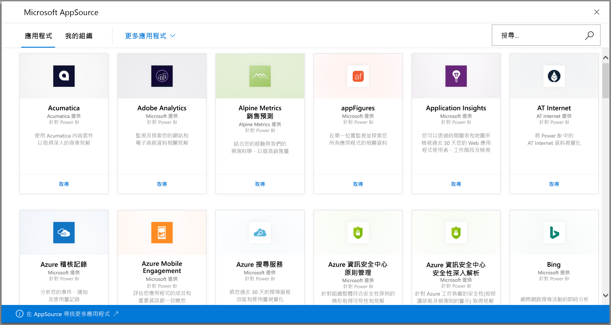
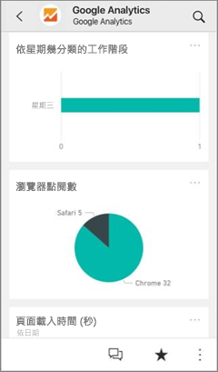
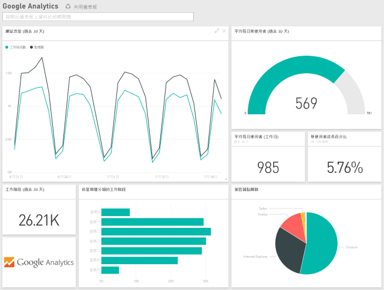

# 使用 Power BI 連接到所用服務
您可以連接到執行業務所用的多個服務，例如 Salesforce、Microsoft Dynamics 和 Google Analytics。 Power BI 首先會使用您的認證來連接至服務，然後建立 Power BI 應用程式與儀表板和一組 Power BI 報表，其會自動顯示資料並提供業務相關的視覺化內容。 

登入 Power BI 以檢視[可以連線的所有服務](https://app.powerbi.com/getdata/services)。 Power BI 小組會定期新增服務。

安裝應用程式之後，您可以在 Power BI 服務 ([https://powerbi.com](https://powerbi.com)) 及 Power BI 行動應用程式中檢視儀表板與報表。 

## 開始使用
[!INCLUDE [powerbi-service-apps-get-more-apps](./includes/powerbi-service-apps-get-more-apps.md)]

## 檢視儀表板和報表
匯入完成時，新的應用程式會出現在 [應用程式] 頁面上。

1. 在左側功能窗格中選取 [應用程式] > 選取應用程式。
   
     ![[應用程式] 頁面](media/service-connect-to-services/power-bi-service-apps-open-app.png)
2. 您可以在問與答方塊中鍵入問題，或按一下圖格開啟基礎報表。 
   
    
   
    您可以篩選和醒目提示報表中的資料，但無法儲存變更。

## 包含的內容
連接至服務之後，您會看到新建立的應用程式與儀表板、報表和資料集。 服務的資料著重於特定案例，而且可能不包含該服務中的所有資訊。 資料已排定自動每天重新整理一次。 您可以選取資料集來控制排程。

您也可以使用 [Power BI Desktop](desktop-get-the-desktop.md) 連接某些服務，例如 Google Analytics，並建立自訂的儀表板和報表。  

如需連接到特定服務的詳細資料，請參閱個別說明頁面。

## 疑難排解
**空的磚**  
雖然 Power BI 先連接到服務，您可能會在儀表板上看到空的磚集合。 如果您 2 小時後仍然看到空的儀表板，可能是連線失敗。 如果您未看到具有問題修正資訊的錯誤訊息，請提出支援票證。

* 在右上角選取問號圖示 (**?**) > [取得說明]。
  
    ![[取得說明] 圖示](media/service-connect-to-services/power-bi-service-get-help.png)

**遺漏資訊**  
儀表板和報表包含各種服務的內容，著重於特定案例，而且不包含該服務中的所有資訊。 如果有內容套件中看不到的特定度量，請在 [Power BI 支援](https://support.powerbi.com/forums/265200-power-bi)頁面上新增想法。

## 建議服務
您有想要向 Power BI 應用程式推薦的服務嗎？ 請移至 [Power BI 支援](https://support.powerbi.com/forums/265200-power-bi)頁面上告訴我們。

您有想要建置應用程式的服務嗎？ [送出您的提名](https://azure.microsoft.com/marketplace/programs/certified/apply/)，並選取 [發佈 Power BI 內容套件] 以開始使用。

## 後續步驟
* [Power BI 中的應用程式是什麼？](service-install-use-apps.md)
* [取得 Power BI 中的資料](service-get-data.md)
* 有其他問題嗎？ [嘗試在 Power BI 社群提問](http://community.powerbi.com/)

