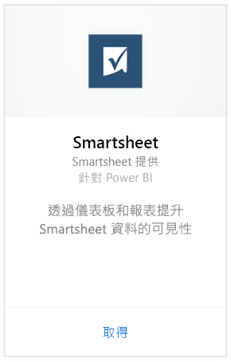
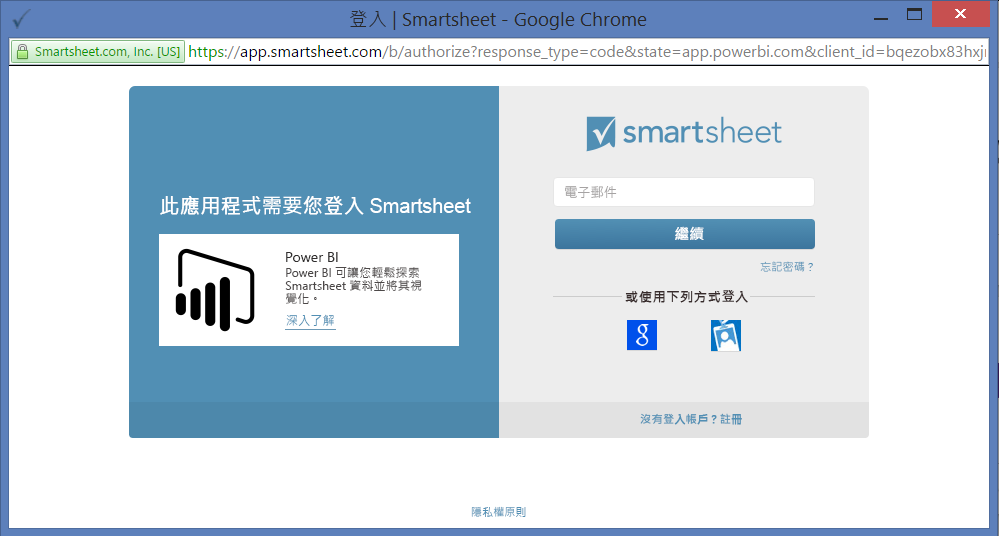
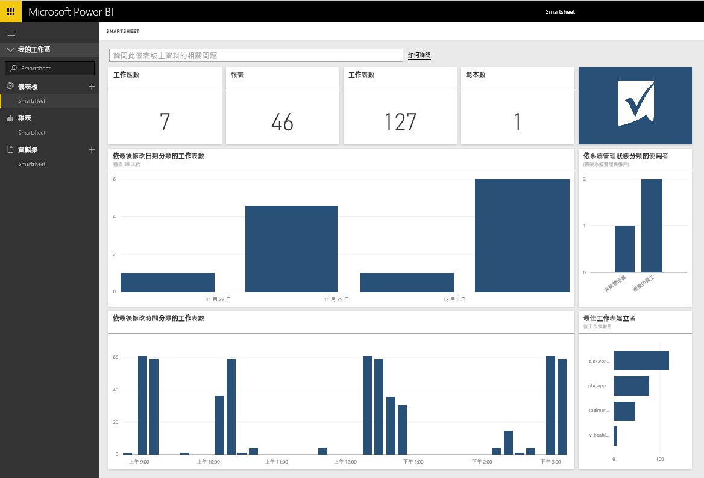

# 使用 Power BI 連接到 Smartsheet
Smartsheet 提供一個簡單的平台，供共同作業與檔案共用使用。 適用於 Power BI 的 Smartsheet 內容套件提供了儀表板、報表與資料集，其顯示 Smartsheet 帳戶的概觀。 您也可以使用 [Power BI Desktop](desktop-connect-to-data.md) 直接連接到您帳戶中的個別工作表。 

連接到 Power BI 的 [Smartsheet 內容套件](https://app.powerbi.com/groups/me/getdata/services/smartsheet)。

>[!NOTE]
>建議使用 Smartsheet 管理帳戶來連接及載入 Power BI 內容套件，原因是其具有額外的存取權。

## 如何連接
1. 選取左側瀏覽窗格底部的 [取得資料]  。
   
   
2. 在 [服務]  方塊中，選取 [取得] 。
   
    
3. 選取 [Smartsheet] \> [取得]。
   
   
4. 針對 [驗證方法]，選取 [oAuth2] \> [登入]。
   
   出現提示時，輸入 Smartsheet 認證，並遵循驗證程序。
   
   
   
   
5. Power BI 匯入資料之後，您會在左側瀏覽窗格中看到新的儀表板、報表和資料集。 新的項目會以黃色星號 \* 標示，選取 Smartsheet 項目。
   
   

**接下來呢？**

* 請嘗試在儀表板頂端的[問與答方塊中提問](consumer/end-user-q-and-a.md)
* [變更儀表板中的圖格](service-dashboard-edit-tile.md)。
* [選取圖格](consumer/end-user-tiles.md)，開啟基礎報表。
* 雖然資料集排程為每天重新整理，但是您可以變更重新整理排程，或使用 [立即重新整理] 視需要嘗試重新整理

## 包含的內容
Power BI 的 Smartsheet 內容套件內含您的 Smartsheet 帳戶概觀，例如您擁有的工作區、報表和工作表數目及其修改時間等等。系統管理員使用者會看到有關其系統使用者的一些資訊，例如最上層工作表的建立者。  

若要直接連接到您帳戶中的個別工作表，您可以在 [Power BI Desktop](desktop-connect-to-data.md) 中使用 Smartsheet 連接器。  

## 後續步驟：

[Power BI 是什麼？](power-bi-overview.md)

[取得 Power BI 的資料](service-get-data.md)