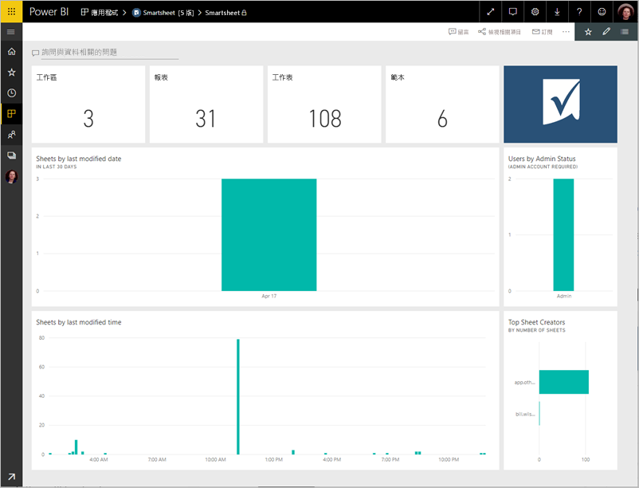

# 使用 Power BI 連接到 Smartsheet
這篇文章會引導您提取您的資料，從您的 Smartsheet 帳戶與 Power BI 範本應用程式。 Smartsheet 提供一個簡單的平台，供共同作業與檔案共用使用。 Power BI 的 Smartsheet 範本應用程式提供儀表板、 報表和資料集，顯示您的 Smartsheet 帳戶概觀。 您也可以使用[Power BI Desktop](desktop-connect-to-data.md)直接連接到您的帳戶中的個別工作表。 

您已安裝的範本應用程式之後，您可以變更儀表板和報表。 然後您可以將它散發為應用程式給同事您組織中。

連接到[Smartsheet 範本應用程式](https://app.powerbi.com/groups/me/getdata/services/smartsheet)適用於 Power BI。

>[!NOTE]
>Smartsheet 管理帳戶是慣用連接及載入 Power BI 範本應用程式，其具有額外的存取權。

## 如何連接

[!INCLUDE [powerbi-service-apps-get-more-apps](./includes/powerbi-service-apps-get-more-apps.md)]

3. 選取  **Smartsheet** \> **立即取得**。
4. 在 **安裝此 Power BI 應用程式嗎？** 選取**安裝**。
4. 在 **應用程式**窗格中，選取**Smartsheet**圖格。

    

6. 在 **開始使用新的應用程式**，選取**將資料連接**。

    

4. 針對 [驗證方法]，選取 [oAuth2] **\> [登入]** 。
   
   出現提示時，輸入 Smartsheet 認證，並遵循驗證程序。
   
   
   
   

5. Power BI 匯入資料之後，會開啟 Smartsheet 儀表板。
   
   

## 修改並散發應用程式

您已安裝 Smartsheet 範本應用程式。 也就是說，您也建立了 Smartsheet 應用程式工作區。 在工作區中，您可以變更報表和儀表板，並再將它做為散發*應用程式*給組織中的同事。 

1. 若要檢視新的 Smartsheet 工作區中的所有內容，在左側的導覽列中，選取**工作區** > **Smartsheet**。 

    

    此檢視位於工作區的內容清單。 在右上角中，您會看到**更新應用程式**。 當您準備好應用程式散發給您的同事時，這是您將開始的地方。 

    

2. 選取 **報表**並**資料集**若要查看工作區中的其他項目。

    了解[將應用程式散發](service-create-distribute-apps.md)向您的同事。

## 包含的內容
Smartsheet 範本應用程式的 Power BI 包含的工作區數目等，Smartsheet 帳戶的概觀報表，和工作表您已進行修改等等。系統管理員的使用者也會看到一些資訊，大約是使用者在其系統中，例如最上層工作表建立者。  

若要直接連接到您帳戶中的個別工作表，您可以在 [Power BI Desktop](desktop-connect-to-data.md) 中使用 Smartsheet 連接器。  

## 後續步驟

* [在 Power BI 中建立新的工作區](service-create-the-new-workspaces.md)
* [在 Power BI 中安裝和使用應用程式](consumer/end-user-apps.md)
* [連接到外部服務的 Power BI 應用程式](service-connect-to-services.md)
* 有問題嗎？ [嘗試在 Power BI 社群提問](http://community.powerbi.com/)