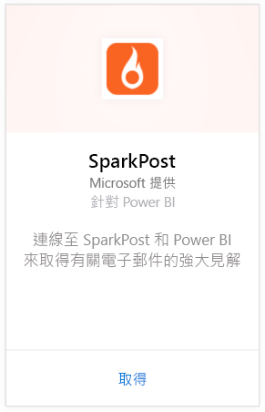
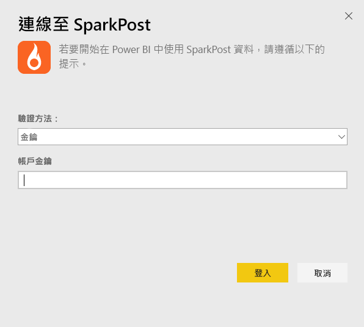
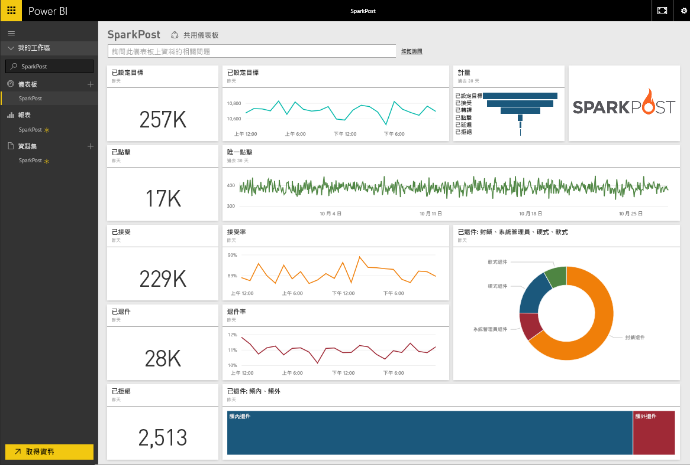
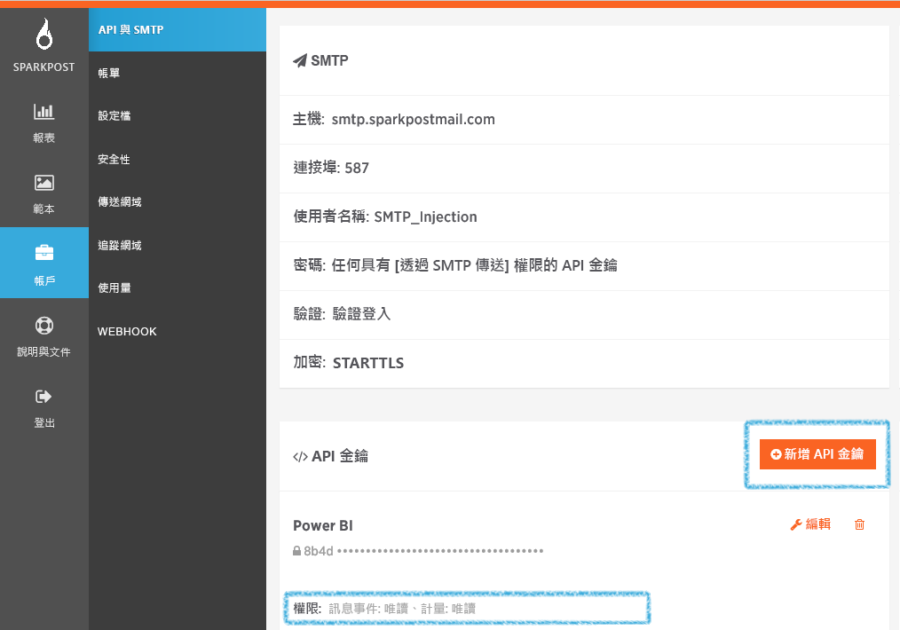

# 使用 Power BI 連接到 SparkPost
Power BI 的 SparkPost 內容套件可讓您將 SparkPost 帳戶的寶貴資料集，擷取放入令人發想的儀表板。 您可以使用 SparkPost 內容套件視覺化整體的電子郵件統計資料，包括網域、活動和 ISP 參與。

連接到 [Power BI 的 SparkPost 內容套件](https://app.powerbi.com/getdata/services/spark-post)。

## 如何連接
1. 選取左側瀏覽窗格底部的 [取得資料]  。
   
   
2. 在 [服務]  方塊中，選取 [取得] 。
   
   
3. 選取 **SparkPost** 內容套件並按一下 [取得] 。 
   
   
4. 出現提示時，請提供 SparkPost API 金鑰並選取 [登入]。 請參閱以下關於[尋找這些參數](#FindingParams)的詳細資訊。
   
   
5. 您的資料會開始載入，時間長短視您的帳戶大小而定。 Power BI 匯入資料之後，您會在左側瀏覽窗格中看到預設的儀表板、報表和資料集，其中已填入您過去 90 天內的電子郵件統計資料。 新的項目會以黃色星號標示\*。
   
   

**接下來呢？**

* 請嘗試在儀表板頂端的[問與答方塊中提問](power-bi-q-and-a.md)
* [變更儀表板中的圖格](service-dashboard-edit-tile.md)。
* [選取圖格](service-dashboard-tiles.md)，開啟基礎報表。
* 雖然資料集排程為每天重新整理，但是您可以變更重新整理排程，或使用 [立即重新整理] 視需要嘗試重新整理

## 包含的內容
Power BI 的 SparkPost 內容套件包含獨特的點擊、接受的速度、退回速度、延遲的速度、拒絕速度等資訊。

## 尋找參數
內容套件會使用 API 金鑰將 SparkPost 帳戶連接至 Power BI。 API 金鑰位在帳戶 \>[API 和 SMTP ] 下的帳戶中 (詳細資訊在[這裡](https://support.sparkpost.com/customer/portal/articles/1933377-create-api-keys))。 建議您使用具有 `Message Events: Read-only `和 `Metrics: Read-only` 權限的 API 金鑰。

