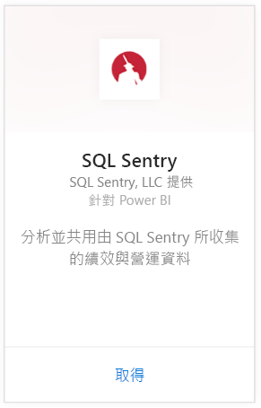
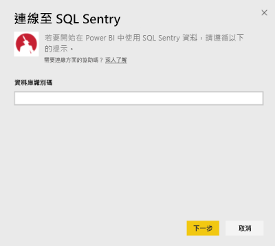
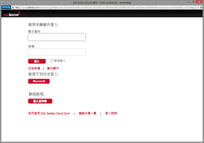
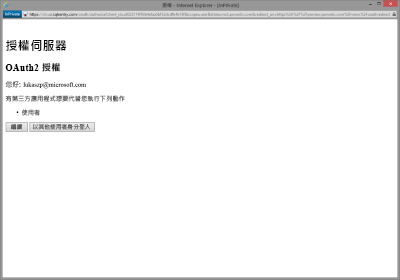
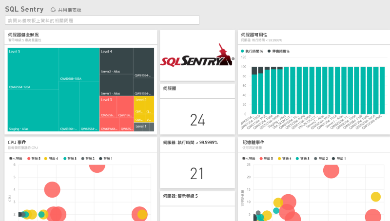
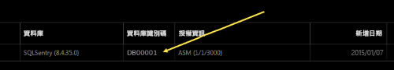
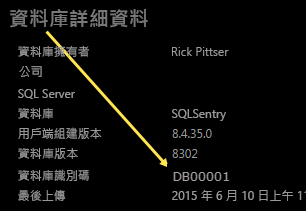

# 使用 Power BI 連接到 SQL Sentry
使用 Power BI 可輕鬆分析由 SQL Sentry 所收集的效能資料。 Power BI 會擷取您的資料，然後根據該資料建置預設的儀表板和相關報表。

連接到 Power BI 的 [SQL Sentry 內容套件](https://app.powerbi.com/groups/me/getdata/services/sql-sentry)。

>[!NOTE]
>存取用於連線到 http://cloud.sqlsentry.com 的 SQL Sentry 帳戶，同時需要您將監視的資料庫識別碼，才可連線。  找到資料庫識別碼位置的說明如下。

## 如何連接
1. 選取左側瀏覽窗格底部的 [取得資料]  。
   
   
2. 在 [服務]  方塊中，選取 [取得] 。
   
    
3. 選取 [SQL Sentry] **\> [取得]**。
   
   
4. 提供您要在 Power BI 中監視之資料庫的 **資料庫識別碼** 。 如需更多資訊，請參閱下文的[尋找這個](#FindingParams)。
   
   
5. 針對 [驗證方法]，選取 [oAuth2] **\> [登入]** 。
   
   出現提示時，請輸入 cloud.sqlsentry.com 認證並遵循 SQL Sentry 驗證程序。
   
   
   
   第一次連接時，Power BI 會提示您允許唯讀存取您的帳戶。 選取 [同意] 開始匯入程序。  匯入程序可能需要幾分鐘的時間，視您帳戶的資料量而定。
   
   
6. Power BI 匯入資料之後，您會在左側瀏覽窗格中看到新的儀表板、報表和資料集。 新的項目會以黃色星號 \* 標示：
   
   
7. 選取 SQL Sentry 儀表板。
   
   這是 Power BI 建立的預設儀表板，可顯示您的資料。 您可以修改此儀表板，以您想要的任何方式來顯示資料。
   
   

**接下來呢？**

* 請嘗試在儀表板頂端的[問與答方塊中提問](consumer/end-user-q-and-a.md)
* [變更儀表板中的圖格](service-dashboard-edit-tile.md)。
* [選取圖格](consumer/end-user-tiles.md)，開啟基礎報表。
* 雖然資料集排程為每天重新整理，但是您可以變更重新整理排程，或使用 [立即重新整理] 視需要嘗試重新整理

## 包含的內容
Power BI 中的 SQL Sentry 提供下列資料：

| 資料表名稱 | 描述 |
| --- | --- |
| 連接 |此資料表提供有關 SQL Sentry 定義的連接資訊。 |
| 日期  |此資料表包含自今天起回溯至最早的日期所收集和保存的效能資料。 |
| 停機時間  |此資料表包含在您環境中受到監視之每部伺服器的停機時間和執行時間相關資訊。 |
| 記憶體使用量  |此資料表包含您每部伺服器中有多少可用記憶體的相關資料。  |
| 伺服器  |此資料表包含您環境中每部伺服器的記錄。 |
| 伺服器健全狀況  |此資料表包含您環境中自訂條件所產生之所有事件的資料，包括嚴重性和計數。 |

## 尋找參數
在新的網頁瀏覽器視窗中登入 <https://cloud.sqlsentry.com>，即可找到**資料庫識別碼**。  **資料庫識別碼** 會列在主要概觀頁面上：

    

[資料庫詳細資料] 畫面上也會顯示 **資料庫識別碼** ：

    

## 疑難排解
如果您某些應用程式的資料未出現在 Power BI，請檢查以確認您使用正確的資料庫識別碼，且具有檢視資料的權限。 

如果您並非要同步到 <https://cloud.sqlsentry.com> 之 SQL Sentry 資料庫的擁有者，請連絡系統管理員以確定您有權限檢視所收集的資料。

## 後續步驟
[Power BI 是什麼？](power-bi-overview.md)

[取得 Power BI 的資料](service-get-data.md)

