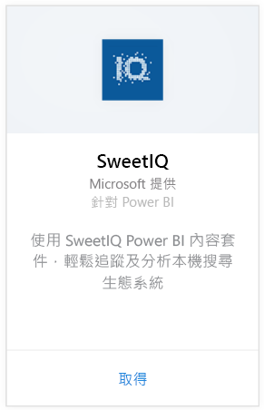
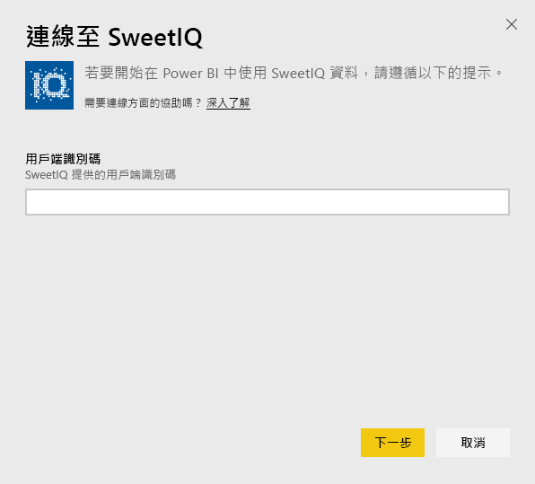
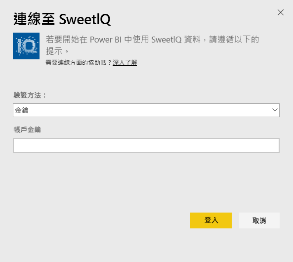
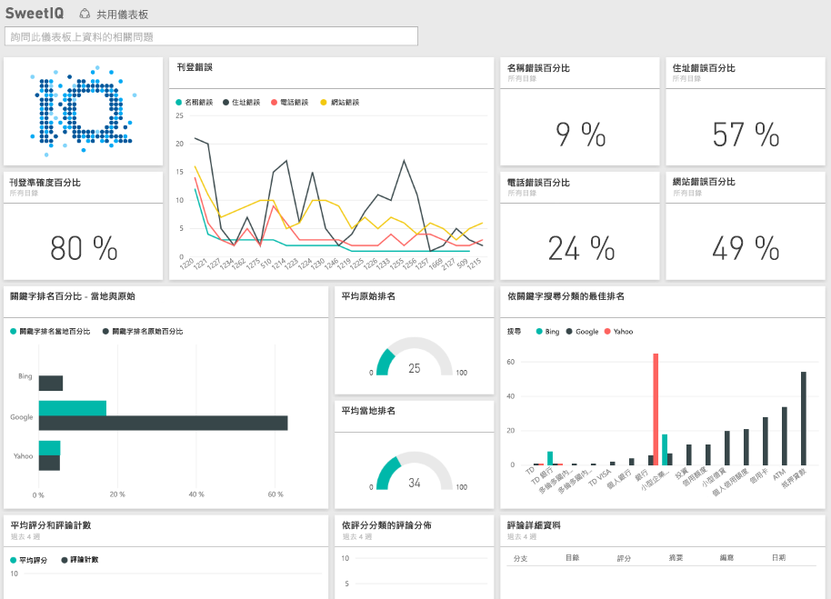

# 使用 Power BI 連接到 SweetIQ
Power BI 內容套件會從 SweetIQ 帳戶提取資料，並產生現成的內容，讓您輕鬆瀏覽資料。 使用 SweetIQ 內容套件來分析有關您的地點、清單、評分和評論。 資料會設定為每天重新整理，確保您所監視的資料為最新狀態。

連接到適用於 Power BI 的 [SweetIQ 內容套件](https://app.powerbi.com/groups/me/getdata/services/sweetiq)。

## 如何連接
1. 在左側瀏覽窗格中，按一下 [取得資料]  。
   
    
2. 選取 [SweetIQ]  並按一下 [取得]  。
   
    
3. 提供您的 SweetIQ 用戶端識別碼。 這通常是英數字元值。 如需有關尋找此值的詳細資訊，請見下方資訊。
   
    
4. 選取 [金鑰]  驗證類型，並提供您的 Sweet IQ API 金鑰。 這通常是英數字元值。 如需有關尋找此值的詳細資訊，請見下方資訊。
   
    
5. Power BI 會開始載入資料，這可能需要一點時間，視您帳戶的資料大小而定。 載入完成後，您會在左側瀏覽窗格中看到新的儀表板、報表和資料集。
   
    

**接下來呢？**

* 請嘗試在儀表板頂端的[問與答方塊中提問](consumer/end-user-q-and-a.md)
* [變更儀表板中的圖格](service-dashboard-edit-tile.md)。
* [選取圖格](consumer/end-user-tiles.md)，開啟基礎報表。
* 雖然資料集排程為每天重新整理，但是您可以變更重新整理排程，或使用 [立即重新整理]  視需要嘗試重新整理

## 尋找參數
此內容套件的用戶端識別碼和 API 金鑰，與您的 SweetIQ 使用者名稱和密碼不同。

選取您帳戶可存取之其中一個用戶端的用戶端識別碼。 您可以在 SweetIQ 帳戶中的 [用戶端管理] 下，找到用戶端清單。

請連絡您的 API 金鑰管理員，來存取特定用戶端的資料。

## 後續步驟
[Power BI 是什麼？](power-bi-overview.md)

[取得 Power BI 的資料](service-get-data.md)

