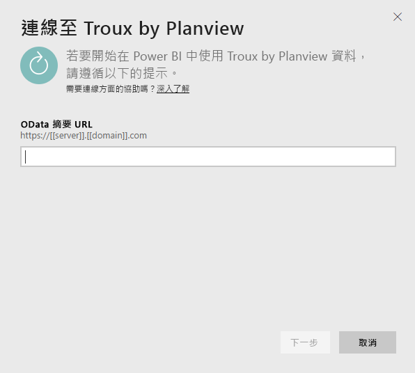
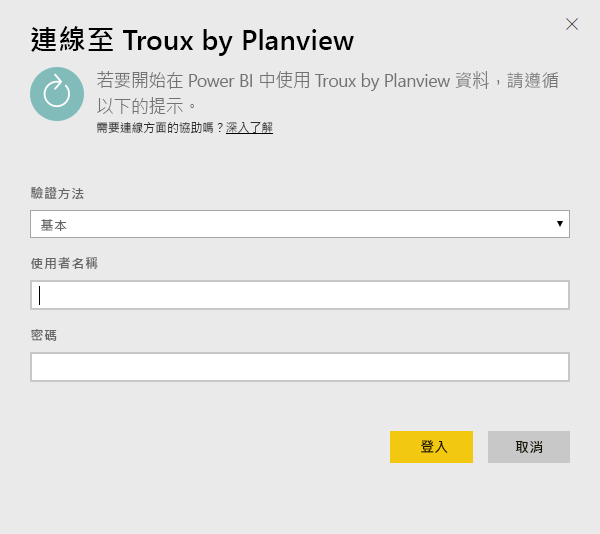
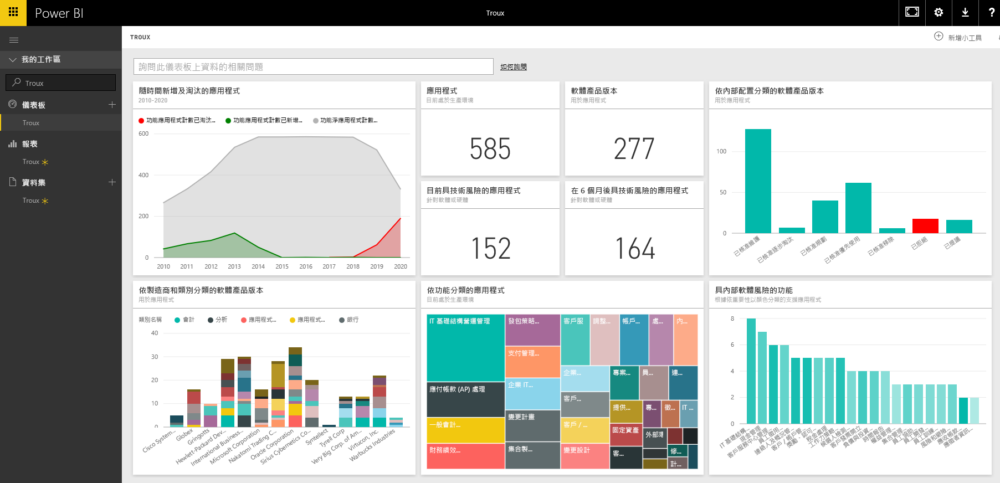

# 連接到 Troux for Power BI
使用 Troux 內容套件，您能以全新的方式，直接在 Power BI 中視覺化企業架構的儲存機制。 內容套件為您商務功能提供一組深入分析，同時提供具有這些功能的應用程式以及支援這些應用程式的技術，這些技術都可以使用 Power BI 完全自訂。

連接到適用於 Power BI 的 [Troux 內容套件](https://app.powerbi.com/getdata/services/troux)。

## 如何連接
1. 選取左側瀏覽窗格底部的 [取得資料]  。
   
   
2. 在 [服務]  方塊中，選取 [取得]  。
   
   
3. 選取 [Troux]  \> [取得]  。
   
   
4. 指定 Troux OData URL。 請參閱以下關於[尋找這些參數](#FindingParams)的詳細資訊。
   
   
5. 在 [ **驗證方法**] 選取 [ **基本** ]，然後輸入使用者名稱及密碼，再選取 [ **登入**]。
   
    
6. 一經核准，匯入程序會自動開始。 完成時，新的儀表板、報表和模型會出現在瀏覽窗格中。 選取儀表板以檢視匯入的資料。
   
     

**接下來呢？**

* 請嘗試在儀表板頂端的[問與答方塊中提問](consumer/end-user-q-and-a.md)
* [變更儀表板中的圖格](service-dashboard-edit-tile.md)。
* [選取圖格](consumer/end-user-tiles.md)，開啟基礎報表。
* 雖然資料集排程為每天重新整理，但是您可以變更重新整理排程，或使用 [立即重新整理]  視需要嘗試重新整理

## 系統需求
需要 Troux OData 摘要和 Troux 9.5.1 或更新版本的存取權限。

## 尋找參數
客戶服務團隊可以提供您唯一的 Troux OData 摘要 URL

## 疑難排解
如果提供認證之後看到逾時錯誤，請嘗試重新連線。

## 後續步驟
[開始使用 Power BI](service-get-started.md)

[取得 Power BI 中的資料](service-get-data.md)

