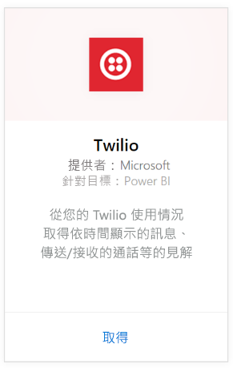
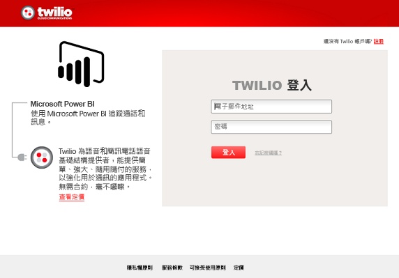
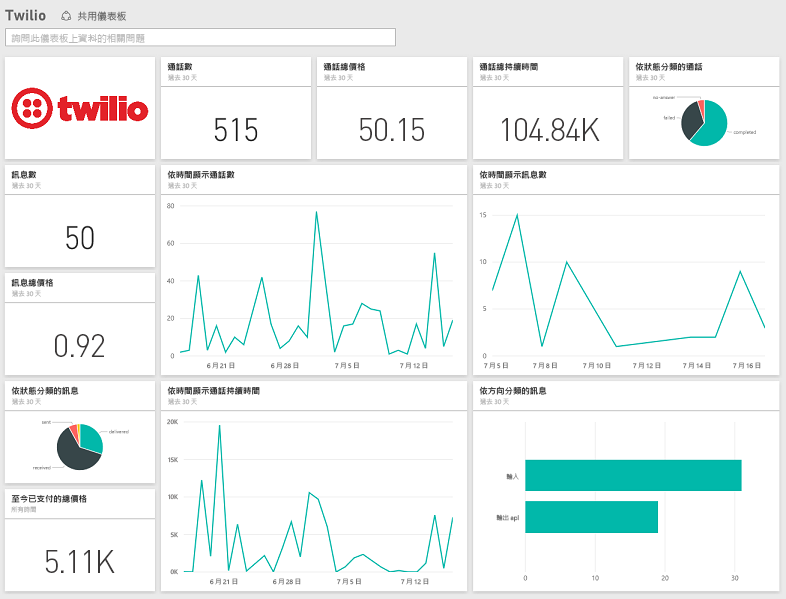

# 使用 Power BI 連接到 Twilio
Power BI 的 Microsoft Twilio 內容套件可讓您提取 Power BI 資料，並建立現成的 [Twilio 儀表板](https://powerbi.microsoft.com/integrations/twilio)和報表，顯示資料的深入解析。 您也可以針對 Power BI 所建立的資料集，建立您自訂的報表和儀表板。 資料會每天重新整理一次，讓您隨時查看最新的資料。

連接到 Power BI 的 [Twilio 內容套件](https://app.powerbi.com/getdata/services/twilio)。

## 如何連接
1. 選取左側瀏覽窗格底部的 [取得資料]  。
   
    
2. 在 [服務]  方塊中，選取 [取得] 。
   
    
3. 選取 [Twilio] \> [取得]。
   
   
4. 針對 **[驗證方法]**，選取 [oAuth2]  **[登入]**\>。 出現提示時，請提供您的 Twilio 認證並授權 Power BI 應用程式存取您的資料。
   
   
5. 這樣會開始從您的 Twilio 帳戶匯入資料，接著將出現儀表板且已填入您過去 30 天內的通話和訊息使用量。 
   
   

**接下來呢？**

* 請嘗試在儀表板頂端的[問與答方塊中提問](consumer/end-user-q-and-a.md)
* [變更儀表板中的圖格](service-dashboard-edit-tile.md)。
* [選取圖格](consumer/end-user-tiles.md)，開啟基礎報表。
* 雖然資料集排程為每天重新整理，但是您可以變更重新整理排程，或使用 [立即重新整理] 視需要嘗試重新整理

## 包含的內容
過去 30 天內所有通話和訊息交易詳細資料。 您可以針對此資料執行各式各樣的分析與彙總。

一系列您可能會想留意的已彙總統計資料。 此系列資料包括：

        All Time Calls Count  
        All Time Calls Duration  
        All Time Calls Price  
        All Time Messages Price  
        All Time Messages Count  
        All Time Count of Phone Numbers  
        All Time Price of Phone Numbers  
        All Time Twilio Client Calls Price  
        All Time Twilio Client Calls Duration  
        All Time Twilio Client Calls Count  
        All Time Total Price  
        All Time Inbound Calls Price  
        All Time Inbound Calls Duration  
        All Time Inbound Calls Count  
        All Time Outbound Calls Price  
        All Time Outbound Calls Duration  
        All Time Outbound Calls Count  
        This Month Calls Price  
        This Month Calls Duration  
        This Month Calls Count  
        This Month Messages Count  
        This Month Messages Price  
        This Month Count of Phone Numbers  
        This Month Price of Phone Numbers  
        This Month Twilio Client Calls Price  
        This Month Twilio Client Calls Duration  
        This Month Twilio Client Calls Count  
        This Month Total Price  
        This Month Inbound Calls Price  
        This Month Inbound Calls Duration  
        This Month Inbound Calls Count  
        This Month Outbound Calls Price  
        This Month Outbound Calls Duration  
        This Month Outbound Calls Count  
        This Month Inbound Messages Price  
        This Month Inbound Messages Count  
        This Month Outbound Messages Price  
        This Month Outbound Messages Count

## 疑難排解
如果您過去 30 天內的資料量非常龐大 (數十萬筆交易)，則資料擷取步驟可能會失敗。 我們已經知道這個問題，且正努力加以解決。 在此同時，若是您碰到這個問題，請使用 Power BI 頁面頂端的支援連結通知我們，我們會連絡您以詳加調查。

## 後續步驟
[開始使用 Power BI](service-get-started.md)

[取得 Power BI 中的資料](service-get-data.md)

