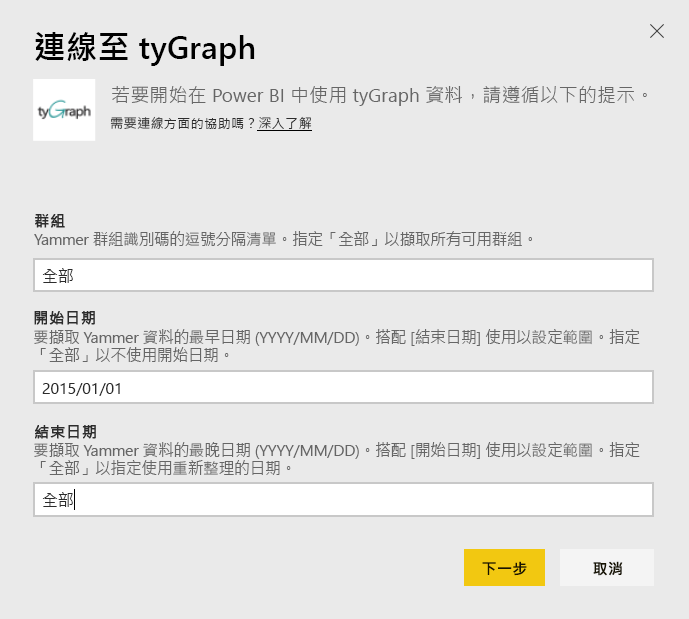
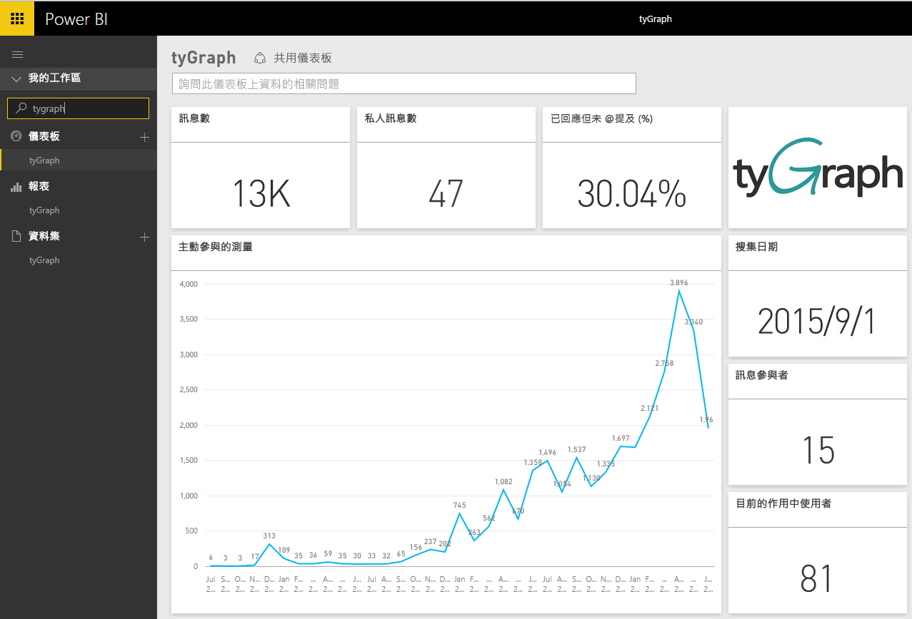
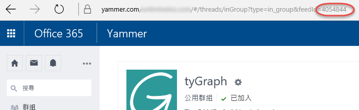

# 使用 Power BI 連接到 tyGraph
使用 Power BI 內容套件以視覺化方式檢視和瀏覽 Power BI 中的 tyGraph 資料。 首先連接至 tyGraph 帳戶並載入儀表板、報表和資料集。 現成的內容包含如作用中參與量值 (MAE 分數) 與熱門參與者等深入資訊。 進一步自訂它以反白顯示您最關心的資訊。  資料會根據您設定的排程自動重新整理。

連線到 [tyGraph for Power BI](https://app.powerbi.com/getdata/services/tygraph)。

## 如何連接
1. 選取左側瀏覽窗格底部的 [取得資料]  。
   
   
2. 在 [服務]  方塊中，選取 [取得] 。
   
   
3. 選取 [tyGraph] \> [取得]。
   
   
4. 指定您想要連接到的群組和時間範圍，否則指定「全部」 (All) 帶入所有資料。 請注意預期的日期格式 (YYYY/MM/DD)。 請參閱以下關於[尋找參數](#FindingParams)的詳細資訊。
   
   
5. 提供連接用的 tyGraph 金鑰。 請參閱以下關於尋找此值的詳細資訊。
   
    **如果您是 Yammer 驗證管理員**  
    您的 API 金鑰會在成功建立 tyGraph 帳戶時，以電子郵件傳送給您。 如果您再也找不到金鑰，可以傳送電子郵件給 support@unlimitedviz.com，要求新的金鑰。如果您還沒有 tyGraph 帳戶，可以在 [http://www.tygraph.com/](http://www.tygraph.com/) 開始試用。 
   
    **如果您不是 Yammer 驗證管理員**
   
    tyGraph 內容套件需要由 Yammer 驗證管理員建立的 tyGraph 帳戶。 建立之後，補充的金鑰可以發給相同組織中的使用者。 如果您的驗證管理員尚未建立 tyGraph 帳戶，請與他們連絡，請他們建立。 如果已建立，您可以傳送電子郵件給 <mailto:support@unlimitedviz.com> 來要求金鑰。
   
    
6. 在成功驗證之後，匯入程序會自動開始。 完成時，新的儀表板、報表和模型會出現在瀏覽窗格中。 選取儀表板以檢視匯入的資料。
   
    

**接下來呢？**

* 請嘗試在儀表板頂端的[問與答方塊中提問](service-q-and-a.md)
* [變更儀表板中的圖格](service-dashboard-edit-tile.md)。
* [選取圖格](service-dashboard-tiles.md)，開啟基礎報表。
* 雖然資料集排程為每天重新整理，但是您可以變更重新整理排程，或使用 [立即重新整理] 視需要嘗試重新整理

## 尋找參數
您可以帶入您有權存取的所有群組上的資料，或者進行選擇以指定子集。 您也可以依日期來建立資料的子集。 您可以建立多個 tyGraph 儀表板來監視特定的群組和/或日期集。 這些參數的詳細資料如下。

**群組**

tyGraph API 可以依特定群組識別碼來篩選資料。 這些會以逗號分隔清單提供給內容套件。 

    Example: 2427647,946595,1154464

您可以瀏覽到群組摘要並檢查 URL，識別 Yammer 中特定群組的群組識別碼。

在上述範例中，Yammer 群組識別碼是 4054844

**開始日期**

開始日期可讓您限制傳回資料的最早值。 只有在此日期當天或之後建立的資料會載入至內容套件。 開始日期的格式是 YYYY/MM/DD。 

    Example: 2013/10/29

在上述範例中，2013 年 10 月 29 日當天或之後的所有資料都會載入至內容套件。 

**結束日期**：結束日期可讓您限制傳回資料的最晚值。 它可以和開始日期搭配使用，來載入某個日期範圍的資料。 只有在此日期當天或之前建立的資料會載入至內容套件。 結束日期的格式是 YYYY/MM/DD。 

    Example: 2014/10/20

在上述範例中，2014 年 10 月 20 日當天或之前的所有資料都會載入至內容套件。 

## 後續步驟
[開始使用 Power BI](service-get-started.md)

[取得 Power BI 中的資料](service-get-data.md)

