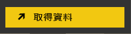
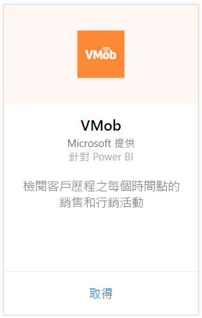
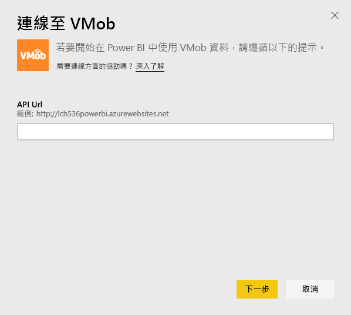
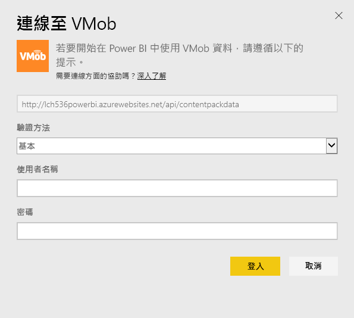
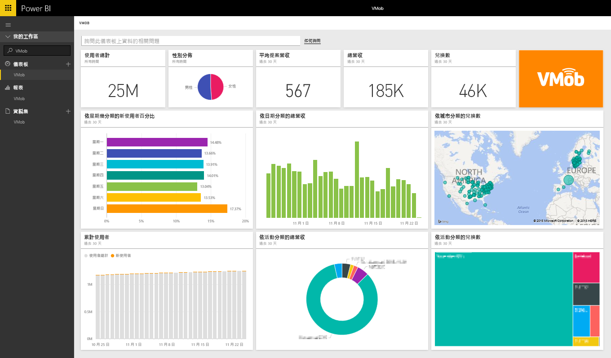

# 使用 Power BI 連接到 VMob
透過 Power BI 和 VMob 內容套件來追蹤和瀏覽 VMob 資料很容易。 Power BI 會擷取下列資料：過去 30 天任何時候的使用者統計資料、過去 30 天的零售 KPI，以及過去 30 天的行銷活動績效。

連接到適用於 Power BI 的 [VMob 內容套件](https://app.powerbi.com/getdata/services/vmob)。

## 如何連接
1. 選取左側瀏覽窗格底部的 [取得資料]  。
   
    
2. 在 [服務]  方塊中，選取 [取得] 。
   
   
3. 選取 [VMob] \> [取得] 。
   
   
4. 出現提示時，輸入您 VMob URL，然後按一下 [下一步] 按鈕。 這是由 VMob 另外提供的 URL。
   
    
5. 在 [驗證方法] 下拉式清單中選擇 [基本]  選項，輸入 VMob 使用者名稱和密碼，然後按一下 [登入]  按鈕。
   
    
6. 此匯入程序會自動開始，並且 Power BI 將擷取 VMob 資料並為您建立現成可用的儀表板和報表。
   
   

**接下來呢？**

* 請嘗試在儀表板頂端的[問與答方塊中提問](power-bi-q-and-a.md)
* [變更儀表板中的圖格](service-dashboard-edit-tile.md)。
* [選取圖格](service-dashboard-tiles.md)，開啟基礎報表。
* 雖然資料集排程為每天重新整理，但是您可以變更重新整理排程，或使用 [立即重新整理] 視需要嘗試重新整理

## 後續步驟
[開始使用 Power BI](service-get-started.md)

[取得 Power BI 中的資料](service-get-data.md)

