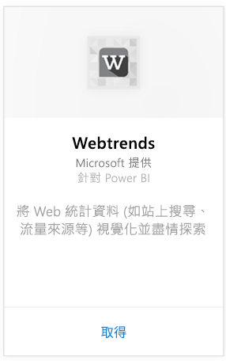
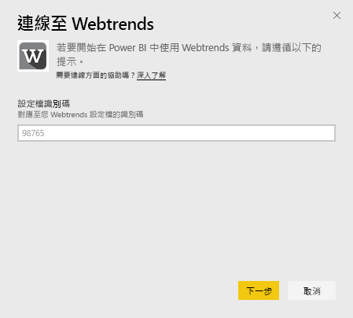
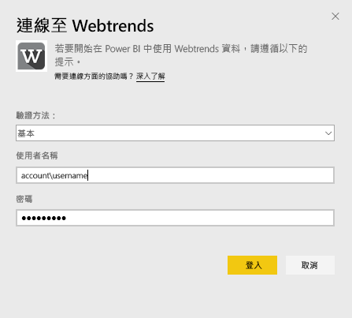
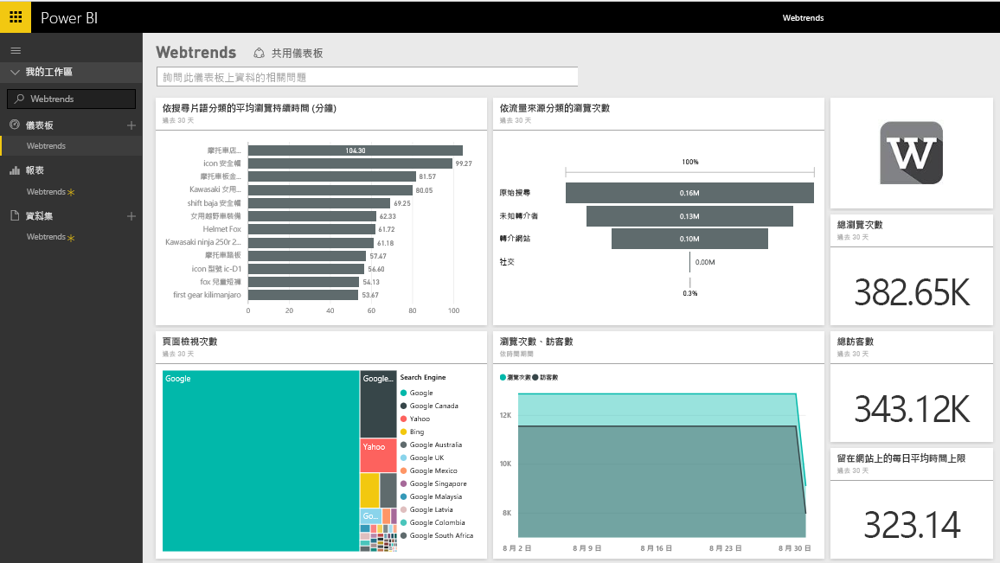
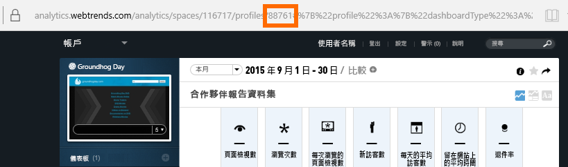
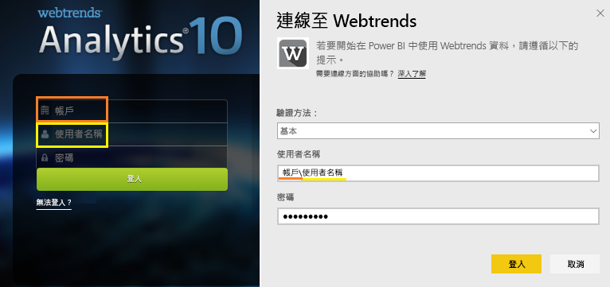

# 使用 Power BI 連接到 Webtrends
Power BI 的 Webtrends 內容套件包含各種現成度量，例如網頁的總檢視，和依流量來源的查閱次數。 在 Power BI 中視覺化您的 Webtrends 資料時，首先請連接至 Webtrends 帳戶。 您可以使用提供的儀表板和報表，或是加以自訂，以反白顯示您特別有興趣的資訊。  資料會自動每天重新整理一次。

連接到 [Power BI 的 Webtrends 內容套件](https://app.powerbi.com/getdata/services/webtrends)。

## 如何連接
1. 選取左側瀏覽窗格底部的 [取得資料]  。
   
   
2. 在 [服務]  方塊中，選取 [取得] 。
   
   
3. 選取 [Webtrends] \> [取得]。
   
   
4. 內容套件會連接到特定的 Webtrends 設定檔識別碼。 請參閱以下關於[尋找此參數](#FindingParams)的詳細資訊。
   
   
5. 請提供您的 Webtrends 認證來進行連接。 請注意，使用者名稱欄位預期輸入您的帳戶和使用者名稱。 請參閱下列[詳細資訊](#FindingParams)。
   
   
6. 一經核准，匯入程序會自動開始。 完成時，新的儀表板、報表和模型會出現在瀏覽窗格中。 選取儀表板以檢視匯入的資料。
   
   

**接下來呢？**

* 請嘗試在儀表板頂端的[問與答方塊中提問](power-bi-q-and-a.md)
* [變更儀表板中的圖格](service-dashboard-edit-tile.md)。
* [選取圖格](service-dashboard-tiles.md)，開啟基礎報表。
* 雖然資料集排程為每天重新整理，但是您可以變更重新整理排程，或使用 [立即重新整理] 視需要嘗試重新整理

## 包含的內容

Webtrends 內容套件會從下列報表提取資料︰  

| 報表名稱 | 報表識別碼 |
| --- | --- |
| 關鍵指標 | |
| 站上搜尋 |34awBVEP0P6 |
| 結束頁面 |7FshY8eP0P6 |
| 後幾頁 |CTd5rpeP0P6 |
| 前幾頁 |aSdOeaUgnP6 |
| 網站頁面 |oOEWQj3sUo6 |
| 現場廣告點選連結 |41df19b6d9f |
| 城市 |aUuHskcP0P6 |
| 國家/地區 |JHWXJNcP0P6 |
| 訪客 |xPcmTDDP0P6 |
| 瀏覽時間 |U5KAyqdP0P6 |
| 搜尋片語 |IKYEDxIP0P6 |
| 流量來源 |JmttAoIP0P6 |
| 搜尋引擎 |yGz3gAGP0P6 |
| 項目頁面 |i6LrkNVRUo6 |

>[!NOTE]
>針對 SharePoint 設定檔，度量名稱可能與 Webtrends UI 中顯示的名稱稍微不同。 執行下列對應可維持 SharePoint 和 Web 設定檔之間的一致性︰   

    - 工作階段數目 = 瀏覽次數  
    - 新使用者人數 = 新訪客人數  
    - 每工作階段的檢視次數 = 每次瀏覽的頁面檢視次數  
    - 平均每日使用者持續時間 = 每位訪客在網站上的平均時間  

## 系統需求
內容套件需要 Webtrends 設定檔的存取權並啟用[一組正確的報表](#Included)。

## 尋找參數
選取設定檔之後，可以在 URL 中找到您的 Webtrends 設定檔識別碼：

您的認證會與您登入 Webtrends 時輸入的內容相同，不過我們預期您在同一行輸入帳戶和使用者名稱，並用反斜線分隔：

## 疑難排解
在您提供認證之後，可能會在載入內容套件時發生問題。 如果在載入時看到「糟糕」訊息，請檢閱以下的疑難排解建議。 如果仍然有問題，請在 https://support.powerbi.com 提出支援票證

1. 正在使用正確的設定檔識別碼；如需詳細資訊，請參閱[尋找參數](#FindingParams)。
2. 使用者可以存取[包含的內容](#Included)一節中所列出的報表。

## 後續步驟
[Power BI 是什麼？](power-bi-overview.md)

[Power BI - 基本概念](service-basic-concepts.md)

