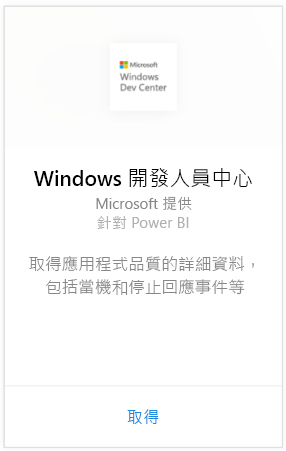
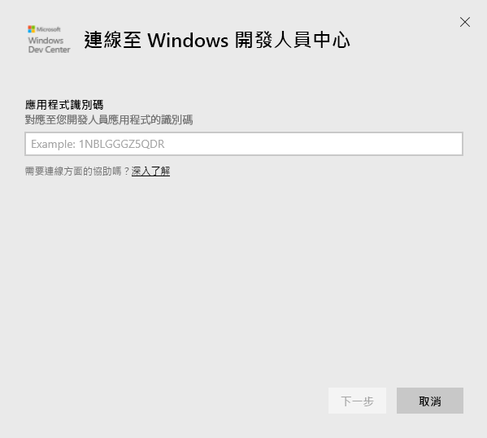
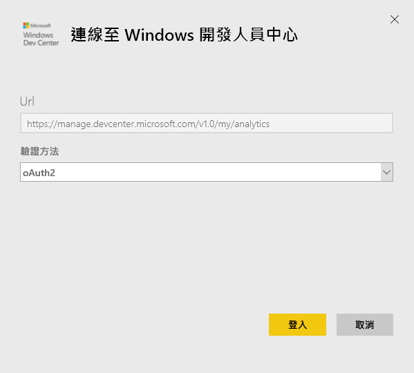
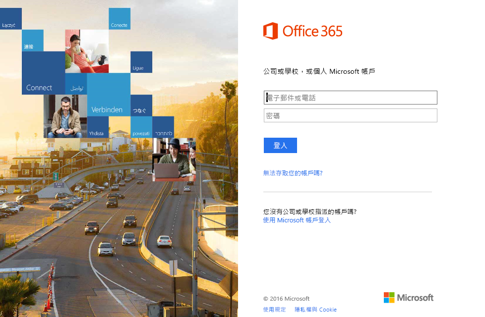
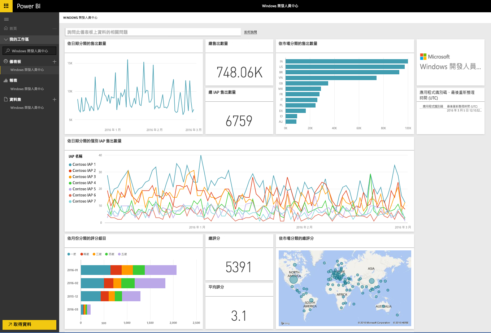
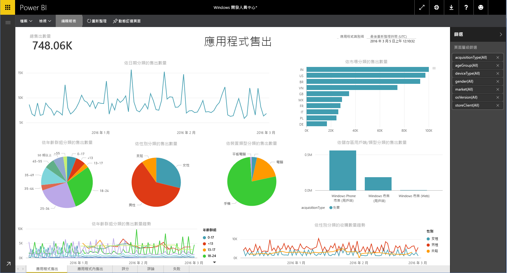

# 使用 Power BI 連接到 Windows 開發人員中心
使用 Power BI 內容套件探索並監視 Power BI 中的 Windows 開發人員中心應用程式中分析資料。 資料會自動每天重新整理一次。

連接到 Power BI 的 [Windows 開發人員中心內容套件](https://app.powerbi.com/getdata/services/devcenter)。

## 如何連接
1. 選取左側瀏覽窗格底部的 [取得資料]  。
   
   
2. 在 [服務]  方塊中，選取 [取得] 。
   
   
3. 選取 [Windows 開發人員中心] \> [取得]。
   
   
4. 輸入您所擁有之應用程式的應用程式識別碼，然後按一下 [下一步]。 請參閱以下關於[尋找這些參數](#FindingParams)的詳細資訊。
   
   
5. 針對 [驗證方法] 選取 [oAuth2] \> [登入]。 出現提示時，請輸入與 Windows 開發人員中心帳戶相關聯的 Azure Active Directory 認證 (如需詳細資訊，請參閱[系統需求](#Requirements))。
   
    
   
    
6. 一經核准，匯入程序會自動開始。 完成時，新的儀表板、報表和模型會出現在瀏覽窗格中。 選取儀表板以檢視匯入的資料，然後選擇一個磚以瀏覽至基礎報表。
   
    
   
    

**接下來呢？**

* 請嘗試在儀表板頂端的[問與答方塊中提問](power-bi-q-and-a.md)
* [變更儀表板中的圖格](service-dashboard-edit-tile.md)。
* [選取圖格](service-dashboard-tiles.md)，開啟基礎報表。
* 雖然資料集排程為每天重新整理，但是您可以變更重新整理排程，或使用 [立即重新整理] 視需要嘗試重新整理

## 包含的內容
開發人員中心 Power BI 內容套件包含您的應用程式和 IAP 營收、評等、評論和應用程式健全狀況的分析資料。 資料限制於過去 3 個月內， 且為移動的視窗，以便重新整理資料集時，將會更新包含的日期。

## 系統需求
此內容套件需要至少一個發佈至 Windows 市集的應用程式和 Windows 開發人員中心帳戶 (如需更多詳細資訊，請前往[這裡](https://msdn.microsoft.com/windows/uwp/publish/manage-account-users))。

## 尋找參數
您可以移至 [應用程式管理] 下的應用程式識別頁面，找到應用程式的應用程式識別碼。

應用程式識別碼位於 Windows 10 市集 URL 的結尾， https://www.microsoft.com/store/apps/ **{應用程式識別碼}**

## 後續步驟
[開始使用 Power BI](service-get-started.md)

[取得 Power BI 中的資料](service-get-data.md)

