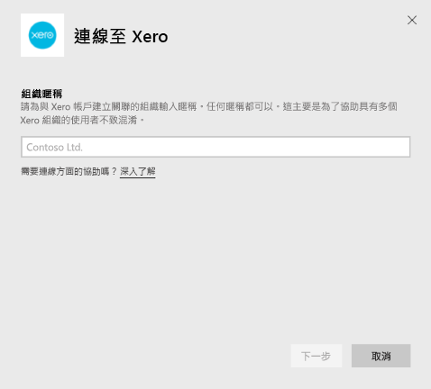
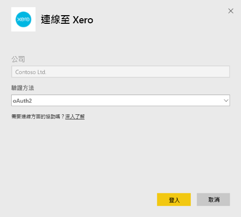
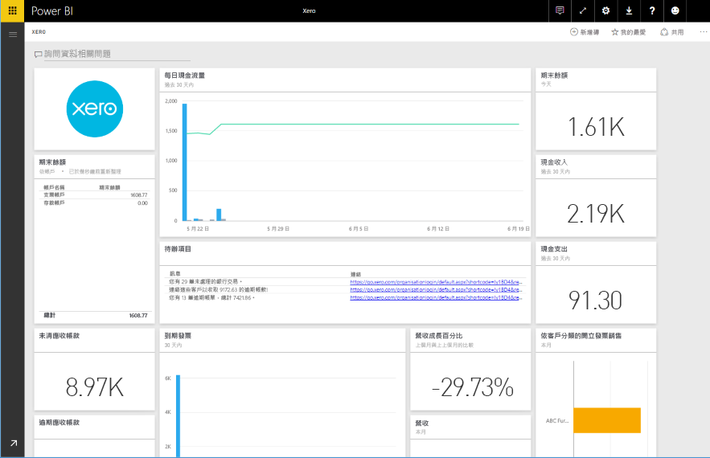

# 使用 Power BI 連接到 Xero
Xero 是簡單易用的線上會計軟體，專為小型企業所設計。 您可以運用 Xero 的財務功能加上此 Power BI 內容套件，建立一份高吸睛力的報表。 您的預設儀表板包括許多小型企業計量，例如現金狀況、收入項下開支、利損趨勢、應收帳款天數及投資報酬率。

連接至 Power BI 的 [Xero 內容套件](https://app.powerbi.com/getdata/services/xero) 或深入了解 [Xero 和 Power BI](https://help.xero.com/Power-BI) 整合。

## 如何連接
1. 選取左側瀏覽窗格底部的 [取得資料]  。
   
   
2. 在 [服務]  方塊中，選取 [取得] 。
   
   
3. 選取 [Xero] \> [取得]。
   
   
4. 請為與 Xero 帳戶建立關聯的組織輸入暱稱。 任何暱稱都可以，這主要是為了協助具有多個 Xero 組織的使用者不致混淆。 請參閱[下列](#FindingParams)的詳細資訊。
   
   
5. 選取 [OAuth] 作為**驗證方法**，當出現提示時，登入您的 Xero 帳戶，然後選取要連接的組織。 登入完成後，選取 [登入] 啟動載入程序。
   
    
   
    
6. 一經核准，匯入程序會自動開始。 完成時，新的儀表板、報表和模型會出現在瀏覽窗格中。 選取儀表板以檢視匯入的資料。
   
     

**接下來呢？**

* 請嘗試在儀表板頂端的[問與答方塊中提問](service-q-and-a.md)
* [變更儀表板中的圖格](service-dashboard-edit-tile.md)。
* [選取圖格](service-dashboard-tiles.md)，開啟基礎報表。
* 雖然資料集排程為每天重新整理，但是您可以變更重新整理排程，或使用 [立即重新整理] 視需要嘗試重新整理

## 包含的內容
內容套件儀表板包含磚和涵蓋各種不同領域的計量，使用對應的報表深入了解︰  

| 區域 | 儀表板磚 | 報表 |
| --- | --- | --- |
| 現金 |每日現金流量  現金收入  現金支出  帳戶別的期末餘額  今日期末餘額 |銀行帳戶 |
| 客戶 |開立發票的銷售  客戶別的開立發票銷售  開立發票的銷售成長趨勢  到期發票  未清應收帳款  逾期應收帳款 |客戶  存貨 |
| 供應商 |使用票據之購買  依供應商別的使用票據之購買  使用票據之購買成長趨勢   到期票據  未清應付帳款  逾期應付帳款 |供應商  存貨 |
| 存貨 |產品別的每月銷售額 |存貨 |
| 損益 |每月損益  本會計年度淨利  本月份淨利  最高額支出帳戶 |損益 |
| 資產負債表 |總資產  總負債  權益 |資產負債表 |
| 健康情況 |流動比率  毛利率   總資產報酬率  總負債對股東權益比率 |健康情況  詞彙和技術提示 |

資料集也包含下列資料表，以自訂您的報表與儀表板︰  

* 地址  
* 警示  
* 銀行對帳單每日餘額  
* 銀行對帳單  
* 連絡人  
* 費用報銷  
* 發票單項  
* 發票  
* 項目  
* 月末  
* 組織  
* 試算表  
* Xero 帳戶

## 系統需求
需要下列角色以存取 Xero 內容套件：「標準 + 報表」或「建議程式」。

## 尋找參數
在 Power BI 中提供名稱以供您的組織追蹤。 這可讓您連接到多個不同的組織。 請注意，您無法多次連接到相同的組織，因為其會影響排定的重新整理。   

## 疑難排解
* Xero 使用者必須擁有下列角色，以存取適用於 Power BI 的 Xero 內容套件：「標準 + 報表」或「建議程式」。 內容套件依賴以使用者為基礎的權限透過 Power BI 存取報告資料。  
* 如果您載入一段時間之後收到失敗，請確認看到該錯誤訊息所需的時間。 請注意，因為 Xero 所提供的存取權杖只在 30 分鐘內有效，所以資料載入所需時間超過該時間範圍的帳戶將會失敗。 我們正積極改善此問題。
* 在載入期間，儀表板上的磚將會處於一般載入狀態。 在完整載入完成之前，預期這種狀態不會變更。 如果您收到通知，您的載入已完成但磚仍在載入，請嘗試使用儀表板右上角的 ... 重新整理儀表板磚。
* 如果您的內容套件重新整理失敗，請檢查您是否在 Power BI 中超過一次連接到相同的組織。 Xero 只允許每個組織中存在單一使用中連線，如果您連接到同一個組織一次以上，您可能會看到錯誤並指出您的認證無效。  
* 對於類似連接至適用於 Power BI 之 Xero 內容套件的錯誤訊息或載入非常緩慢等問題，先清除快取 / Cookie 並重新啟動瀏覽器，再重新連接至 Power BI。  

對於其他問題，如果問題仍然存在，請在 http://support.powerbi.com 提出票證。

## 後續步驟
[開始使用 Power BI](service-get-started.md)

[取得 Power BI 中的資料](service-get-data.md)

