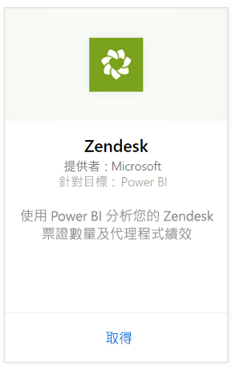
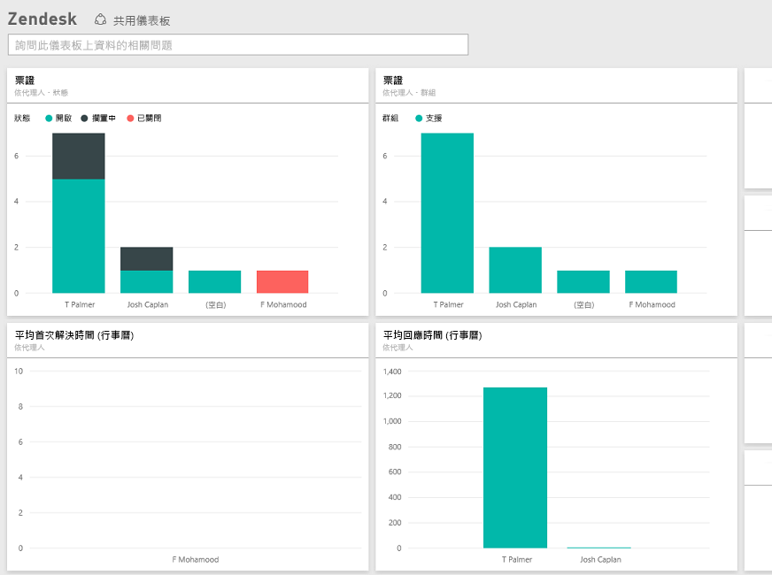

# 使用 Power BI 連接到 Zendesk
Zendesk 內容套件包含 Power BI 儀表板和一組 Power BI 報表，提供您有關於票證數量及代理程式效能的深入分析資料。 您可以使用提供的儀表板和報表，或是加以自訂，以反白顯示您特別有興趣的資訊。  資料會自動每天重新整理一次。 

連接到 [Zendesk 內容套件](https://app.powerbi.com/getdata/services/zendesk)或深入了解 Power BI 與 [Zendesk 的整合](https://powerbi.microsoft.com/integrations/zendesk)。

>[!NOTE]
>需要有 Zendesk 管理帳戶才能連接。 下方有[需求](#Requirements)的詳細資訊。

## 如何連接
1. 選取左側瀏覽窗格底部的 [取得資料]  。
   
   
2. 在 [服務]  方塊中，選取 [取得] 。
   
    
3. 選取 [Zendesk] \> [連接] 。
   
   
4. 提供與您帳戶相關聯的 URL。 其格式為 **https://company.zendesk.com**，請參閱下方的[尋找這些參數](#FindingParams)，以了解詳細資料。
   
   
5. 出現提示時，請輸入您的 Zendesk 認證。  選取 [oAuth 2]  做為驗證機制，然後按一下 [登入] 。 請遵循 Zendesk 驗證流程。 (如果您已經在瀏覽器中登入 Zendesk，可能就不會出現輸入認證的提示。)
   
   > [!NOTE]
   > 此內容套件需要您連接到 Zendesk 系統管理員帳戶。 
   > 
   > 
   
   
6. 按一下 [允許]  以允許 Power BI 存取您的 Zendesk 資料。
   
   
7. 按一下 [連接]  開始匯入程序。 Power BI 匯入資料之後，您會在左側瀏覽窗格中看到新的儀表板、報表和資料集。 新的項目會以黃色星號標示\*。
   
   

**接下來呢？**

* 請嘗試在儀表板頂端的[問與答方塊中提問](power-bi-q-and-a.md)
* [變更儀表板中的圖格](service-dashboard-edit-tile.md)。
* [選取圖格](service-dashboard-tiles.md)，開啟基礎報表。
* 雖然資料集排程為每天重新整理，但是您可以變更重新整理排程，或使用 [立即重新整理] 視需要嘗試重新整理

## 包含的內容
Power BI 內容套件包含下列資料：  

* 使用者 (使用者和代理程式)  
* 組織  
* 群組  
* 票證  

也會包含一組已計算的量值，例如平均等候時間及過去 7 天解決的票證數目。 完整的清單包含在內容套件中。

## 系統需求
需要有 Zendesk 系統管理員帳戶才能存取 Zendesk 內容套件。 如果是有興趣檢視 Zendesk 資料的代理程式或使用者，請在 [Power BI Desktop](desktop-connect-to-data.md) 中新增建議並檢閱 Zendesk 連接器。

## 尋找參數
Zendesk URL 與您用來登入 Zendesk 帳戶的 URL 相同。 如果不確定 Zendesk URL，可以使用 Zendesk [登入說明](https://www.zendesk.com/login/)。

## 疑難排解
如果您在連接時發生問題，請檢查 Zendesk URL，並確認使用的是 Zendesk 系統管理員帳戶。

## 後續步驟
* [開始使用 Power BI](service-get-started.md)
* [取得資料](service-get-data.md)

