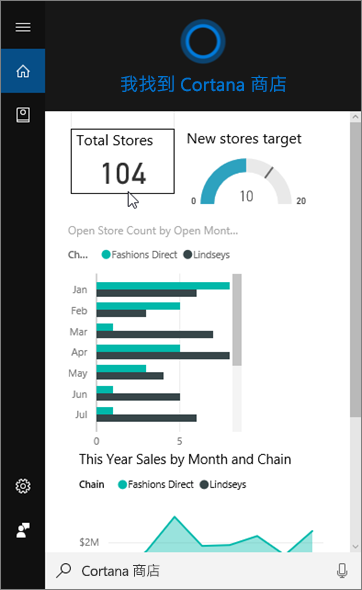
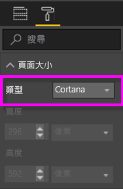
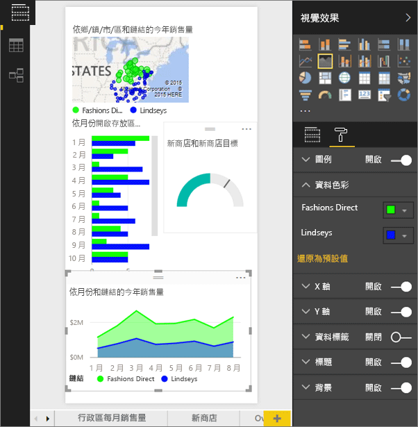
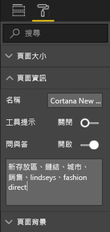
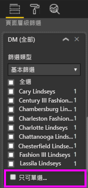

# 使用 Power BI 服務或 Power BI Desktop 建立 Cortana 的自訂回應頁面
您可以使用 Power BI 的完整功能，建立稱為「Cortana 回應頁面」  (有時稱為*Cortana Answer Card*)、專為回答 Cortana 問題所設計的特殊報表頁面。

> [!IMPORTANT]
> Cortana 整合已被取代，在 Power BI 中。 從 6 月 11 日，Cortana 將不再適用於任何儀表板和報表。

## 開始之前
我們提供四份文件引導您設定和使用適用於 Power BI 的 Cortana。 若您尚未開始，請從文章一開始閱讀。 文章二描述一些您必須採取才能開始使用 Cortana 回應頁面的步驟，因此特別重要。

**文章 1**：[了解 Cortana 和 Power BI 如何搭配運作](service-cortana-intro.md)

**文章 2**：[搜尋 Power BI 報表：進行 Cortana - Power BI - Windows 整合](service-cortana-enable.md)

**文章 3**：此文章

**文章 4**：[對問題進行疑難排解](service-cortana-troubleshoot.md)

## 建立專為 Cortana 設計的 Cortana 回應頁面
報表中的「Cortana 回應頁面」  會特別為 Cortana 調整大小，讓 Cortana 可以在畫面中將其顯示為問題的答案。 建立 Cortana 的回應頁面：

1. 建議從空白報表頁面開始。
2. 在 [視覺效果]  窗格中，選取油漆滾筒圖示，然後選擇 [頁面大小]   > [類型]   > [Cortana]  。
   
    
3. 建立您要在 Cortana 中顯示的一個或一組視覺效果，以回覆特定問題 (或問題集)。

> [!NOTE]
> Cortana 回應頁面目前不支援其中有靜態影像顯示的影像。 您可以將影像包含在以您資料內 URL 為基礎動態提取的資料表或矩陣視覺效果中。 
> 
> 

4. 確定所有視覺效果都在頁面框線內。 (選擇性) 修改顯示設定、資料標籤、色彩和背景。  
   
    
5. 命名頁面並新增替代名稱。 Cortana 會使用這些名稱來搜尋結果。 在 [視覺效果]  窗格中，選取畫刷圖示，然後選擇 [頁面資訊]  。 將滑桿移至 [開啟]  ，啟用此視覺效果的問與答。
   
    
   
   > [!TIP]
   > 若要改善結果，請避免使用同時也是資料行名稱的文字。
   > 
   > 
6. (選擇性) 如果您的報告包含頁面層級篩選，可以設定 [只可單選]  。 只有指定問題中的唯一篩選項目時，Cortana 才會將這個報表顯示為答案。 在 [篩選條件]  窗格底部可以找到 [只可單選]  。
   
   > [!NOTE]
   > 您不必設定 [只可單選]  也可要求 Cortana 顯示有頁面層級篩選的報表。 例如「顯示 Charlotte Lindseys 的業績」會顯示回應頁面，不論 [只可單選] 設定為何。
   > 
   > 
   
     
   
      例如，如果您詢問 Cortana：
   
   * 「依店家名稱顯示銷售量」，則不會顯示這個回應頁面，因為您未在必要的頁面層級篩選中包含任何項目。
   * 「顯示 Cary Lindseys 和 Charlotte Lindseys 的銷售量」，則不會顯示這個回應頁面，因為您從必要的頁面層級篩選指定了多個項目。
   * 「顯示 Charlotte Lindseys 的銷售量」，則會顯示這個回應頁面。
     
     =「顯示銷售量」，則不會顯示這個回應頁面，因為您未在必要的頁面層級篩選中包含任何項目。

> [!IMPORTANT]
> 您必須先[啟用 Cortana 的資料集](service-cortana-enable.md)，Cortana 才能存取您的 Cortana 回應頁面。
> 
> 

## Cortana 如何排序結果？
具有高分答案的結果 (例如與指定頁面名稱完全相符的項目) 會先出現，以作為 Cortana 中的「最符合項目」  。 如果 Power BI 中有多個 Cortana 回應頁面，就可能出現多個最符合的項目。 得分中等或較低的答案會以連結形式列於 Cortana 的最符合項目下方，例如答案不是以回應頁面名稱為依據，或問題含有 Power BI 無法理解的字組。

> [!NOTE]
> 將新的資料集或自訂 Cortana 回應頁面新增至 Power BI 並針對 Cortana 啟用時，Cortana 最多可能需要 30 分鐘的時間，才會開始顯示結果。 登入和登出 Windows 10，或在 Windows 10 中重新啟動 Cortana 程序，都會使新內容立即顯示。
> 
> 

## 後續步驟
[搭配 Power BI 使用 Cortana](service-cortana-intro.md)

還是無法讓 Cortana 搭配 Power BI 運作嗎？  請嘗試 [Cortana 疑難排解員](service-cortana-troubleshoot.md)。

有其他問題嗎？ [試試 Power BI 社群](http://community.powerbi.com/)

