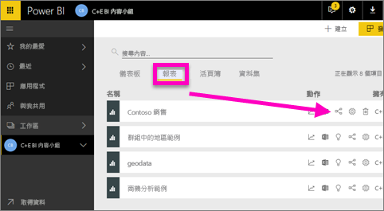
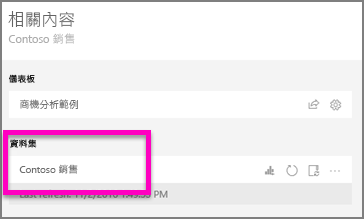
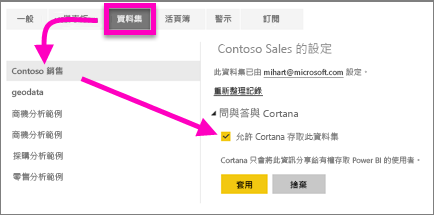
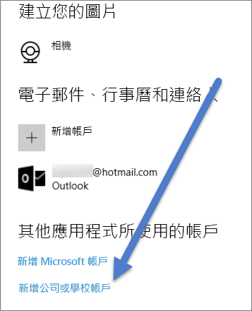

# 允許 Cortana 存取 Power BI 報表 (和其基礎資料集)
您已經讀過 [Cortana 及 Power BI 簡介](service-cortana-intro.md) (如果沒有，您可能要先讀過後再回來)。 而現在，您會想要親自試試。  您在 Cortana 中詢問自然語言問題，並從儲存在 Power BI 報表中的資料尋找答案之前，有幾項要求。 具體來說，您必須執行下列作業。

> [!NOTE]
> 如果您試用 Cortana 和 Power BI 儀表板 Preview，則可以略過本文的其餘部分。 不需要進行設定，Cortana 就可以搜尋 Power BI 儀表板。
> 
> 

在 Power BI 服務中

* 允許 Cortana 使用一或多個資料集 (報表會依據資料集來建立，因此 Cortana 必須有這些資料集的存取權)

在 Microsoft Windows 中

* 確認您執行的是 Windows 10 的 1511 版或更新版本
* 確認 Power BI 和 Windows 可以跟彼此「交談」。 這表示將您的帳戶連線到 Windows。

## 使用 Power BI 服務允許 Cortana 存取 Power BI 中的報表頁面
允許 Cortana 存取 Power BI 中的報表是簡單的程序。  事實上，您只需要選取 [允許 Cortana 存取這個資料集] 來允許報表的基礎資料集。 在這之後，任何可存取 Power BI 中資料集的使用者，透過一般 Power BI 共用、應用程式及內容套件功能，都能在 Windows 10 中從 Cortana 中的報表得到答案。

您必須登入 Power BI 服務 (而非 Power BI Desktop)，並對要讓 Cortana 能夠存取的每個資料集，重複上述步驟。

1. 決定要啟用的資料集。 從報表內容清單中，選取您想要 Cortana 存取的報表，然後選擇**檢視相關項目**圖示 。
   
    
2. 與此報表建立關聯的資料集是 **Contoso Sales**。
   
    
3. 在資料集名稱的右邊，選取省略符號 (...) > [設定]。  
   
    ![選擇 [設定]](media/service-cortana-enable/power-bi-settings-cortana.png)
4. 選取 \[Q&A and Cortana] \(問與答及 Cortana) > [允許 Cortana 存取此資料集] > [套用]。
   
   
   
   在這個範例中，我們想要在 Contoso Sales 資料集上啟用 Cortana。
   
   > [!NOTE]
   > 將新的資料集或 Cortana 回應卡新增到 Power BI 中，並允許 Cortana 使用時，最多可能需要 30 分鐘的時間，才會開始顯示結果。 登入和登出 Windows 10，或在 Windows 10 中重新啟動 Cortana 程序，都可立即顯示新內容。
   > 
   > 如果您針對 Cortana 啟用資料集，而且該資料集屬於您擁有的內容套件或應用程式，就必須重新發佈，才能讓同事透過 Cortana 使用此資料集。
   > 
   > 

## 將您的 Power BI 認證新增到 Windows
您必須執行 Windows 10 的 1511 版或更新版本。

1. 判斷您正在執行的 Windows 10 版本。 開啟 [設定]。
    

    然後選取 [系統] > [關於]。 在畫面底部，您會看到 [Windows 規格] > [版本]

   * 如果您擁有 Windows 10 的 1511 版 (Windows 10 的 2015 年 11 月更新) 到 1607 版，請新增您的公司或學校帳戶和 Microsoft 帳戶 (完成下方步驟 2 和 3)。
   * 如果您擁有 Windows 10 1607 版 (Windows 10 的 2016 年 7 月更新) 或更新版本，請新增您的公司或學校帳戶 (僅需完成下方步驟 2)。
1. 為 Cortana 新增工作或學校帳戶。
   
   * 開啟 [設定] > [帳戶]。
     
       
   * 捲動至底部，然後選取 [新增工作或學校帳戶]。 或者，從 [帳戶] 頁面選取 [存取公司或學校] > [連線]。
     
     

Cortana 將會使用這個公司或學校帳戶，來檢查 Power BI 中是否可能有 Cortana 問題的答案。

## 後續步驟
[在 Power BI 中建立 Cortana *Answer Card*](service-cortana-answer-cards.md)

[對 Cortana 和 Power BI 整合問題進行疑難排解](service-cortana-troubleshoot.md)

有其他問題嗎？ [試試 Power BI 社群](http://community.powerbi.com/)

