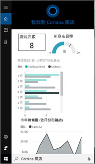
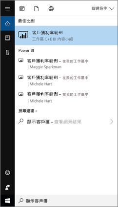
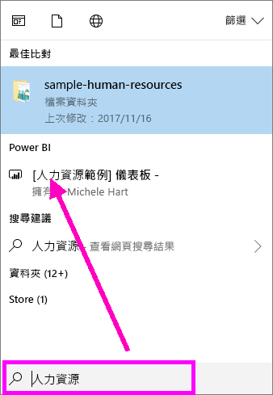
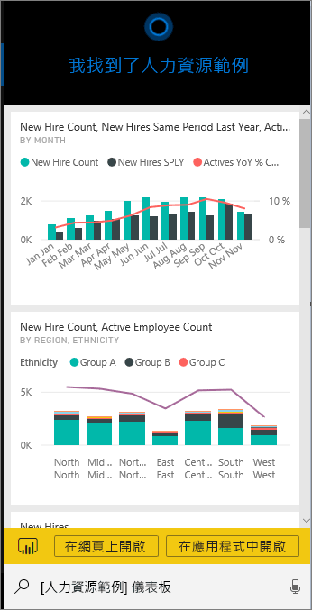
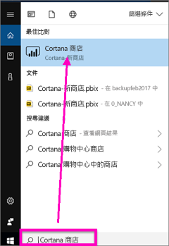
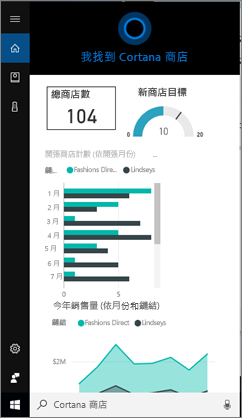
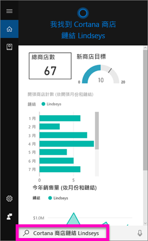
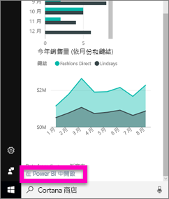
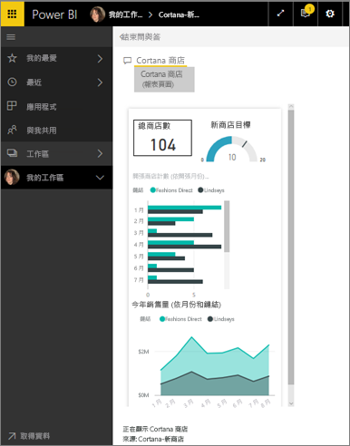

# 尋找和檢視適用於 Power BI 的 Cortana 與 Power BI 資料
在您的 Windows 10 裝置上使用 Cortana，以取得重要業務問題的即時解答。 Cortana 藉由與 Power BI 整合，可直接從 Power BI 儀表板和報表擷取關鍵資訊。 需要的只有 Windows 10 2015 年 11 月 (含) 以上的版本、Cortana、Power BI 以及至少一個資料集的存取權。

> [!IMPORTANT]
> Cortana 整合已被取代，在 Power BI 中。 從 6 月 11 日，Cortana 將不再適用於任何儀表板和報表。

## 預覽 Windows 10 的新 Cortana 儀表板  搜尋體驗
一段時間之後，您現在已可以[使用 Cortana 擷取某些類型的報表頁面](service-cortana-answer-cards.md)。 現在我們已新增**新體驗** -- 也會擷取儀表板的能力。 現在就試試看並[傳送意見反應在 Power BI Ideas](https://ideas.powerbi.com/forums/265200-power-bi)。 最後，「新體驗」  將擴充成包含 Cortana 一併搜尋報表。  新體驗的其中一個重要優點在於您設定時不需要進行特殊處理 (不允許 Cortana 或設定 Windows 10)。 它會正常運作。

> [!NOTE]
> 如果它未運作，請參閱[疑難排解文章](service-cortana-troubleshoot.md)以取得協助。
> 
> 

底層技術是使用 [Microsoft Azure 搜尋服務](https://docs.microsoft.com/azure/search/)。 這項搜尋服務提供額外的功能，例如智慧排名、錯誤修正和自動完成。

這兩個 Cortana 體驗可存在於並排顯示。

## Cortana for Power BI 文件
四份文件會引導您設定和使用 Cortana for Power BI。

**文章 1** (本篇)：了解 Cortana 和 Power BI 如何搭配運作

**文章 2**：[搜尋 Power BI 報表：啟用 Cortana - Power BI - Windows 整合](service-cortana-enable.md)

**文章 3**：[搜尋 Power BI 報表： 建立特殊*Cortana 回應卡*](service-cortana-answer-cards.md)

**文章 4**：[對問題進行疑難排解](service-cortana-troubleshoot.md)

## Cortana 和 Power BI 如何一起運作
當您使用 Cortana 問問題時，Power BI 可以是 Cortana 尋找答案的其中一個地方。 在 Power BI 中，Cortana 可以從 Power BI 報表 (包含稱為「Cortana 回應卡」  的特殊報表頁面類型) 和 Power BI 儀表板中，找到豐富的資料驅動答案。

如果 Cortana 找到相符項目，則會在 Cortana 螢幕中的該處顯示儀表板或報表頁面的名稱。 您可以在 Power BI 中開啟儀表板或報表頁面。 也可以在 Cortana 中探索報表頁面 - 它們是互動式的。

### Cortana 和儀表板 (新體驗  )
Cortana 可以在您擁有的儀表板以及已與您共用的儀表板中尋找答案。 使用標題、關鍵字、擁有者名稱、工作區名稱、應用程式名稱等項目，來詢問 Cortana 問題。

您的問題必須至少有 2 個字，Cortana 才能尋找答案。 因此，若您在具有單字名稱 (Marketing) 的儀表板或報表上進行搜尋，請在問題中新增 "show"、"Power BI" 單字或擁有者名稱，如同 "show Marketing" 與 "michele hart sample"。 

如果您儀表板的標題有多個字，則只有在搜尋至少符合兩個字時，或符合其中一個字和擁有者名稱時，Cortana 才會傳回該儀表板。 針對名為 "Customer Profitability Sample" 的儀表板： 

* "show me customer"*不*傳回 Power BI 儀表板結果。   
* 「 談話例如"show me customer profitability"，"customer p"、"customer s"、"profitability sample"、"michele hart sample"、"show customer profitability sample"和"show me customer p"*請勿*傳回 Power BI 結果。
* 新增"powerbi"字組計算為兩個必要字組，因此"powerbi sample"的其中一個*沒有*傳回 Power BI 結果。 
  
    

### Cortana 和報表
 Cortana 可以在具有[專供 Cortana 顯示所設計的頁面](service-cortana-answer-cards.md)的報表中尋找答案。 只需要從其中一個特殊報表頁面中，使用標題或關鍵字詢問問題。  

報表使用的基礎技術[Power BI 問與答](power-bi-tutorial-q-and-a.md)。

當您在 Cortana 中詢問問題時，Power BI 會從專為 Cortana 設計的報表頁面進行回答。 Cortana 會直接從已在 Power BI 中建立的 Cortana「回應卡」  ，即時判斷可能的答案。  若要進一步探索答案，請在 Power BI 中開啟結果。

> [!NOTE]
> 您必須[使用 Power BI 服務及設定 Windows 以與 Power BI 通訊來啟用這項功能](service-cortana-enable.md)，Cortana 才能在您的 Power BI 報表中尋找答案。  
> 
> 

## 使用 Cortana 從 Power BI 取得答案
1. 在 Cortana 中啟動。 有許多不同的方法可以「開啟」  Cortana：在工作列中選取 Cortana 圖示 (請參閱下圖)、使用語音命令，或在 Windows 行動裝置上點選搜尋圖示。
   
     
2. Cortana 準備就緒之後，請在 Cortana 搜尋列中鍵入或說出問題。 Cortana 會顯示可用的結果。 如果有符合問題的 Power BI 儀表板，就會顯示在 [最佳相符]  或 [Power BI]  下方。
   
     
   
   > [!NOTE]
   > 目前僅支援英文。
   > 
   > 
3. 選取儀表板以在 Cortana 中開啟。

    

    您可以[編輯儀表板的電話檢視  ](service-create-dashboard-mobile-phone-view.md)，以變更配置。 

1. 在 Cortana 中，您也有選項可在 Power BI 服務或 Power Bi 行動裝置中開啟儀表板。 選取 [在網頁上開啟]  ，以在 Power BI 服務中開啟儀表板。 
   
      
4. 現在讓我們使用 Cortana 搜尋報表。 我們需要知道[頁面包含 Cortana 回應卡的報表](service-cortana-answer-cards.md)。 在此範例中，名為 "Cortana-New-Stores" 的報表具有名為 "cortana stores" 的 Cortana 回應卡頁面。  
   
     在 Cortana 搜尋列中鍵入或說出問題。 Cortana 會顯示可用的結果。 如果有符合問題的 Power BI 報表頁面，就會顯示在 [最佳相符]  或 [Power BI]  下方。 在這個範例中，我用來建立回應卡的 .pbix 檔案 (及備份) 也會顯示在 [文件]  下方。
   
      
5. 選取 [Cortana stores]  報表頁面，以在 Cortana 視窗中予以顯示。
   
       
   
    請記住，「回應卡」  是由資料集擁有者建立的特殊類型 Power BI 報表頁面。  如需詳細資訊，請參閱[建立 Cortana 回應卡](service-cortana-answer-cards.md)。
6. 還不只這樣。 您可以像在 Power BI 一樣，與回應卡上的視覺效果互動。
   
   * 例如，選取一個視覺效果上的項目，以交叉篩選及亮顯回應卡上的其他視覺效果。
     
     
   * 也可以改用自然語言篩選結果。  例如詢問 "Cortana stores for Lindseys"，查看篩選成只顯示 Lindseys 連鎖店資料的卡片。
     
     
7. 繼續探索。 捲動到 Cortana 視窗底部，然後選取 [在 Power BI 中開啟]  。
   
     
8. 在 Power BI 中，開啟報表頁面。    
     

## 考量與疑難排解
* Cortana 無權存取任何從未到過的 Cortana 卡片[允許 Power BI](service-cortana-enable.md)。
* 還是無法讓 Cortana 搭配 Power BI 運作嗎？  請嘗試 [Cortana 疑難排解員](service-cortana-troubleshoot.md)。
* Cortana for Power BI 目前僅提供英文版。
* 只有在 Windows 行動裝置上才能使用 Cortana for Power BI。

有其他問題嗎？ [試試 Power BI 社群](http://community.powerbi.com/)。
想提出意見反應嗎？ 將意見反應傳送給 [Power BI Ideas](https://ideas.powerbi.com/forums/265200-power-bi)。

## 後續步驟
[啟用報表的 Cortana - Power BI - Windows 整合](service-cortana-enable.md)

