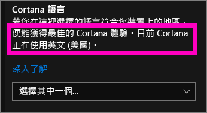
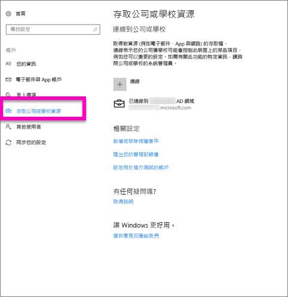
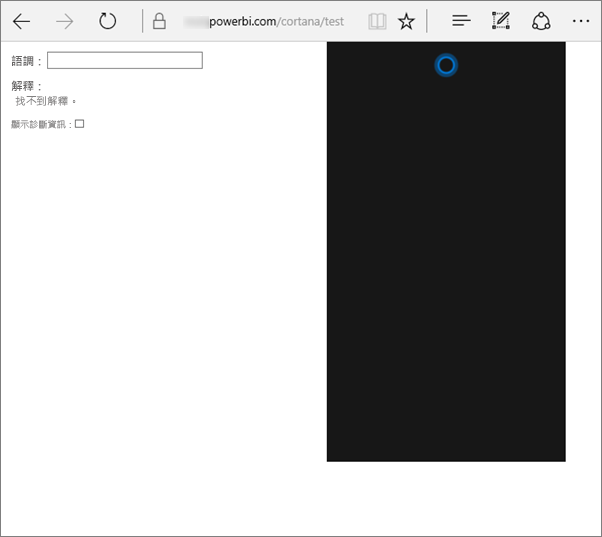
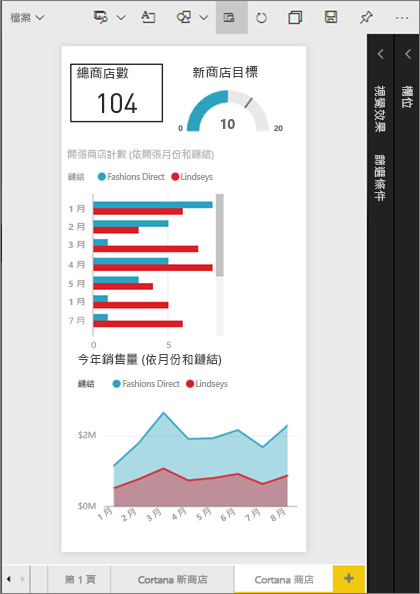
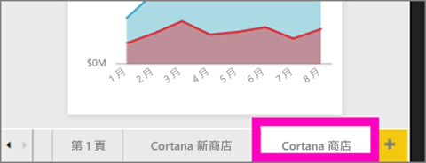

# 對適用於 Power BI 的 Cortana 進行疑難排解
本文是系列文的其中一篇。 如果還沒有這麼做，建議您閱讀下列三篇文章。

**文章 1**：[了解 Cortana 與 Power BI 如何搭配運作以搜尋 Power BI 儀表板和報表](service-cortana-intro.md)

**文章 2**：[針對搜尋報表：啟用 Cortana - Power BI - Windows 整合](service-cortana-enable.md)

**文章 3**：[針對搜尋報表：建立特殊 Cortana 回應卡](service-cortana-answer-cards.md)

如果您在讓 Cortana 與 Power BI 整合時仍遇到問題，就來對地方了。 請遵循下方步驟以診斷及修正問題。

## 為什麼 Cortana 從我的 Power BI 報表或儀表板找不到答案？
1. 您有 Power BI 帳戶嗎？  如果沒有，可[註冊以免費試用](https://powerbi.microsoft.com/get-started/)。
2. Cortana 有在運作嗎？  您在工作列中有看到 Cortana 圖示嗎？

    

    當您選取圖示時，開啟的 Cortana 會有可鍵入的欄位嗎？
3. 您在搜尋中使用至少 2 個字組嗎？ Cortana 需要至少 2 個字組片語，才能在 Power BI 中找到答案。 請嘗試將 "show" 新增至問題開頭。
4. 如果您儀表板的標題有多個字組，則只有在搜尋至少符合兩個字組時，Cortana 才會傳回該儀表板。 針對名為 "Sales FY16" 的儀表板：

   * "show sales"「不會」傳回 Power BI 結果。   
   * "show me sales fy16"、"sales fy16"、"show sales fy16" 和 "show me sales f"「將」會傳回 Power BI 結果。    
   * 新增 "powerbi" 字組會算作 2 個必要字組中的其中一個，因此 "powerbi sales"「會」傳回 Power BI 結果。
5. 您有任何報表或儀表板的存取或編輯權嗎？ 若為報表，請確認您嘗試搜尋的內容有[回應卡](service-cortana-answer-cards.md)。  針對儀表板，請確定您嘗試搜尋的內容位在 [與我共用]、應用程式工作區或 [我的工作區] 中。 [使用疑難排解工具](#try-the-cortana-troubleshooting-tool)，協助找出問題。
6. 您使用的是行動裝置嗎？  目前，我們只在 Windows 行動裝置上支援 Power BI 與 Cortana 整合。
7. Cortana 有設定為英文嗎？  目前的 Cortana-Power BI 整合僅支援英文。 開啟 Cortana，然後選取齒輪圖示以顯示 [設定]。 向下捲動到 [Cortana 語言] 並確認其已設為其中一個英文選項。

   
8. 您已經讓 Cortana 使用 100 張以上的報表嗎？  Cortana 最多只會搜尋 100 個。  若要確認您的報表包含在其中，請將其移動或複製到 [我的工作區]，因為 Cortana 會優先在那裡搜尋。
9. 或許您只需要給它一點時間。 當您初次鍵入查詢時，模型可能會「沒反應」。 請稍候幾秒，讓資料可以載入記憶體中，然後再試一次。
10. 針對儀表板，最多可能需要 24 個小時的時間，Cortana 才能存取它們。    
11. 針對報表，將新的資料集或自訂回應卡新增至 Power BI 並允許 Cortana 使用時，Cortana 最多可能需要 30 分鐘的時間，才會開始顯示結果。 登入和登出 Windows 10，或在 Windows 10 中重新啟動 Cortana 程序，都可立即顯示新報表內容。  
12. Power BI 系統管理員可以「退出」。 請與您的系統管理員確認，查看是否為這種情形。

## 僅限報表：為什麼 Cortana 從我的 Power BI 報表找不到答案
1. 如果您要在報表中尋找答案，則有任何報表具有 Cortana **回應卡**嗎？ 回應卡是 Cortana 在您的 Power BI 報表中找到答案的唯一方法。  閱讀[在 Power BI 服務及 Power BI Desktop 中建立 Cortana 回應卡](service-cortana-answer-cards.md)，以了解如何建立回應卡。
2. 您執行的是 Windows 1511 版或更新版本嗎？  開啟 [Windows 設定] 後選取 [系統] > [關於] 以了解。 如果不是，請更新您的 Windows 版本。
3. 您的 Windows 和 Power BI 帳戶連線了嗎？ 這可能會令人困惑。 請遵循[啟用適用於 Power BI 的 Cortana](service-cortana-enable.md#add-your-power-bi-credentials-to-windows) 中的指示。
4. 已針對 Cortana 啟用基礎資料集嗎？ 可能有同事共用了她已經允許 Cortana 使用的資料集。 但如果沒有，請[了解如何自行讓資料集使用 Cortana](service-cortana-enable.md)。 這又快又簡單。

## 僅限儀表板：為什麼 Cortana 從我的 Power BI 儀表板找不到答案
1. 確定已連線至您的公司帳戶。 Power BI 需要此連線，才能驗證您對資料的存取權限。 若要確認您是否已連線，或要在未連線時連線至公司帳戶，請使用 Windows 搜尋方塊巡覽至 [連線到公司或學校]。  

    
2. 您可以存取 Cortana 嗎？ 選取 Windows 搜尋方塊，並提供您資訊的 Cortana 存取權限。

## 嘗試 Cortana 疑難排解工具
仍然有問題嗎？  現在是執行 Cortana 疑難排解工具的好時機，並縮小可能問題的範圍。

### 從報表擷取答案時發生問題嗎？
1. 針對報表，在執行疑難排解工具之前，請務必將 Cortana 回應卡上的 [頁面層級] 篩選設為 [只可單選]。 如需這項作業的說明，請參閱[建立 Cortana 回應卡](service-cortana-answer-cards.md)。
2. 將 "/cortana/test" 新增到 Power BI 服務 URL 即可開啟疑難排解工具。 您的 URL 看起來應該像這樣：

   app.powerbi.com/cortana/test

   
3. 在 [Utterance] 欄位中，若要對報表進行疑難排解，請鍵入 Cortana 回應卡**在 Power BI 索引標籤中顯示的相同名稱**。

   

    

   
4. 有時候，您初次在 [Utterance] 欄位中鍵入內容時，不會有任何反應。 請把這當作在啟動系統；您正在讓疑難排解工具知道該啟動了。 剪下並貼上，或重新鍵入 [Utterance] 欄位中。 在本例中，回應卡的名稱為 **Cortana stores**。 在工具中貼上或鍵入 **Cortana stores**，會產生單一結果，顯示在 [Interpretations] (解譯) 欄位中。 按一下以查看 Cortana 視窗中所顯示的回應卡，在此情況下，為 **Cortana stores**。

   

   因為得到了結果，所以我們現在知道 Cortana **已經**在 Power BI 中啟用。 這把問題的範圍縮小到了 Windows 端、或 Cortana 語言設定，或已讓 100 個以上的資料集使用 Cortana。

### 從儀表板擷取答案時發生問題嗎？
尋找已與您共用的儀表板嗎？  開啟 [Power BI] > [Shared with me] (與我共用)，並找到儀表板的名稱。  然後在 [Utterance] 欄位中鍵入該名稱。

![在 Power BI 中開啟 [Shared with me] (與我共用)](media/service-cortana-troubleshoot/power-bi-cortana-shared-with-me.png)

#### 疑難排解工具已知問題
* 如果工具在第一次時未擷取結果，請改為將查詢貼入 Utterance 文字方塊。
* 查詢必須有 2 個以上的字。  如果您的查詢過短，請加上 "show" 字。
* 某些具有介係詞的查詢字串可能無法運作 (例如 sales by item)。 請嘗試其他沒有使用介係詞，而且有意義/唯一的查詢字詞。

有其他問題嗎？ [試試 Power BI 社群](http://community.powerbi.com/)
